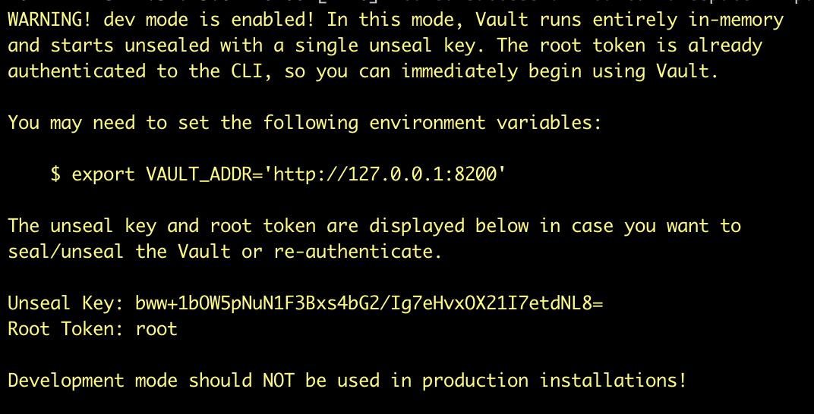
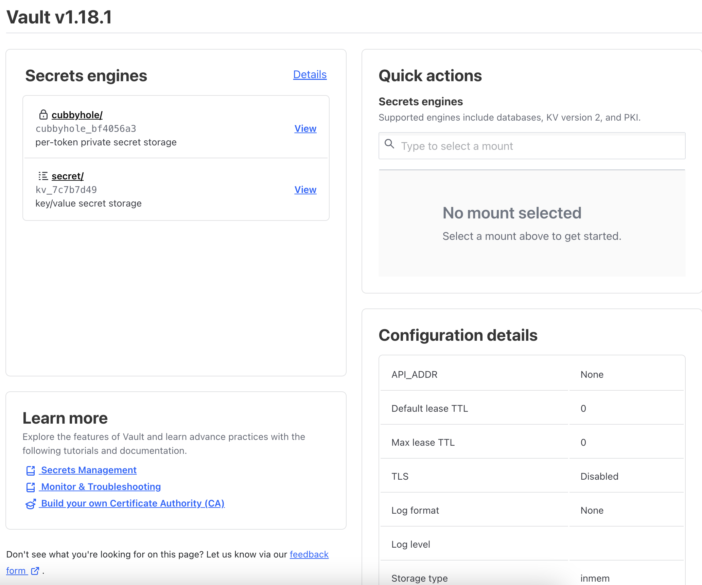
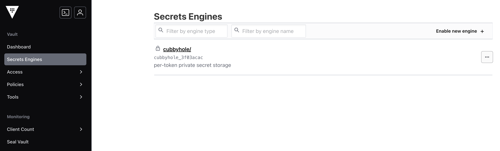
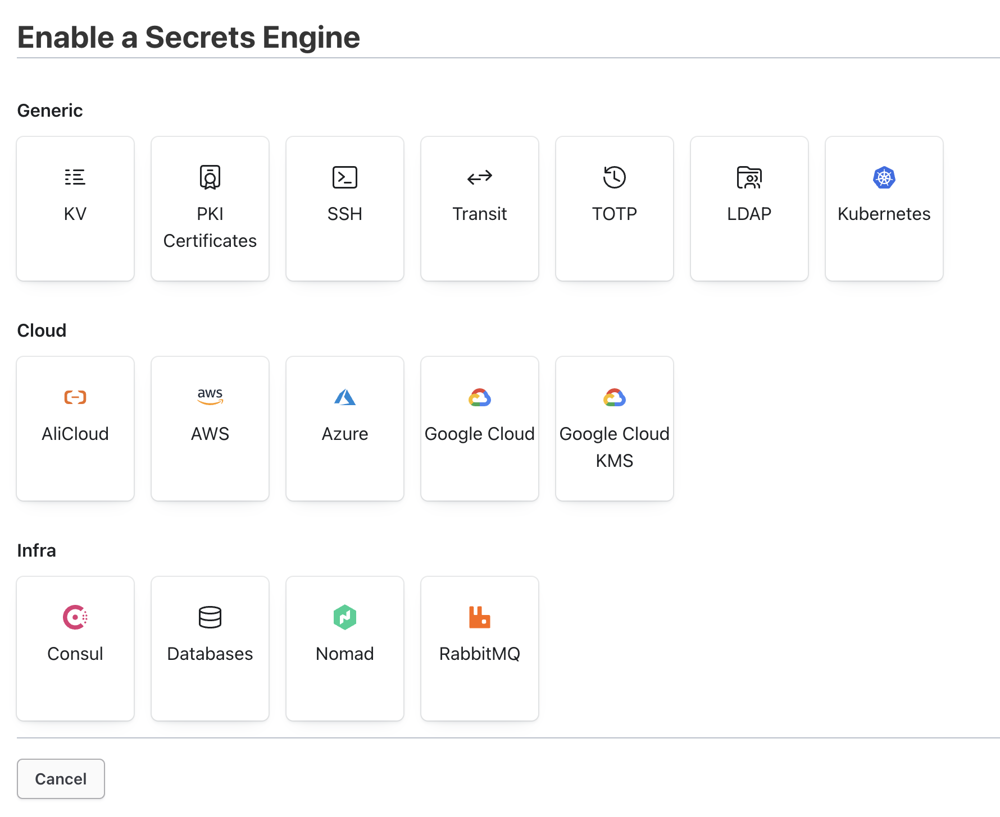
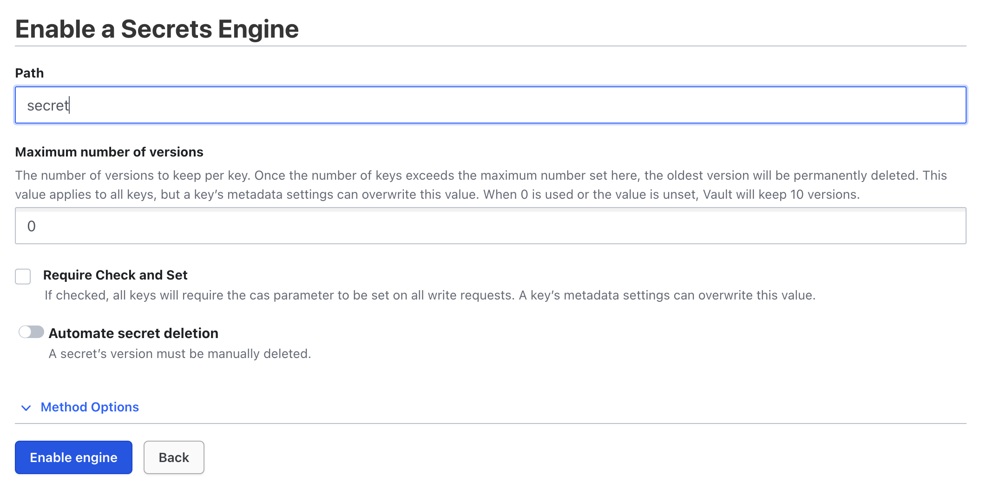
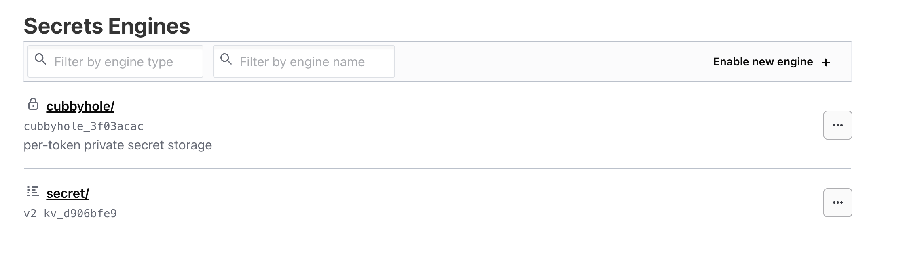

Recently I have spent a reasonable amount of time in Hashicorp vault. As part of a mini series on how to make better use of it in Network Automation, I started writing this as a "intro" to a post on the subject.

As per usual with me, it ended up being so long that it had to be its own post. So. Here you are.

> Some of you might have opinions about Hashicorp and their licence changes. 
> I do not (either professionally nor personally), compete with Hashicorp, 
> and so it is my understanding I can use their products in an opensource 
> sense. If you feel differently, feel free to use openbao. 

Also funny; when I pushed this to github, it complained at me that I was posting a vault token to a git repo. I'm pleased that github scanning is picking up on this in the push process - that's going to help a lot of people from firing a footgun. :D

## Vault bootstrap

Main Options:
* Vault dev server on your machine (Easy, **EPHEMERAL!!!**)
* Vault docker (Easy, requires bootstrap, non-production)
* Vault Cluster (Hard, requires full on terraforming, Production Ready ;) )

I will ignore the last and maybe talk about that in another post one day. There are lots of people doing that if you google for it in the meantime. Unless you already have Consul, or you like Russian Dolls, I would suggest you skip that and just use RAFT on some local disk, then split the cluster over a few machines. I only mention it to be sure you realise everything else we discuss below is a test setup, and not something to trust with real data!

### Vault -dev

This is one of those things that reminds you how cool single Go binaries are. 

[Download](https://developer.hashicorp.com/vault/install?product_intent=vault) the vault binary to your system, and put it in your $PATH.

In a terminal simply type `vault server -dev -dev-root-token-id=root` and you will get an instance running on your local system on port 8200, with a default authentication token that is simply: `root`.



[Click](http://localhost:8200) the link it provides to visit the webUI and enter the token `root` and login. You will now see the administrator view of the UI. On the screen should be two secrets "engines" called cubbyhole and secret. Engines are not secret stores themselves, but sort of plugins that reflect _what_ is being stored. You then create secret mount points that use these engines.



#### So what is a Cubbyhole? 

By default, every time a token is used to login, that token gets a "cubbyhole". This is a place that can be used to store secrets ephemerally for the duration of the login session. If you use hardcoded tokens (dont), then you could rely on that store remaining between login sessions. If you use something "proper" for auth, then each time you login, you would have a new token, and so would lose all the content you stored there, EVEN IF you used the same login userpass for example. 

TL:DR? Cubbyhole isn't durable. Its per-session only. Use it accordingly, or simply, don't use it at all.

#### Secrets are what what I think they are right?

Yes. At some point in the past there were two key/value engines, v1 and v2, and there were a bunch of relevant differences between them. By default, you will get a kv-v2, and I won't get into the weeds about the difference or the pros/cons. 

Secret stores use "real" storage and persist to whatever backend the vault config file has configured. In the dev instance, **this is a ramdisk**, and data will be lost when the process stops (hence why its dev use only). If you want to be able to retain data between restarts of the vault instance, you will have to look at the next option which uses docker to persist to disk. 

Assuing you dont want that, at this point you are in fact ready to [get cracking](/posts/making-more-use-of-vault/)

---

### Vault Docker

If you want to have something closer to a UAT instance that is a little more persistent, you will need to setup something more real than `vault server -dev`. 

My goto here is the official docker image and a couple of docker volumes. Here is a basic docker-compose.yml you can use (hat tip to [this blog](https://ambar-thecloudgarage.medium.com/hashicorp-vault-with-docker-compose-0ea2ce1ca5ab) for some starter hints)

First, make a home for all this, e.g. `mkdir ~/vault`

Second, make the folder structure the compose needs to work: `mkdir -p ~/vault/{config,file,logs}`

Now, make yourself a docker compose file
```bash
cd ~/vault
cat << EOF > docker-compose.yaml
version: '3.3'
services:
  vault:
    image: hashicorp/vault
    container_name: vault
    environment:
      VAULT_ADDR: http://localhost:8200
    ports:
      - "8200:8200"
    restart: always
    volumes:
      - ./logs:/vault/logs/:rw
      - ./config:/vault/config/:rw
      - ./file:/vault/file/:rw
    cap_add:
      - IPC_LOCK
    entrypoint: vault server -config /vault/config/config.hcl
EOF
```

Finally, make yourself a config file:
```shell
cd ~/vault/config
cat <<EOF > config.hcl
ui = true
disable_mlock = "true"

storage "file" {
  path    = "/vault/file"
}

listener "tcp" {
  address = "[::]:8200"
  tls_disable = "true"
}
EOF
```

You can then start that up with `cd ~/vault; docker compose up -d`

#### Vault first use

When we run this compose _the first time_, we have to initialise the database.

First, get a shell on the container `docker compose exec -it vault sh`

Second, fire up the init: `VAULT_ADDR=http://localhost:8200 vault operator init`

My instance (among other things) gave me back this: 
```
Unseal Key 1: /YnhBEd8lnWp632thqoML7iC9wye1pi372NzA8zr7ZxI
Unseal Key 2: gua+WSvI7/bV6Cmnea/x694girGbmXJprObpFrS7o8g0
Unseal Key 3: iqKELoMDxdVR1LHhi7ns316sSECEGr1/0utGk2FOeh7o
Unseal Key 4: MhUSVeaRvUee64TZzhgqYE2BchM2bwvKZ8hQdrfMNwYD
Unseal Key 5: zcF+I0rZKRV/TutGklMs+bhbTyWNbQFA+LvHHrQ4so0y

Initial Root Token: hvs.trdFUmCJ00eTm6FuWq3NrmBR
```

We now have to unseal the vault. By default, the vault content is "sealed" and this means the content on disk is unreadable by the system. The keys to unseal and thus allow the content to be accessed, are split into a number of shards, so that multiple people can be "keyholders" and as long as you have as many "shares" needed to cross the "threshold", you can unlock. Read more [here](https://devopstronaut.com/hashicorp-vault-101-4-unsealing-vault-with-key-shards-shamirs-secret-sharing-algorithm-8f7754832815) if you like.

TO do the unlock, we need to run the `vault operator unseal` command 3 times, pasting a new key from the unseal list each time. I picked the first, third and fifth key for lols.

Keep an eye on the "unseal progress" field...

```
/ # vault operator unseal
Unseal Key (will be hidden): /YnhBEd8lnWp632thqoML7iC9wye1pi372NzA8zr7ZxI
Key                Value
---                -----
Seal Type          shamir
Initialized        true
Sealed             true
Total Shares       5
Threshold          3
Unseal Progress    1/3
Unseal Nonce       0f055c4d-b09b-bb67-211b-3f6bb8f625e2
Version            1.18.1
Build Date         2024-10-29T14:21:31Z
Storage Type       file
HA Enabled         false

/ # vault operator unseal
Unseal Key (will be hidden): iqKELoMDxdVR1LHhi7ns316sSECEGr1/0utGk2FOeh7o
Key                Value
---                -----
Seal Type          shamir
Initialized        true
Sealed             true
Total Shares       5
Threshold          3
Unseal Progress    2/3
Unseal Nonce       0f055c4d-b09b-bb67-211b-3f6bb8f625e2
Version            1.18.1
Build Date         2024-10-29T14:21:31Z
Storage Type       file
HA Enabled         false

/ # vault operator unseal
Unseal Key (will be hidden): zcF+I0rZKRV/TutGklMs+bhbTyWNbQFA+LvHHrQ4so0y
Key             Value
---             -----
Seal Type       shamir
Initialized     true
Sealed          false
Total Shares    5
Threshold       3
Version         1.18.1
Build Date      2024-10-29T14:21:31Z
Storage Type    file
Cluster Name    vault-cluster-ba330731
Cluster ID      3e7c8e39-28e6-c1e8-e594-8ca3f8ab32a5
HA Enabled      false
```

You'll notice that the last time the change of `sealed: false`.

Lets move onto the vault contents...

> Note: All of the following will make use of the "Initial Root Token" provided to us when we completed the init.

Lets make a quick check before leaving the container shell:

```
/ # VAULT_TOKEN=hvs.trdFUmCJ00eTm6FuWq3NrmBR vault token lookup
Key                 Value
---                 -----
accessor            0VNSiyg97yqkAI5R0uqeyAB1
creation_time       1731946768
creation_ttl        0s
display_name        root
entity_id           n/a
expire_time         <nil>
explicit_max_ttl    0s
id                  hvs.trdFUmCJ00eTm6FuWq3NrmBR
meta                <nil>
num_uses            0
orphan              true
path                auth/token/root
policies            [root]
ttl                 0s
type                service
```

Double check you are all sorted with a quick look at the webui on http://_serverip_:8200 and use the same initial root token for auth.



Notice that this time we don't have the secrets engine enabled by default...

#### Engine Setup

Since we want to get to the same position as the dev server, we will limit ourselves to the same kv v2 secret engine.

UI method: 

1. click the "Enable a new Engine + " button
2. click the "KV" type
3. set the name to "secret" (same name as dev for simplicity)
4. click "enable engine"







---

Depending on which path you took, you should now have a functional - **!!!NON PRODUCTION!!!** vault server that you can [continue your adventures with](/posts/making-more-use-of-vault/).

Later I will post some follow up on a production-like service setup, but tbh, you should probably just learn the vault tooling, and build something that works in your environment, rather than copying some blog.

Thanks for stopping by, and see you soon!