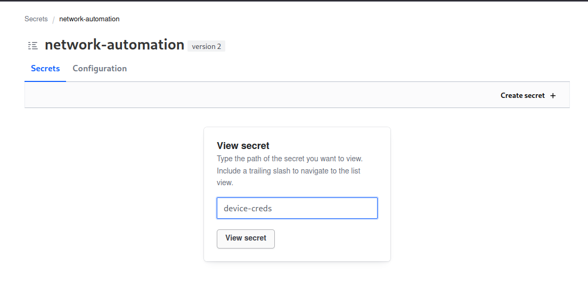

## abstract

Following on from the Hashicorp Vault "how-to" series. Lets dial things up a notch, and setup a PKI in vault that can issue "real" certificates for your devices. 

This has a couple of real tangible benefits. 

1. No more `verify=false` and/or urllib hacks to connect to TLS secured endpoints
2. No need to fight `openssl` to wrangle self signed (or for the really brave, a manual CA)
3. Full automation support to enable estate wide renewal in minutes, not _half a lifetime_.

Much of this content was abstracted from the Original Hashi docs, which are brilliant, and can be found [here](https://developer.hashicorp.com/vault/tutorials/pki/pki-engine).

So all that being said, lets get into it.

---

## pre-requisites

First, we need a vault. If you are really going to do this in production, I recommend you get a "real" vault. up and running. The [hashi docs](https://developer.hashicorp.com/vault/tutorials/getting-started/getting-started-deploy) are great. If you just want to faff about a bit to learn, you can use my docker setup from [here](https://www.problemofnetwork.com/posts/bootstrapping-hashi-vault/) if you like. 

It will be really important to build out an authentication system, but its too much to cover here. I'm cheating and using a root token for the terraform bit, but we will create some scoped tokens for the _actual_ signing requests, within the terraform repo itself. You should poke around this more to setup a scoped token for the terraform to use that leverages policy to only have permissions to the parts of the vault needed.

Because there was soooo much to do inside of vault, I decided to make this into terraform and put it into git. You should clone the repo from `https://github.com/fatred/exploring-vault.git` into a place on your system. 

Before running anything you will need the [vault client](https://developer.hashicorp.com/vault/docs/install) on your system, and the [terraform client](https://developer.hashicorp.com/terraform/tutorials/aws-get-started/install-cli) too.

--- 

## Vault PKI setup

As previously discussed, Vault offers many options for storing secrets, but it can also be used to produce them as well. A software HSM if you will. To be able to make use of the PKI tooling, we have to enable the PKI engine, and configure a number of nerd knobs to ensure that what we deliver is of value.

> Note: Vault is written in golang, and it's generally understood that the golang crypto libraries (at least the ones used for x509 work in vault), are incredibly strict in terms of applying the RFCs. There are a number of things that openssl might allow, that the vault will not. Two examples I ran into include use of underscores in common names (vault say no, openssl say meh), and invalid PathLength attributes in the chainlength field - if you say 1 and you have an intermediate CA, then this will be invalid. You should read your error messages carefully, and refer to the [issues in the stdlib](https://github.com/golang/go/issues?q=is%3Aissue+crypto%2Fx509) for `crypto/x509`. Chances are you will find something specific in there.

Due to the nature of trust, and the power that the Root Cert holds, there are schools of thought that say the Root should not be an online thing. There are examples on the Terraform docs site where the Root CA is operated by a tool called certstrap (which is really really cool btw). I don't want to make this post any longer then neccesary, so if that sounds like something you will need, you can refer to these instructions, they are very similar. For today's purposes, we keep the root online in the Vault.

So, lets get started with some policies we will need in the vault system. In the repo, you want to look inside the `terraform` subfolder.

As you review the items in the repo, you'll note that I have broken them out into files that logically group things to make them easier to find and interact with. This is not actually required in TF world, but "good tf repo structure" is an exercise for the reader.

#### providers.tf

This file is typically used to "configure" the terraform _module_ (aka this folder and its descendent .tf files). Here we say we want to use the vault provider version 4.2.0. We then instansiate it, providing no variables. If you _want_ you can put the vault_addr and vault_tokens in here, but we will use environment vars for this instead.

At this point, you can visit your shell and enter the terraform folder of the repo. Export the `VAULT_ADDR` and `VAULT_TOKEN` for your vault instance, and then run `terraform init`. This should fetch the content for the provider and return a success message. If it doesn't make sure your internet is working to get the provider, and that the vault isn't sealed.

```
➜  terraform git:(main) terraform init
Initializing the backend...
Initializing provider plugins...
- Finding hashicorp/vault versions matching "4.2.0"...
- Installing hashicorp/vault v4.2.0...
- Installed hashicorp/vault v4.2.0 (signed by HashiCorp)
Terraform has created a lock file .terraform.lock.hcl to record the provider
selections it made above. Include this file in your version control repository
so that Terraform can guarantee to make the same selections by default when
you run "terraform init" in the future.

Terraform has been successfully initialized!

You may now begin working with Terraform. Try running "terraform plan" to see
any changes that are required for your infrastructure. All Terraform commands
should now work.

If you ever set or change modules or backend configuration for Terraform,
rerun this command to reinitialize your working directory. If you forget, other
commands will detect it and remind you to do so if necessary.
```

### Tokens and policies

First thing we want to put into vault is a method to login that _isn't_ the root token, and to limit the capabilities of these accounts to least priviledges possible.

#### network-automation-kv.tf

This is creating a "vault_mount" resource called "network-automation" which is a key value v2 database. In otherwords, its a place we can put credentials and certs after we created them.

#### policies.tf

Here we have two policies that permit a client with that policy to do things. Its a subject/verb system that is quite similar to kubernetes and cloud IAM systems. 

In the first policy we we setup the ability to read `device-creds` in the `network-automation` mount point.

In the second policy we we setup the ability to create, update and read `device-creds` in the `network-automation` mount point.

Idea here is that we have a human account that has more privs, and a service account used by automation that has less privs. 

#### auth.tf

Finally, we enable the `userpass` auth method, then create two accounts: 
* the `pki-admin` user who gets the `pki-admin-vault-policy` on login, which means they can do all the things that policy permits
* the `device-deployer` user who get the `pki-reader-vault-policy` on login, which means they can only read the creds/certs from the automation repo.

> Duh: It should shock no-one to hear that baking a username and password into the TF repo is a bad idea. You could hand these off to env vars in a CI pipeline maybe, but I personally wouldn't. In reality, many will use a ldap or oidc provider to move auth off to a central source. This extra step makes no sense to show in this kind of material so lets just say in a production scenario this should be using _your_ existing auth system. Vault supports pretty much anything you would.

#### deploying this

make sure the network-automation-kv, policies and auth files are as per the main branch of the repo, and then run your first `terraform apply`

```
➜  terraform git:(main) terraform apply      

Terraform used the selected providers to generate the following execution plan. Resource actions are indicated with the following symbols:
  + create

Terraform will perform the following actions:

  # vault_auth_backend.userpass will be created
  + resource "vault_auth_backend" "userpass" {
      + accessor        = (known after apply)
      + disable_remount = false
      + id              = (known after apply)
      + path            = (known after apply)
      + tune            = (known after apply)
      + type            = "userpass"
    }

  # vault_generic_endpoint.device-deployer will be created
  + resource "vault_generic_endpoint" "device-deployer" {
      + data_json            = (sensitive value)
      + disable_delete       = false
      + disable_read         = false
      + id                   = (known after apply)
      + ignore_absent_fields = true
      + path                 = (known after apply)
      + write_data           = (known after apply)
      + write_data_json      = (known after apply)
    }

  # vault_generic_endpoint.pki-admin will be created
  + resource "vault_generic_endpoint" "pki-admin" {
      + data_json            = (sensitive value)
      + disable_delete       = false
      + disable_read         = false
      + id                   = (known after apply)
      + ignore_absent_fields = true
      + path                 = (known after apply)
      + write_data           = (known after apply)
      + write_data_json      = (known after apply)
    }

  # vault_mount.network-automation will be created
  + resource "vault_mount" "network-automation" {
      + accessor                     = (known after apply)
      + audit_non_hmac_request_keys  = (known after apply)
      + audit_non_hmac_response_keys = (known after apply)
      + default_lease_ttl_seconds    = (known after apply)
      + external_entropy_access      = false
      + id                           = (known after apply)
      + max_lease_ttl_seconds        = (known after apply)
      + options                      = {
          + "version" = "2"
        }
      + path                         = "network-automation"
      + seal_wrap                    = (known after apply)
      + type                         = "kv"
    }

  # vault_policy.pki-admin-vault-policy will be created
  + resource "vault_policy" "pki-admin-vault-policy" {
      + id     = (known after apply)
      + name   = "pki-admin-vault-policy"
      + policy = <<-EOT
            ## place to store account details for automation towards the devices
            path "network-automation/+/device-creds" {
              capabilities = ["create", "update"]
            }
            path "network-automation/+/device-creds" {
              capabilities = ["read"]
            }
            ## place to store certificates we generate for the devices
            path "network-automation/+/device-certs" {
              capabilities = ["create", "update"]
            }
            path "network-automation/+/device-certs" {
              capabilities = ["read"]
            }
            ## Vault TF provider requires ability to create a child token
            path "auth/token/create" {  
              capabilities = ["create", "update", "sudo"]  
            }
        EOT
    }

  # vault_policy.pki-reader-vault-policy will be created
  + resource "vault_policy" "pki-reader-vault-policy" {
      + id     = (known after apply)
      + name   = "pki-reader-vault-policy"
      + policy = <<-EOT
            ## place to store account details for automation towards the devices
            path "network-automation/+/device-creds" {
              capabilities = ["read"]
            }
            path "network-automation/+/device-certs" {
              capabilities = ["read"]
            }
            ## Vault TF provider requires ability to create a child token
            path "auth/token/create" {  
              capabilities = ["create", "update", "sudo"]  
            }
        EOT
    }

Plan: 6 to add, 0 to change, 0 to destroy.

Do you want to perform these actions?
  Terraform will perform the actions described above.
  Only 'yes' will be accepted to approve.

  Enter a value: yes

vault_policy.pki-admin-vault-policy: Creating...
vault_policy.pki-reader-vault-policy: Creating...
vault_mount.network-automation: Creating...
vault_auth_backend.userpass: Creating...
vault_auth_backend.userpass: Creation complete after 0s [id=userpass]
vault_policy.pki-reader-vault-policy: Creation complete after 0s [id=pki-reader-vault-policy]
vault_policy.pki-admin-vault-policy: Creation complete after 0s [id=pki-admin-vault-policy]
vault_mount.network-automation: Creation complete after 0s [id=network-automation]
vault_generic_endpoint.pki-admin: Creating...
vault_generic_endpoint.device-deployer: Creating...
vault_generic_endpoint.device-deployer: Creation complete after 0s [id=auth/userpass/users/device-deployer]
vault_generic_endpoint.pki-admin: Creation complete after 0s [id=auth/userpass/users/pki-admin]

Apply complete! Resources: 6 added, 0 changed, 0 destroyed.
```

#### testing those new accounts

Visit your terraform web interface and try the new creds.

First, we will login as `pki-admin`. 

Pick username from the login, and type the creds.


The policy we created only allows touching `device-creds` and `device-certs` paths. Neither of these exist yet, so lets try and make the creds one with a test entry.


Assuming it all goes to plan, you get the secret page.


Lets now logout and test that we can read the cred we just created, and then prove we cant create something else.

When we fist login as `device-deployer` we cannot see anything, and we have to provide a path to check. Enter `device-creds`



We are now able to view that test credential


And finally lets prove we can't make something new.


So there we go, we now have accounts that can do the needful. Lets move on to making the PKI store.

### PKI engine

The PKI engine is specialised plugin in vault that knows how to make certificates with a simplified request. First, lets customise the terraform provided to our environment.

Remove first column of comments on `pki.tf` (leaving the explainer ones above each resource definition) and do a `terraform plan`. You should get 13 resources to add. Before we apply, lets look at the pki.tf file a little closer.

```
# setup the mount point for the Root CA
resource "vault_mount" "pki" {
  path        = "pki"
  type        = "pki"
  description = "Problem of Network Root CA Mount"
  default_lease_ttl_seconds = 86400
  max_lease_ttl_seconds     = 315360000
}

# create the actual root CA Cert and key
resource "vault_pki_secret_backend_root_cert" "pon_root_g1" {
  backend     = vault_mount.pki.path
  type        = "internal"
  common_name = "Problem Of Network Root G1"
  ttl         = 315360000
  issuer_name = "root-g1"
  key_bits    = 4096
}
```

Here we are making the actual Root CA mount and generating the root certificate. It has a validity of 10y. Note how we call the resource `pon_root_g1`. pon is my shorthand for Problem Of Network. You would search and replace `pon_root_g1` as you so wish.

```
# write this certificate to the terraform folder so we can use it elsewhere
resource "local_file" "pon_root_g1_cert" {
  content  = vault_pki_secret_backend_root_cert.pon_root_g1.certificate
  filename = "root_ca_g1.crt"
}

# optional: show this back to the user at runtime
output "root_ca_certificate" {
  value = vault_pki_secret_backend_root_cert.pon_root_g1.certificate
}
```

These are for convenience, we are writing the root_ca_g1.crt file to disk for later use outside of terraform. TF itself doesnt need this, it has the cert data in its state file, and it can be obtained using the same variable path.

```
# the backend issuer is the element of the vault pki that enables people to requests issuing certs against this root 
resource "vault_pki_secret_backend_issuer" "pon_root_g1" {
  backend                        = vault_mount.pki.path
  issuer_ref                     = vault_pki_secret_backend_root_cert.pon_root_g1.issuer_id
  issuer_name                    = vault_pki_secret_backend_root_cert.pon_root_g1.issuer_name
  revocation_signature_algorithm = "SHA256WithRSA"
}

# the backend role is the api parameters that are allowed to be used when signing issuing certs
resource "vault_pki_secret_backend_role" "role" {
  backend          = vault_mount.pki.path
  name             = "root-sign-issuing-role"
  allow_ip_sans    = true
  key_type         = "rsa"
  key_bits         = 4096
  allow_subdomains = true
  allow_any_name   = true
}
```

The word issuer in backend_issuer shouldnt be confused with "an issuing" CA. This is actually the API interface name for how to get a cert signed (issued) by this CA.

You need an issuer (interface) and a role (config parameters) to be able to sign certs out of a CA basically. Here we configure these settings for the Root CA. If the issuing CSR came in with parameters outside of these acceptable ones, the Root would not sign it.

```
# these config URLs are part of the vault pki ecosystem that clients can use to do ongoing checks that certs issued by this CA are not revoked before their expiry time 
resource "vault_pki_secret_backend_config_urls" "config-urls" {
  backend                 = vault_mount.pki.path
  issuing_certificates    = ["http://vault.fatred.co.uk:8200/v1/pki/ca"]
  crl_distribution_points = ["http://vault.fatred.co.uk:8200/v1/pki/crl"]
}
```

The config URLs are a key part of making a CA production effective. If you discover a cert with 12m of validity is compromised in month 2, you can replace this very quickly, but the compromised certificate could still be used by an attacker for those remaining 10 months _if_ we do not mark this cert as invalid. This is done with revocation, and these URLs (hosted you will see on http deliberately) allow clients to check a list of revoked certificates on the CA, and forcibly not trust them in that situation.

```
# this is establishing the vault mountpoint for the issuing certificate authority
resource "vault_mount" "pki_int" {
  path        = "pki_int"
  type        = "pki"
  description = "Problem of Network Issuing CA Mount"

  default_lease_ttl_seconds = 86400
  max_lease_ttl_seconds     = 157680000
}
```

So here is our mount for the issuing CA. You will see it has a lifetime of only 5 years. 

```
# here we build a CSR (key never leaves vault) for that issuing CA
resource "vault_pki_secret_backend_intermediate_cert_request" "csr-request" {
  backend     = vault_mount.pki_int.path
  type        = "internal"
  common_name = "problemofnetwork-Issuing-G1"
  key_bits    = 4096
}
```

Unlike our root which is psuedo self-signed, we generate an RSA 4096 key and then build a CSR with our issuing CN. We could write this to disk (especially if we were signing that from an external root), but the CSR can be fetched from state too.

```
# optional: here we dump the certificate request contents out to the file system
# resource "local_file" "csr_request_cert" {
#   content  = vault_pki_secret_backend_intermediate_cert_request.csr-request.csr
#   filename = "pki_intermediate.csr"
# }

# here we are signing the issuing CA cert from the root CA backend using the CSR we just generated
resource "vault_pki_secret_backend_root_sign_intermediate" "pon_issuing_g1" {
  backend     = vault_mount.pki.path
  common_name = "problemofnetwork-Issuing-G1"
  csr         = vault_pki_secret_backend_intermediate_cert_request.csr-request.csr
  format      = "pem_bundle"
  ttl         = 15480000
  issuer_ref  = vault_pki_secret_backend_root_cert.pon_root_g1.issuer_id
}
```

So this is the first bit of signing magic. We tell the root CA (using the root backend and the root issuer_ref), to sign our CSR.

```
# optional: write the issued certificate out to disk for use in chains
resource "local_file" "pon_issuing_g1_cert" {
  content  = vault_pki_secret_backend_root_sign_intermediate.pon_issuing_g1.certificate
  filename = "pon_issuing_g1.cert.pem"
}
```

Since we will likely want this later on as well, we write it to a local file.

```
# now that we have a signed cert from the root CA, we import that into the intermediate pki mountpoint ready for service
resource "vault_pki_secret_backend_intermediate_set_signed" "pon_issuing_g1" {
  backend     = vault_mount.pki_int.path
  certificate = vault_pki_secret_backend_root_sign_intermediate.pon_issuing_g1.certificate
}

# ...and ensure all the cert is applied to the backend issuer 
resource "vault_pki_secret_backend_issuer" "pon_issuing_g1" {
  backend     = vault_mount.pki_int.path
  issuer_ref  = vault_pki_secret_backend_intermediate_set_signed.pon_issuing_g1.imported_issuers[0]
  issuer_name = "problemofnetwork-Issuing-G1"
}
```

First we import the signed cert from the previous step from the tf statefile and into the issuing mountpoint, and then we configure the issuing api to use it.

```
# the intermediate backend role is where we will issue our end device certificates from
resource "vault_pki_secret_backend_role" "pon_issuing_role" {
  backend          = vault_mount.pki_int.path
  issuer_ref       = vault_pki_secret_backend_issuer.pon_issuing_g1.issuer_ref
  # this is the name we will use later to target this role
  name             = "problemofnetwork-dot-com"
  # valid for as little as 1d or up to 30d
  ttl              = 86400
  max_ttl          = 2592000
  # we let the user request IP SANs (important in networking certs)
  allow_ip_sans    = true
  # we hook ourselves to rsa4096
  key_type         = "rsa"
  key_bits         = 4096
  # limited to certs in the problemofnetwork.com domain
  allowed_domains  = ["problemofnetwork.com"]
  # we say we are ok with requests for _something_.problemofnetwork.com
  allow_subdomains = true
}
```

This last one is pretty much the most important. Its also the first point at which we can start to create some differentiation.

As we said earlier, the "role" is the config settings that, when coupled with the issuing api, define what a "client" can do when requesting a certificate. 

On that basis, you should probably be mentally prepared for having _many_ roles in the issuing CA, which have tight parameters which reflect the nature of the request being made. You can then apply granular policies that allow certain userpass/tokens to be able to request certs only in specific domains or with specific validity periods.

In this example, we are being a little broad and saying that the `pon_issuing_role` can be used to create certs that:

* have RSA4096 keys
* are valid anything between 1d and 30d
* can contain an IP_SAN
* are within the problemofnetwork.com domain, including subdomains

If you dont see any problems with whatever (if ever) you renamed something, you can apply and watch as the entities are created, and the root/issuing CA certs are dumped onto the screen (and on disk in the terraform folder).

### Shipping Certs with Terraform

#### Cheeky test cert

Assuming that worked, we have a quick "test" where we can generate a cert from terraform and check it manually.

Open the `test_cert_issuance.tf` file and again remove the first column of comments. A quick `terraform plan` should show that there is only one thing to create; our cert.

```
Terraform will perform the following actions:

  # vault_pki_secret_backend_cert.test-problemofnetwork-dot-com will be created
  + resource "vault_pki_secret_backend_cert" "test-problemofnetwork-dot-com" {
      + auto_renew            = false
      + backend               = "pki_int"
      + ca_chain              = (known after apply)
      + certificate           = (known after apply)
      + common_name           = "test.problemofnetwork.com"
      + expiration            = (known after apply)
      + format                = "pem"
      + id                    = (known after apply)
      + issuer_ref            = "08c1741e-8751-b82f-0908-451fbe278130"
      + issuing_ca            = (known after apply)
      + min_seconds_remaining = 604800
      + name                  = "problemofnetwork-dot-com"
      + private_key           = (sensitive value)
      + private_key_format    = "der"
      + private_key_type      = (known after apply)
      + renew_pending         = (known after apply)
      + revoke                = false
      + serial_number         = (known after apply)
      + ttl                   = "3600"
    }

Plan: 1 to add, 0 to change, 0 to destroy.
```

Note how there is no private key displayed back to us. Thats security that is. You can get the cert out of the statefile. This command is _not_ pretty I admit:

`cat terraform.tfstate | jq -r '.resources.[] | select(.name=="test-problemofnetwork-dot-com") | .instances[0].attributes.private_key'`
```
-----BEGIN RSA PRIVATE KWEY-----
MIIJKgIBAAKCAgEAwAZGTTGYmAL9CkbreAx+PKpnhu9jEtO08INexTsjgGW11ohZ
S5cj07BbBbtpqulRJz3evJr/Owo+T+jJ9n14TbL/N0k79oGBNjKKFn+bqc2TKoii
bUeykJ7sKQiUWTCmh7VSilTt3XlT0ZLHznLpIZtLwyM4LUp/kbHAM+Zc48FC4Kau
XDFkZrMXIOeXjQ66NU4Fqa/QUDZpn3oWGPvUayMycp1CV1z8t40nF2R5rABuaw71
op7o0akLLYSBKGLwSIV3apmb2NlPZF1eDs/utdC9FLOx4jd3Dv3F/xIAeJPyxPhJ
YaXEg6ukjcT8+78uMhMRGBmGY2HPZDRX/BYzFinTLLIcve+9lfFW0LncVBNdeGDr
SgH/D906OtyMDYw657UQsyY+BlfsODIzlT/5HklbF4B1BBxm0tr5YY2abXSPrYNr
aCxZqSbfjiq1gjzRQJ+Ym8saVPQMLh6Wg2YAkZURiplkyEwwHmKpWUbBllVSpmMa
EwBcuvVoj0Df0tKv3IJZ10w3oUecir6PL+MrxfJohO/Z/wYlSWhTkdFmTr8CAwEA
AQKCAgEAtv3DxRB8cHB4n3CSOKb/LeTeH7LFYU2q4oDusVn4LQXAUZ9CKUzw8Wzg
cQf2XM9XbOQC/Q1gKO1MEG6w+Fr9aF4p5I+/utwTPIjRGzukJh8oHaJzkywTyN/U
MHWPMbJwM/xfaK5KDad4TBN5sbGee0P4f2go1TQ5uijr/MCsOlVXXDTamoCA1cfr
4ELBJhro22/HnYl+UBBpbRPpjq5biTr1FbnmaoPKS3wWRYs1ws3Fr7I5wnZO7o7k
Uv5AEPbR3AWpkPX6b9KNU+xiyJStIj+R5XYMtOyHwVn45fyjjM/BYcC17FmNamlE
ozDQNbZRMTcXImvPQoF4CmgX4tspwwEEtQNXl3WGkEzuAL0n2Rswcc6lxBEGiIV1
lfXqK5Qi6MuEPf+wupyzn9/gDHODmAkDURJIp30EXJHaqa90tn44PXL7JWqhK83N
JEbLXW8QcWJMZ4s9rMBKqampNyhBHNSpFLJCzECIzyNJYnGaz5tU0lVvCwZRff9+
8aOiFrQjMBtiN5/5zpnZd6k6jfwig1Fgx7Lm217Th/1/E1v4WIjjwLsuNi7oc8QH
y/hRtQigC+PlfMzMucaIYyNRdsqdLbh1tRwQTCOtuWKPy95AjewuC/1WC0DxBcaW
TNEgac/F5VvlPhtG1eg7/7V8HpzZOxfEeesnCP2f2p0YkT9YtGECggEBANz8Ef9I
3wnV8/K7sPG8ycNbjZ5k3utG8hwsNxUYKBgqQNVqPFD1mnW4zWCzqS6dFOUMKASq
NaviGrA4U7y+1e2+hKGHUN00AZCJIgP3MDZcmAmXQ+TJkWmq150a2mWQiIXzplhr
PyGGUmSmpdBmBXE/VrpxdPMqmJGSLOnwi6Y/RpBWhNan8/GfirgEuWsO2vR1wjDJ
7staXG6va2w4srEPLCLwl1jop3TpHQ+ojq8h3M9H7aylPK9QyiMwnJF38FYekbR3
VCtPlv/mY4ehLT0aSoebALQbMMV/VayrPIIAmYEbl0DlRiJI3MGREIqQpN1tJ8gZ
f8j7zUr/LFd+TdcCggEBAN5zeiuPbNfNwCMz1dSDbDLzcjBFInnVbrqdk9bo6LBN
4DZhVenR2yND97e2Vxawnv3cUP8Z7pTtoD1KqRHkOic895nXE1NlUbeUQFywORly
7+qk2lTWCZGJ4Id0OBKiFvl6NTvH4c7G9dkkEHggm6+ePDxH+E3MAzUTQWmeknUc
40yb//NBDDYk3J8OkeQL70DHB2X9QERz6x4oQ5bededAnqG/piaM7SYfVWdu2MTk
+nPtBaG+HtrDd4sygfxibPfwqYN897LidY/lJNxJB/P+QB4nieUbcuPTJFDJtrij
CsJN7MAE1roOVSxBSd2Hj434YY8kQiDJAmcVIXlO2VkCggEBALsL4W/jjmYU4tei
ZrM2yNDCvaxEVStwcZ3HDxibydQqb5Y0xbkBKixar/waFimObBEzqOvJ5oQGbfCa
vMYWAZ2qlTjkAF47ltdwO4p/wB9DYK09jAorUxnNsZMZF6LAI8693R8aJ+WIfFUV
eWRb9l9U7WQChKsOcvVEdR/Oq2WcSW4CzY2ju6fZEuGPniIwAMTKqAQD6EvXwEUv
1g1UMGwOG523Z2OqCZO7fQ2z7pHuZ6hLibGIa0U5bN88VkoK6zL5zPqjxmqig302
1SgIFPKTPmJpoL7SBQYmMa5lgmHHgCb3457acfKzGaf90bJ3nBSQQAvvCWplN+8y
7aVhEyECggEBAKDgGqaOH0Uiw6Wxwx7hvMpMTXSjSv+ZX28OrvBpmH6Ik3JAioWD
A1xJt0jhUbJTIWiugNU8x9Jk19H7wLHzwCrIaLiVVqClUafWS4W83E6PVPr5Jfzc
nibm876CSlsPZlYeD4mgUKneMcZL0q1Nx8oGQcHGusholpk3x8K+r2SK88dfuocN
r+soVXWib9fg2bKbPbqAoI3g11UEAX2GfPY1QYPwuhR/LrK3TmhzPcmHX6me7MfA
W0gSvM2qRV9lPzFAlxdEtU5lgGgEa9fz6RCH+47TQWKzqy8gb88NUlvNbeZ/vIxR
84iy/N34iZbwht1BmCyRKFHVjStHmOHGKGECggEAC7ejfDBAsJuwsyUxTnDDXv2V
Q8eeB2G5RrvuKFZZ2h9wI3kQl/1iR4gOgFtqPKIHaXIo7snoEwtrTL8ES34sHJs0
KZitkmUeW3NOLCWM0lPvKUkKf4CKHW6U40640y0jqRBXed/7q4WsoH5dvfcjYOUu
sv3vlApQ4zFdbI9MkHmRc5r+2s6S4E01Iv/QGY/wkXtDIbg4HBB+VTo4HtM/pv+N
vc35penRFqL2jSq+ZUtjNLw8sTwlmOFwQPsPNus0LGLAlJUPvJxIaEUjnOAmEAyV
7a2vve/Ev++NhP6puuqo7CqLXxJFhFQsIu0rtsDC7YNINwDYNy15gtLUdS6juw==
-----END RSA PRIVATE KWEY-----
```

> Private Key intentionally broken to protect my innocence from the github secret leaking complaint AIs.

#### Applying PKI permissions

That cert was requested and signed in one step by terraform. Terraform is using the root token in my case, so that means we didnt use the policies. If we try to make a cert using the pki-admin user, it will fail. 

If you return to the `policies.tf` file you will see a block at the bottom that was commented out. 

```
###
# uncomment the below into the "pki-admin-vault-policy" between line 48/49
## Work with pki secrets engine
#path "pki*" {
#  capabilities = [ "create", "read", "update", "delete", "list", "sudo", "patch" ]
#}
###
```

Follow those instructions to update the pki-admin-vault policy so that it now looks like this: 

```
resource "vault_policy" "pki-admin-vault-policy" {
  name = "pki-admin-vault-policy"

  policy = <<EOT
## place to store account details for automation towards the devices
path "network-automation/+/device-creds" {
  capabilities = ["create", "update"]
}
path "network-automation/+/device-creds" {
  capabilities = ["read","list"]
}
## place to store certificates we generate for the devices
path "network-automation/+/device-certs" {
  capabilities = ["create", "update"]
}
path "network-automation/+/device-certs" {
  capabilities = ["read","list"]
}
## Vault TF provider requires ability to create a child token
path "auth/token/create" {  
  capabilities = ["create", "update", "sudo"]  
}
# Work with pki secrets engine
path "pki*" {
 capabilities = [ "create", "read", "update", "delete", "list", "sudo", "patch" ]
}
EOT
}
```

If we do another `terraform apply` we should see that being updated in place:

```
Terraform will perform the following actions:

  # vault_policy.pki-admin-vault-policy will be updated in-place
  ~ resource "vault_policy" "pki-admin-vault-policy" {
        id     = "pki-admin-vault-policy"
        name   = "pki-admin-vault-policy"
      ~ policy = <<-EOT
            ## place to store account details for automation towards the devices
            path "network-automation/+/device-creds" {
              capabilities = ["create", "update"]
            }
            path "network-automation/+/device-creds" {
              capabilities = ["read","list"]
            }
            ## place to store certificates we generate for the devices
            path "network-automation/+/device-certs" {
              capabilities = ["create", "update"]
            }
            path "network-automation/+/device-certs" {
              capabilities = ["read","list"]
            }
            ## Vault TF provider requires ability to create a child token
            path "auth/token/create" {  
              capabilities = ["create", "update", "sudo"]  
            }
          + # Work with pki secrets engine
          + path "pki*" {
          +   capabilities = [ "create", "read", "update", "delete", "list", "sudo", "patch" ]
          + }
        EOT
    }

Plan: 0 to add, 1 to change, 0 to destroy.
vault_policy.pki-admin-vault-policy: Modifying... [id=pki-admin-vault-policy]
vault_policy.pki-admin-vault-policy: Modifications complete after 0s [id=pki-admin-vault-policy]

Apply complete! Resources: 0 added, 1 changed, 0 destroyed.
```

We can now test this with a second test, this time we will use the HTTPAPI and return some JSON, just to be fancy. To make the output clean, I pipe that data to `jq`. you can skip that if you like and just pick out the bits you need. I would install `jq` tho. Its awesome.

First we login and fetch the token:

```
curl -s \
    --request POST \
    --data '{"password": "Velly-Secure-Cred!"}' \
    https://vault.problemofnetwork.com:8200/v1/auth/userpass/login/pki-admin | jq .auth.client_token
```

If you did `jq` filter then the string we get back is what we would set into the `VAULT_TOKEN`, or could be used in the webUI to login with "token" type if we felt like being _really_ extra.

If you didnt `jq`, then youll need to pluck out the .auth.client_token which should start `hvs.something`

Now, we make our certificate request. Since we are using the HTTPAPI we dont need to export the token to ENV, we send it as a header.

We then put the common_name and the ttl into the --data block as a json formatted string. You can also write yourself a .json file and replace that `--data '{}'` appraoch with `--data @payload.json`

The `pki_int` in the request url is the mount-point name from the resource we created in pki.tf at line 62.

The `problemofnetwork-dot-com` part at the end of the request url is the role name from the resource we created in pki.tf at line 115

```
curl -s \
    --header "X-Vault-Token: hvs.CAESIA8JLdluHo0o1AxgxoOAr61Nh_xgzkvCy3x_vjDZFf79Gh4KHGh2cy51V1ZFc2x2ZnRyQUhrNElololololololololol" \
    --request POST \
    --data '{"common_name": "curl.problemofnetwork.com", "ttl": "86400" }' \
    https://vault.problemofnetwork.com:8200/v1/pki_int/issue/problemofnetwork-dot-com | jq 
```

and what we get back is a big JSON blob with the key, cert, chain and metadata.

```json
{
  "request_id": "5d8e80e2-e17f-86dd-c7ae-ce5e5b6f2d7b",
  "lease_id": "",
  "renewable": false,
  "lease_duration": 0,
  "data": {
    "ca_chain": [
      "-----BEGIN CERTIFICATE-----\nMIIF6jCCA9KgAwIBAgIUIllrJVj36u4qFrnbmBKDDSAojeswDQYJKoZIhvcNAQEL\nBQAwJTEjMCEGA1UEAxMaUHJvYmxlbSBPZiBOZXR3b3JrIFJvb3QgRzEwHhcNMjQx\nMjE2MDgyMTU2WhcNMjUwNjEzMTIyMjI2WjAmMSQwIgYDVQQDExtwcm9ibGVtb2Zu\nZXR3b3JrLUlzc3VpbmctRzEwggIiMA0GCSqGSIb3DQEBAQUAA4ICDwAwggIKAoIC\nAQDYwWz+a1vqEh0z+YGK+CU7ftdj1GxAKo0mUkQpLJMjGTGacQA+NvdUxy\nv1evaFeUoWdi5ldl9Ud/aTSDV1KrHjzrxOsEj4w8y5jK6R1DHtMGF54XsDeKZu9q\nsoNnKDscTgE6TzsZJ+4IIQUJTRKfPG9F1WgiZ3+CioIyajxA2u7eyWJKaS9WG/PJ\nRKMvVDPUgr99lBHOZUqJz/VSDWpkkGzWvBeepMVpIFXXzyGuOLoDtzP7k44DtFZq\ne4a0/U5i2yLN1qnXqySIEkgPjQgp5j/YsGiIwxEYxLrkH0m50rZEn0xWFdWfm3nV\nSqYG/uQIAukcJ3ESnhCE8OuM7pQ2L9pwfyuP5UoUsuMDJyuv/dPUjZSa+N3XFpB3\n7nfMtN+cWt2hv+d4LEfkuFu2F9uPuIDMXndhsG/DjSAnR8ONi3QvTR1wtH0PACs1\neGdtROqOYc3dyYW4MtrOV8dun1GVgBrQFRX0wzSEHuznPQIDAQABo4IBDzCCAQsw\nDgYDVR0PAQH/BAQDAgEGMA8GA1UdEwEB/wQFMAMBAf8wHQYDVR0OBBYEFOVF8Xto\nBeYBSj75jJRTY/qPqyAjMB8GA1UdIwQYMBaAFCUwQ8Lo7F0uraO4mvrlmSzA+4dH\nMEQGCCsGAQUFBwEBBDgwNjA0BggrBgEFBQcwAoYoaHR0cDovL3ZhdWx0LmZhdHJl\nZC5jby51azo4MjAwL3YxL3BraS9jYTAmBgNVHREEHzAdghtwcm9ibGVtb2ZuZXR3\nb3JrLUlzc3VpbmctRzEwOgYDVR0fBDMwMTAvoC2gK4YpaHR0cDovL3ZhdWx0LmZh\ndHJlZC5jby51azo4MjAwL3YxL3BraS9jcmwwDQYJKoZIhvcNAQELBQADggIBAJH3\n9dWKUhZYcS8S+qgLHyzgLA4EfyGwf7Sl8XsaHfxgxcJAlNJ+tPZWTre5i9BVHxQc\nXHYK0x3PN8lCI9iMLxHxI4NJejBTq4pPKZtvmBDIhuQJ/Ozw8isT3fDJsh4N5GDh\nZ86AenVuOzO0bPx7Zwkal+y13hFkg/VnlG71vrEVMLVyvMT7MhfhmYYa307Hidhp\nbp1otsHyLEMiGD76z1dL0w7DZjxvGC+7aUn5Vl2o+t8YV4VZwAo9/fnWkJhcnnVp\n8dLamJYfD3dVswYfkSUO499wjfYAXU7vjLbONa4jYITrfFh4SskFFm2RFhdMpDoI\n/xSB8ZWVFHSs5b7PMeqD8ZYhCOzpSYN/1PfOeeR41Qc7yqroIu5dM4lEOVd7ZJkP\n+ZpPPCD7lxC2/EEyCTvaRF3V8dc6sdoVTA0b2ftJez3QSZ8b1whN4JJCH88HzAH4\nnwX1DK2PRwBHbRdsgZpnOKBjgXi0dsopou7jJ8Sh70MiNrQ8V6PvEdfalsE8vfV5\nlTRuACBJIkwqZurqquh30USPZWk6GUbY+9R2Gq892kHgtuse+HmIZRZBZ0A6urtV\nNkQhJVmKgVnqnQ8F8aGUrtgw2YwXGsXDxY4hqBlyO8UEZ7f2xwRQCDMn8DM81WBD\nOIROkylhwiJtVrFEfr3iNuCBZMFMVz0ine4tKDeM\n-----END CERTIFICATE-----",
      "-----BEGIN CERTIFICATE-----\nMIIFvzCCA6egAwIBAgIUE0/G6POV+xoD+7Mb/BTgvTYbQoAwDQYJKoZIhvcNAQEL\nBQAwJTEjMCEGA1UEAxMaUHJvYmxlbSBPZiBOZXR3b3JrIFJvb3QgRzEwHhcNMjQx\nMjE2MDgyMTU2WhcNMzQxMjE0MDgyMjE4WjAlMSMwIQYDVQQDExpQcm9ibGVtIE9m\nIE5ldHdvcmsgUm9vdCBHMTCCAiIwDQYJKoZIhvcNAQEBBQADggIPADCCAgoCggIB\nAMDU7JUiRcfuCtOBoDY24FHBLxk2z6Y1QfUFB/JJQUOxgsJEpdp7+rWZRZ7kZq9Q\nJcPAl64Pj7eLQdLp6IV0h6Uoe2GxWCnpQ0TkdKonP7EjYQ6CJvc5mYjExEMpnN81\nzjFN/uucQ8UZwTzzc3hBQioXfqtNjtMObBCMyPcYbsqnvLws2a\n5KDTuvzJg+ghsWJk/45XODsmdpBrSbHSmz+g64C2vvHisnx/FOALt4R1kaFGof+j\nBmgbKQBPTcGvTnicnj2zGadPPoeg1OCW7fzmAbDiQZAZiO1OPDcwvs/sgIsU0Qtu\nnuyLQokhVaraMImKpx+XK288/OePXZtpvynf6bHCqrecXTioO4OlyL0tGUnZ7t4E\n+L6pLdiGZA4TemdAU/6iici3DB7Yjb92dr9Rih4ZPTPmldGdxOkIbwyCpzI/Bcvt\njutBl7gaLdI12BHAzzpx75DQLcuof72dDAeACRQ523AYeLB9qlaOfsbFcGlPJIAI\n94kV0lM1A92zkKhOgWr0Nzuz6DS6wb0PncEmPLlOYXFZAgMBAAGjgeYwgeMwDgYD\nVR0PAQH/BAQDAgEGMA8GA1UdEwEB/wQFMAMBAf8wHQYDVR0OBBYEFCUwQ8Lo7F0u\nraO4mvrlmSzA+4dHMB8GA1UdIwQYMBaAFCUwQ8Lo7F0uraO4mvrlmSzA+4dHMEQG\nCCsGAQUFBwEBBDgwNjA0BggrBgEFBQcwAoYoaHR0cDovL3ZhdWx0LmZhdHJlZC5j\nby51azo4MjAwL3YxL3BraS9jYTA6BgNVHR8EMzAxMC+gLaArhilodHRwOi8vdmF1\nbHQuZmF0cmVkLmNvLnVrOjgyMDAvdjEvcGtpL2NybDANBgkqhkiG9w0BAQsFAAOC\nAgEAAe8hdYxi0R1CbCOAKo+nQfvNOrPdERcqkb3Aitexh3pnKscYq2cBwVhnFa+e\nVMdnNz1vUTlAJebD1GXVGcv+dfsTGrXMCuSC8sfA3QAm82n2hPEHw8w5210PsjYQ\nrv029bJLMTWmH+HTi284rRlAvAtgNDadBMVufTJ8SlamO0hwBaS0rDBgkra4eymZ\nYWAU4eDZ+iJPD4+uMC8npV+6E24orNxREujg4rwd1ZACQnbFqMgniAAG0WySuecZ\nZ15TQkNLVt6YFU6cgrsbaS8K/Z5M7IUGBXCXffbiZsg+sPQ63SJG0+e9ukc6NSPx\nxVBfVgWi1Ne23lIFu9J3hlLxxgjwMMt7y5qa0vQSitaLd6V8IvCtCIAd/aa3XuZW\nKvh+tjzki7cI09W+GSDZ4KEkCUDWXTIA02ZHA6uSgxqq1zYdTTyHDftcvPiRlfmB\n3eC/lrgoPg0YEa5EI3ArlImPTUvZ+5S/0NR1hHaElkOvq1gTEO9JFhDX5GBsd8IK\nd7wtS26NvEuH9usOWfib0/vHK/d7eeVpkQup+N8vj8p79ox/wRODgt4XHNEHHXqo\nd0QDhs9KXeElZlgqnbCDr6WYKWOgbj7AcNCR613STEeekSziV15NMvodCeQLYGVv\nmtJUSypN9TnpDttGBTzVj/NgONHDYqhMtoV/Fbe8NLsNkXs=\n-----END CERTIFICATE-----"
    ],
    "certificate": "-----BEGIN CERTIFICATE-----\nMIIFcTCCA1mgAwIBAgIUTbrCbLgiSGuYV0X/yl6C9PnoARowDQYJKoZIhvcNAQEL\nBQAwJjEkMCIGA1UEAxMbcHJvYmxlbW9mbmV0d29yay1Jc3N1aW5nLUcxMB4XDTI0\nMTIxNjA4MjY1N1oXDTI0MTIxNzA4MjcyNlowJDEiMCAGA1UEAxMZY3VybC5wcm9i\nbGVtb2ZuZXR3b3JrLmNvbTCCAiIwDQYJKoZIhvcNAQEBBQADggIPADCCAgoCggIB\nAM++G0czy35LBVecV+ID71fUHIq3msvyF0eHQKAoNzfxaN7fBpx5cdFNq2MBnlao\naEMBElJuizhBYVhVfgZTBThuxcCXw3T0ACL1PnFCPEPK2XiU2mobhzgH6+4NRzpB\nV1B55GzmPjj9spmpCsQyNGF5bPFEpdBo3BV6Uisw3lUXHNkDP/GXbNDvog+Ac\nPXDNbddWjqCU4pCAsG9X1rR6ob4lXeSL1Xa5y/r4Zj0PcDqRFaOXJtVzmFjv6/hG\nqvacEXfsw3d/IiEOlfM1A5bKjBeBTYbQrpaCv9wRWBmGbWW+wOSNnsSVye7ryuXa\nX6ItUACbtgxiEQ7SYm8H7HIA7C/4kLt31OJbTGuDsvhW/yoeJvWrXkH6TNY/ZpC4\nnXSPJYBO4rQrpFXEj4G6IWnesfyicACDLBNp3WxUiiyv7pM1kuIM2UzrOWWZOQMw\njMuZyoPdpPYMZRe+J/NAJQJI/yMUmGsBNjIdrDbtiyUsbEzeVV/NdjHR9ZUTAZUG\nB8/kvoD1ZHFF69jmzVvnWYVa1WZx2gRtKY4JgZVmfPR3AgMBAAGjgZgwgZUwDgYD\nVR0PAQH/BAQDAgOoMB0GA1UdJQQWMBQGCCsGAQUFBwMBBggrBgEFBQcDAjAdBgNV\nHQ4EFgQUfH/92wfcoEkh5dVIHlj7K1MpTOgwHwYDVR0jBBgwFoAU5UXxe2gF5gFK\nPvmMlFNj+o+rICMwJAYDVR0RBB0wG4IZY3VybC5wcm9ibGVtb2ZuZXR3b3JrLmNv\nbTANBgkqhkiG9w0BAQsFAAOCAgEAylp9NeB1Eld7g+3goks1lXKVaGaLSchL5N1q\nvPW7pr0e0EVW/Yq0mubW6YRequDeEsSrqIx1hf42d2bGCf7rcGK7hy/Gn8XwevC6\n8D3WsOiSh1w4S22z11EOx5B9Ks/TqELIWZp+llSUZwY8xpI/luBHuJ/I+q3rlwpM\nyDxnXXRIDfUFr1wOZ+NK8GVDrSADExSz8bbLhlYdU0ytYAYWE3W6ojRvMy9yasLf\nNeOdW/nhy6jUvm3vRMX1z+uJom46Ed/nbEKirRNMb/XnVGCEbUNeE7RYlxFmW/E5\nQgJacVhpYB2iYfx6RtbIf5SXH8AuTEu1vI+qaskHBqn3hfQJqBwwe8rrz9hQisOv\nPGEoPnBJvoo/9Wd+UT8peWnaSG4/Ck9MHAZHnAy4lA6s31DxsIQwvcNKMqSDe74f\nKkjTr8P0EwU3aSHQK4c27DhGZBmWdDWW6QIimx9CkbpNcIdODrnLYdeB7t60o8Wk\nyPgjDqNmsNWGouWXtJsT1bpdfOow5Uvr9DbwVX9i1q4getRtixhN9UfdvhfPui15\nNXcR8EcWminOJ8PCr/u7oAL2myCvD2ZkZ5uCytWd69PA1rEGhIB3tYUlduFY8eKW\nlae1OUzwcZF2EKxY4xlAMJjotuHkm5b1X+dj7EdlNn7DUVGgQbSmJkxYLcrMPIZj\nckrL5VQ=\n-----END CERTIFICATE-----",
    "expiration": 1734424046,
    "issuing_ca": "-----BEGIN CERTIFICATE-----\nMIIF6jCCA9KgAwIBAgIUIllrJVj36u4qFrnbmBKDDSAojeswDQYJKoZIhvcNAQEL\nBQAwJTEjMCEGA1UEAxMaUHJvYmxlbSBPZiBOZXR3b3JrIFJvb3QgRzEwHhcNMjQx\nMjE2MDgyMTU2WhcNMjUwNjEzMTIyMjI2WjAmMSQwIgYDVQQDExtwcm9ibGVtb2Zu\nZXR3b3JrLUlzc3VpbmctRzEwggIiMA0GCSqGSIb3DQEBAQUAA4ICDwAwggIKAoIC\nAQDYwWz+a1vqEh0z+YGK+CU7ftdj1GxAKo0mUkQpLJMjGTGacQA+vvUBbjdinvF3\ngYd7p36tEiH1KEpAXiap+JDdeR8nxdmVF5rNMnb6eTC1RMZofXLRr7egm9+fMi8S\necz+X7QViiZd+I9j4u9OjLU2byvOwAaw8kAr/woBYjMHCfKGsYXElwwEmlkxEClT\nPvrN0eoArh7UCvf9HHWeoOHEEFlkXaNnOvYA9KeKONbWZGqJAnQZ1Kc1b+CioIyajxA2u7eyWJKaS9WG/PJ\nRKMvVDPUgr99lBHOZUqJz/VSDWpkkGzWvBeepMVpIFXXzyGuOLoDtzP7k44DtFZq\ne4a0/U5i2yLN1qnXqySIEkgPjQgp5j/YsGiIwxEYxLrkH0m50rZEn0xWFdWfm3nV\nSqYG/uQIAukcJ3ESnhCE8OuM7pQ2L9pwfyuP5UoUsuMDJyuv/dPUjZSa+N3XFpB3\n7nfMtN+cWt2hv+d4LEfkuFu2F9uPuIDMXndhsG/DjSAnR8ONi3QvTR1wtH0PACs1\neGdtROqOYc3dyYW4MtrOV8dun1GVgBrQFRX0wzSEHuznPQIDAQABo4IBDzCCAQsw\nDgYDVR0PAQH/BAQDAgEGMA8GA1UdEwEB/wQFMAMBAf8wHQYDVR0OBBYEFOVF8Xto\nBeYBSj75jJRTY/qPqyAjMB8GA1UdIwQYMBaAFCUwQ8Lo7F0uraO4mvrlmSzA+4dH\nMEQGCCsGAQUFBwEBBDgwNjA0BggrBgEFBQcwAoYoaHR0cDovL3ZhdWx0LmZhdHJl\nZC5jby51azo4MjAwL3YxL3BraS9jYTAmBgNVHREEHzAdghtwcm9ibGVtb2ZuZXR3\nb3JrLUlzc3VpbmctRzEwOgYDVR0fBDMwMTAvoC2gK4YpaHR0cDovL3ZhdWx0LmZh\ndHJlZC5jby51azo4MjAwL3YxL3BraS9jcmwwDQYJKoZIhvcNAQELBQADggIBAJH3\n9dWKUhZYcS8S+qgLHyzgLA4EfyGwf7Sl8XsaHfxgxcJAlNJ+tPZWTre5i9BVHxQc\nXHYK0x3PN8lCI9iMLxHxI4NJejBTq4pPKZtvmBDIhuQJ/Ozw8isT3fDJsh4N5GDh\nZ86AenVuOzO0bPx7Zwkal+y13hFkg/VnlG71vrEVMLVyvMT7MhfhmYYa307Hidhp\nbp1otsHyLEMiGD76z1dL0w7DZjxvGC+7aUn5Vl2o+t8YV4VZwAo9/fnWkJhcnnVp\n8dLamJYfD3dVswYfkSUO499wjfYAXU7vjLbONa4jYITrfFh4SskFFm2RFhdMpDoI\n/xSB8ZWVFHSs5b7PMeqD8ZYhCOzpSYN/1PfOeeR41Qc7yqroIu5dM4lEOVd7ZJkP\n+ZpPPCD7lxC2/EEyCTvaRF3V8dc6sdoVTA0b2ftJez3QSZ8b1whN4JJCH88HzAH4\nnwX1DK2PRwBHbRdsgZpnOKBjgXi0dsopou7jJ8Sh70MiNrQ8V6PvEdfalsE8vfV5\nlTRuACBJIkwqZurqquh30USPZWk6GUbY+9R2Gq892kHgtuse+HmIZRZBZ0A6urtV\nNkQhJVmKgVnqnQ8F8aGUrtgw2YwXGsXDxY4hqBlyO8UEZ7f2xwRQCDMn8DM81WBD\nOIROkylhwiJtVrFEfr3iNuCBZMFMVz0ine4tKDeM\n-----END CERTIFICATE-----",
    "private_key": "-----BEGIN RSA PRIVATE KWEY-----\nMIIJKAIBAAKCAgEAz74bRzPLfksFV5xX4gPvV9Qcireay/IXR4dAoCg3N/Fo3t8G\nnHlx0U2rYwGeVqhoQwESUm6LOEFhWFV+BlMFOG7FwJfDdPQAIvU+cUI8Q8rZeJTa\nahuHOAfr7g1HOkFXUHnkbOY+OP2ymakKxDI0YXls8USl0GjcFXpSKzDeVRcc2QM/\n8Zds0O+iD5Ee+GezR/Kh4m\n9ateQfpM1j9mkLiddI8lgE7itCukVcSPgbohad6x/KJwAIMsE2ndbFSKLK/ukzWS\n4gzZTOs5ZZk5AzCMy5nKg92k9gxlF74n80AlAkj/IxSYawE2Mh2sNu2LJSxsTN5V\nX812MdH1lRMBlQYHz+S+gPVkcUXr2ObNW+dZhVrVZnHaBG0pjgmBlWZ89HcCAwEA\nAQKCAgBtGZfV0vvBvcB2fGMjDZH6/ChpKXegN+nF5OApvDUTqjK7KUGdl6IQm8uw\nWT9An3zyA3QN2oQ+7QckjvF6fMs3EeXE+W7q0uHneghrDq/7omKHkxUJuJ9Q68gZ\n4ttPWtVyLDGsh1aSM5pCXKaM1xjvQAfYxYaXZxp+JRlWGXoKEfNSfQRt6mp5aAAi\nUMKFDmD3HUmpujN+8dRbzy6USmofA8J3GWEhUjcnBAeolrkAfNRgqSfNwv/XPkH0\nTYnB0VCQV0IBqI+iFKnMmE2vk1mQPgpJtF9pHDghhWjs9hhbCcq9NhW77b2HD7Oq\nIiIODoat4RUYjBqndsltvkfqkaTtfVQxzI3QVm8rSQyIlKY4FogOtRmPL9m4u3Ag\nvAQY/z8E115mfRuvDieIGxkoNJRonvznBdWGZCyDXdhNmpuRQbKhD9bfCJMwuuDL\nfJPrIFcxEi8oSAXBV75jtoGzZjGRE5n0sj333TI1OmscD+7tGGGow1id7tOVJZol\nuVYBhR/EklX2+cc767IQ5f+Yr4CN/rF1acsYM/1Ii+NP5M29V9961U4UqtbFEw9o\nqT9f6Qu/5uyXMdBMSy3Zmt4KOtXl/nyisQlakrFAhjBDRCYGTy8A8EdBiJT1hWUG\np+qUPmeYrDwY/woGCBGODl5jwm6PNlT0RNyhcIxf3XiasiePcQKCAQEA4NIgtIWf\nk+Cxo2B4B4lfAcG3ePDPBErHwGyBn+APfhugm00TubtlPiq1nFY+S6vGpoaFviP0\nlH4lFe5/wJ5dmsBe7vJ/TWt3QbeFnISMAlcKSG3LmfFq4I9qdf1zfj5crRBC7uC+\nqRvwA9zLOfu6MsBW1ioC7Zs0KgsusykGI/XnC8/cGuGePFBAoO5RnHa8oxrEOvkC\n3LS0IjfAH8DjcN7oSlJzeCoHnvYEg1ZeXi+nWOacDqDG8ixnyN8TXKIaWTpAY/wf\nQeC8GYt/krTztcLCoE9aS6OXSw5TEzW8EqjVSqUXpv2LQEPc1Y79e2KXHF7szvcF\nGh8kn3dv+sxkPQKCAQEA7I2ljrfzxhxMHWXrv3f8+ZVNk7OQFtjWArirl1sG4eDu\nCD2SZI1flIFgkTndmWFavoqqEGyGsZGKrob8KlY+q7IBICqie/hiNrXZvyVylKSp\nQkm12n7O1irYUN62i0O5zVfa6t/bhXkJVchErJa7LdHlK2LiLHFH+DfuPfrn2Cqz\niP+POuAX1QNU4dCXrIp1ivkHYO405DSLpWV4QjE1VJDQtn6sTyEDQ89g9itohsRQ\nZnaU0+Jxz11Zxsj+K2uxgK+ipq8zLh7jFdAazmPeWBBhDUoxXkUdqKdQAi1F9eMGCItPe\ngJQ10drArfAu1NnXapIU7gt5quRuAk3b/7l7T3SnSccZlS2gVF+kJuIFuDxAPUgu\nfnOvsbixpquQ3hl8ftHRGfHUGHhFtAy+lpntsUgLDUzxLmggjC0UgavpGr0C9tuk\nEMUZh0aLeTtVwiRGVfMGOrlpZdhjjGYIYqF32dm3cAkPjHzv6jtiUs4+RW2vX6Fv\nEQN8jQKCAQBS6MqQHRVJ6H0dCK36K9n0uEm6bQMhntpTldo+cF8XKDkFll8K8yn+\n6OGpxPhQW/jsM7mri/4hmnta9GDJjfTlRLx0Q70zajkyJ8ar4joosxXH8AHXFP71\nvYqXvZeJdDFZMWO/UrqkK2oEMO8w9pugUaLa9AuFvCaXbzMHcjt0XnMSn0/aONTh\nigtkIjIm/Vh5XxMg/Bx5p5kSXWArAwhIHYGplPhbu5xjVfoMDebS5Vewsfsz0HhH\nT9a5f5TmLxbFncK8hWrNHjenNqv0l2qo6WJu8bvCY2StFLAAxeNgMCrXEbRY0O2R\nwtGUBvmRLFjZcrRsZexIk8VADHtUUrL1AoIBADA/v+kBki7Tjka4p24JNSFLSpHn\nBGImEC+9y2zGDOERa34+nN7qBuG7Pn51XymnUWJxSXJ4bC9EfrghQrXbjxcH9B3+\nnmPR4ZK9unHq0/eUaZN/XqyOGp91XJZBDWVhn3/glZyySN+ciOuqgdWWjP12avJN\nf0YxfmCxO8TpU9OGpeU4UalIf9j9yg3oPMHu5F8cSST0suNsAnT1sWPLEMF24282\n/pYD1j8fNuABgXEsOlZmbIG//6JKbDIIpHYEaTy0YbdWYwVPtrVLLfhHWqSpw1pD\ndDsbt0vQdMZ0PJA99tGkLhmoPn0FzZFnx31unFHC7yT/gwvUWMnAZSiPv/I=\n-----END RSA PRIVATE KWEY-----",
    "private_key_type": "rsa",
    "serial_number": "4d:ba:c2:6c:b8:22:48:6b:98:57:45:ff:ca:5e:82:f4:f9:e8:01:1a"
  },
  "wrap_info": null,
  "warnings": null,
  "auth": null,
  "mount_type": "pki"
}
```

> Note: again I broke the response here to prevent the secrets fairies getting overly excited.

### Revoking a cert

Just to wrap this up, we just made two certs that are effectively trash. We could let them expire in 24h, but im going to show the HTTPAPI method to revoke them for completeness.

Its quite simple: 

```
curl -s \
    --header "X-Vault-Token: ..." \
    --request POST \
    --data '{"serial_number": "4d:ba:c2:6c:b8:22:48:6b:98:57:45:ff:ca:5e:82:f4:f9:e8:01:1a"}' \
    https://vault.problemofnetwork.com:8200/v1/pki_int/revoke | jq .

```

Updating the token correctly, should then give a `state: revoked`:

```
{
  "request_id": "33a0620f-ca79-ce11-e3e5-a491da7aac38",
  "lease_id": "",
  "renewable": false,
  "lease_duration": 0,
  "data": {
    "revocation_time": 1734338617,
    "revocation_time_rfc3339": "2024-12-16T08:43:37.01260581Z",
    "state": "revoked"
  },
  "wrap_info": null,
  "warnings": null,
  "auth": null,
  "mount_type": "pki"
}
```

Tada: a "secure" way to generate everything you need to durably encrypt a TLS endpoint.

### Root Trust

But finally, we need to ensure that our system trusts this Root CA going forward, or else this was a monumental waste of time.

How you do this will vary between your operating system and implementation, so rather than repeating a lot prior art, here is a pretty good summary of how to do it that I stole of the internet:

#### Microsoft Windows

Right-click the `root_ca_g1.crt` certificate file and select 'Install Certificate'. Follow the prompts to add the certificate to the trust store either for the current user only or for all users of the computer.

#### Linux - Ubuntu

Copy the `root_ca_g1.crt` certificate to /usr/local/share/ca-certificates

For example:
`sudo cp root_ca_g1.crt /usr/local/share/ca-certificates/`

Update certificates with this command: `sudo update-ca-certificates`

#### Firefox

Firefox does not use the operating systems trust store, so the CA has to be added manually.

The simplest way is to drag-and-drop the CA certificate file onto Firefox; a prompt will ask you to trust the certificate.

Otherwise, manually add certificates and manage added certificates through Firefox's Privacy & Security preferences.

#### Chrome/Chromium

Chrome and Chromium do not use the operating system trust store, so the CA needs to be added manually.

Open Settings > Advanced > Manage Certificates > Authorities > select 'Import'

### Wrapping up

So. I think this is long enough for one post. 

Next up we will take this PKI structure, couple it with python to generate certs for an estate then commit them to the vault kv store.

We do this asyncronously to separate the producer from the consumer. Such segregation of duties, much secure. So ISO.

So, we will then pull them back out again into a TLS profile on the device, which we can apply to management services like JSON-RPC and gNMI.

Until next time, thanks for stopping by!