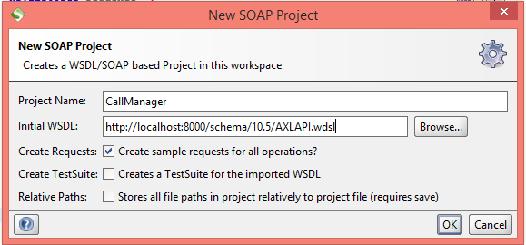
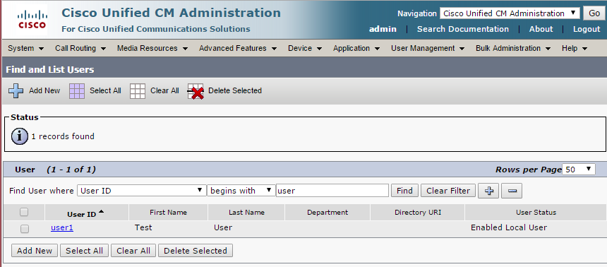
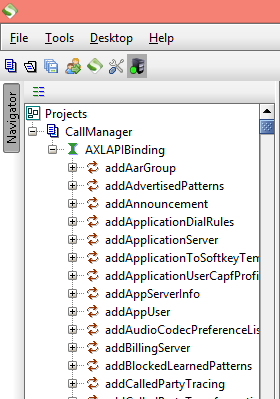
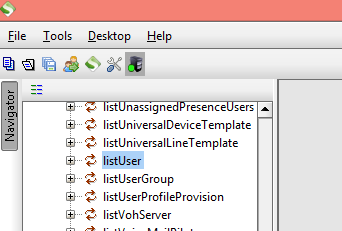
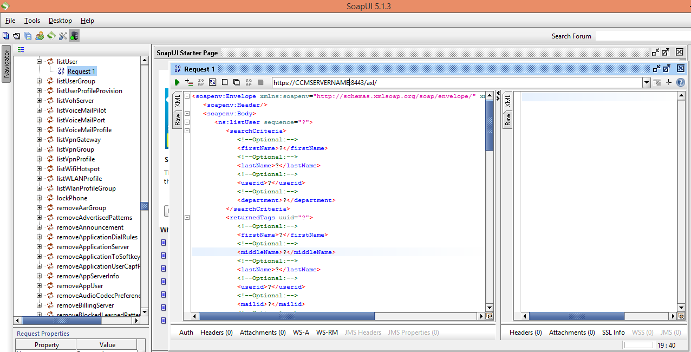
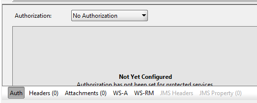
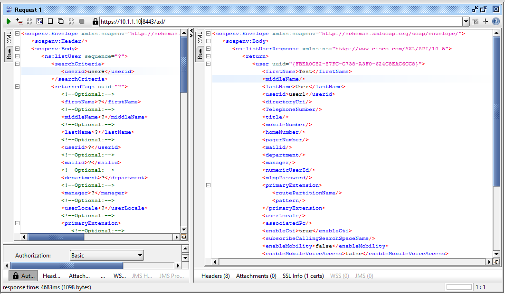

+++
title = "Using CallManager APIs for fun and profit: Part 1 - SoapUI"
date = "2015-05-29T16:13:00+00:00"
author = "John Howard"
authorTwitter = "fatred" #do not include @
cover = ""
tags = ["CallManager","Automation","API","Devops","Python"]
keywords = ["", ""]
description = ""
showFullContent = false
readingTime = false
hideComments = false
color = "" #color from the theme settings
aliases = ['/2015/05/automating-for-fun-and-profit.html']
+++
This is one of those posts that I will constantly refer back to... ;)

In my day job it's clear to me that we need to automate more and more of the dumb day to day stuff.  One of those things is Leavers and Starters on our phone system.  

We employ Cisco CallManager, much like the rest of the world, and if you have ever spent any time with it, you will know that its VASTLY over-complicated to manage.  A single extension on someones' desk requires (at least):

* an End User object
* a Device Profile (extension mobility)
* a Phone object
* a Voicemail profile*

In order for these to exist and function you need access to appropriately configured:

* Device Pools
* Calling Search Spaces
* Partitions
* Regions
* Clusters
* Gateways

All of this ends up being at least one person's full time job once you get over a certain level of employees.

There are various functions within the standard Web GUI including the entertainingly named "SuperCopy" which cuts the admin burden from about 40 mins per user of manual click-type, to about 20 mins.  A valuable 50% saving in time, but that's still 20 mins of click-type that we could all do without.

There is however, a rather rich (read: confusing) API for CallManager called AXL, which with the right amount of time and dedication can be tamed.

Over the past 2 weeks I have been mulling over my own SuperCopy scripts in python, with a view to swapping the 20 mins of click-type for 10 questions and 10 seconds.  The right hand page will be to add phone provisioning into our existing Account Setup automation over AD, thus eliminating all manual operations for leavers and starters entirely.  If it works, we look to gain an entire head in our team back on a full time basis to focus on break/fix and engineering improvements - a MASSIVE win.

I have said before, that the role of the Network Engineer is moving further and further away from fingerbashing CLIs.  If you cannot embrace APIs and scripting, then its my job to tell you that you are making yourself obsolete. Fabrics and flows are already replacing the classic tree architectures and packet based switching.  Our jobs are no longer about making things work and more about optimising whats there.  APIs and automation are how we as engineers stay ahead of the curve, and in employment.  On top of all of that, its more fun as well...

So, where to start?

---

## In the beginning there was an interface

Ah, CallManager, how I dread using they web GUI...

Everything you do on CUCM is on one of its 5 web interfaces (yes 5).  The vast majority of Move/Add/Change is in the Unified Admin section, but you can also configure system stuff in Unified Serviceability and OS administration.  Driving these requires a good chunk of change from even the most seasoned Pro.  

Its based on Java Tomcat, so its clunky, its slow, its fiercely hierarchical, but nowhere near visible about how that hierarchy works.   The longer you spend with it, the more ingrained the methodology becomes however.  This is how most Voice Engineers are able to get those previously described 50% savings in effort over time.

The key here is to consider that everything that happens in the web interface probably has a mirrored and logically labelled API call.  Once you figure out what it is you are doing, and where it is the data you Moved/Added/Deleted, you are half way through the battle. So the plan for me, and the plan for this post is to help you look at things you do on the GUI and replicate that in the API.

## Mimicing Interface processes with SoapUI Calls

I wont go into detail about suds or even python - other people have done a far greater job of that.  What I will talk about however, is API inspection and referencing it with SUDS...

So we must start with the API itself, and for that, I heartily recommend SoapUI...

To do the following, you will require a few Pre-Reqs;

1. The AXLToolkit from Cisco DevNet
2. SoapUI from SmartBear software (Free for the ugly-ass java client, but I can strongly recommend SoapUI NG Pro - its so much easier to use)
3. Python 2.7 + the suds libraries
4. A CallManager that you can play with - I will not be held responsible for you breaking a production system!!! Play safe!!!

_Now a word of warning here.  If you cannot look at the pre-reqs and sort that out without further instructions, then the rest of this series probably isn't for you.  I would recommend that you park this, and go away to brush up your simple API skills.  I would look at getting a RaspberryPi and having a go with Python via here. I would then move on to understand the framework using DevNet training and the AXL Cookbook._

Once you have the API, you need to extract the ZIP and get the schema folder hosted on a web server somewhere so that you can use it.  I cheat.  I browse to the folder I extracted the ZIP to, and then fire up a Python web server with a one liner.  If you have access to a private web server that's nailed up, this might be a better option. Just make sure that it doesn't require auth to see it, and for your own bandwidth, I would avoid making it public...

Once you have SoapUI installed, spin up a copy and start a new project.  You will be asked for the location of the WSDL.  Here you enter the URI for the webserver that hosts the AXLAPI.wsdl file.

Pay attention to the directories, which are the minimum version numbers required for all features of that WSDL to be supported.  It seems like stuff is backwards compatible, but to prevent unnecessary sadface, I would restrict yourself to the lowest version that you have in your environment.  



Now that you have the WSDL imported you can start to explore the features.  Full documentation for the APIs are online here too: Collab DevNet

You will note that throughout the API you see the same verbs at the start of a lot of methods;

* add
* get
* list
* remove
* update

The nouns after these verbs then start to make more sense, since they relate or name a CUCM object.

Take a look around, and then get a coffee.  Things are about to get nerdy - we will start with a simple read only job, then progress into changes via the API.

To do that, we are going to perform some tasks on a CUCM web GUI, then repeat that in the API.  We will then change something on the WebGUI and validate that changed on the API, and then do the same vice-versa.  Finally, we will add something new via the API and check it on the web...

## Searching

Lets go find an end user with "user" in their username... I wont insult anyone intelligence with a review of how to drive the GUI ;o)



Great.  We have a user called "Test User" with username "user1".

In the API, searching is referred to as "list". So we need to find something to do with Listing Users. Expand the Project, CallManager, AXLAPIBinding tree to expose a list of all the methods we can use.



Then have a scroll down until you reach the ones starting with "list".  You want something referring to Users.



_Note: Don't confuse the user types.  We searched for a normal end user.  There is a whole separate section in the GUI for application users, and unsurprisingly the same is true in the API; listAppUser._

So we have something that looks like it might work in SoapUI.  Expand the tree alongside the method, to open up a pre-defined request.  Select that and magic appears in the foreground pane.



Here we can see an XML envelope that contains two main sections.  The first is the searchCriteria section.  The second is the returnedTags section.  Within lists we then have two additional fields at the bottom; skip and first.

## The Sections: searchCriteria

Search criteria is the equivalent of the search panel in the GUI.  Where in the GUI you have a dropdown to pick what youre looking for, in the API, you have optional fields to complete


So, much like the GUI, you pick a field to search on, and swap the "?" In the middle of the tags with what you want.  You can (indeed probably should) remove any search fields you don't need.


## The Sections: returnedTags

The returned tags section is essentially the API asking you to tell it what to obtain and return back to you in the reply.  SoapUI offers up a list of all the fields that appear in the WSDL, which depending on what you are looking up, could be a little or a lot of options.  

Since its a list of what you want returned to you, the values inside the field (default of ?) is largely irrelevant.  The reply will be populated with the real value from the system.

Something to consider here is that you probably don't need the vast majority of this stuff.  To start with leave this alone, but as you get to understand the replies and your requirement, you can remove the things you don't need...


## The Sections: skip/first

Finally, with certain get/list operations, there is a pair of fields at the bottom for managing the batching of results.


Skip basically says, from the first record in the database, skip past this number of records.  i.e. its the record start point for the query.

First basically says, starting from the record number indicated above, return the first x number of records.  It would be so much more sensible to refer to it as "return count".

So, assume you have 2000 users, you dont really want to yank them all in one go.  You could write a process that pulls users 50 at a time.  

Request 1 would say:

```xml
 <skip>0</skip>
 <first>50</first>
```

Request 2 would say:

```xml
 <skip>49</skip>
 <first>50</first>
```

So, for the purposes here, we don't care.  You either remove the start/first field completely, or at the very least, remove the "?" from the middle on both.  We now have a completed SOAP envelope ready to send.  

## The Sections: Request URI

Nearly there, now we have to configure SoapUI to talk to our server.  I have used a simple lab box that has basically nothing in it - YMMV.

At the top of the SoapUI request pane, we have the URI box.  This is the path to the AXLAPI service on your CUCM.  By default the hostname is set to CCMSERVERNAME.  We must update that to point at the IP/Hostname we are connecting to.


This information is required on a request by request basis.  Once you have entered it and saved the project it will remember it, but always check it before submitting the request.

## The Sections: Authentication

Finally, we need to pass valid Application User creds into the API.  In the lab here I am using the default web admin account.  I strongly recommend you create a dedicated application user with a strong password that only has permissions to the API.

At the bottom of the Request pane there is a tab for Auth.  This pops up to show you the config applied to the request for authentication.  By default there is none.  We need to select "add new authorization" to create a new auth token.



Select Basic from the drop down and click OK


Now enter your credential into the Username and Password boxes.  No other changes are required.


So, now you can submit your request.  Hit the Green play button at the top, and cross your fingers.


Woohoo! We have a response!

But hang on, its empty?  Word to the wise.  API Calls do not have wildcard matching unless you specify it.  

In our searchCriteria, we specified userid "user".  The username we looked up in the GUI was also "user".  Whats the difference?

In the GUI we said "UserID begins with user".  To replicate this properly we need a wildcard match, which on our API is the Percent Symbol (%).  

So, to mimic the options in the GUI, here are the options:

| query | operand |
|:----- |:-------------:|
| Begins with | `value%` |
| Ends with | `%value` |
| Contains | `%value%` |
| Is Exactly | `value` |
| Is empty | `(nothing)` |
| Is not Empty | `%` |

Update your searchCriteria to be "user%" and resubmit.



Boom!  One massive blob of XML that represents all of the fields assigned to an End User.  Bit much tho eh?

What you actually get on the User Search screen is UserID, First Name, Last Name, Department, DirectoryURI and Status.

Lets cull and reorder our requestedTags to make it look the same...


This is of course great to see, but its not viable to drive all our interactions through SoapUI.

In the next post we will look to python to start framing a script that does this for us.  Then we can start the real work of adapting that to writing changes into the system.
