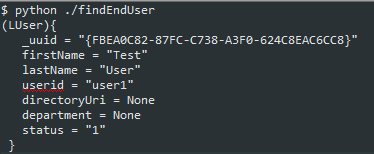

+++
title = "Using CallManager APIs for fun and profit: Part 2 - Python"
date = "2015-05-31T18:33:00+00:00"
author = "John Howard"
authorTwitter = "fatred" #do not include @
cover = ""
tags = ["CallManager","Automation","API","Devops","Python"]
keywords = ["", ""]
description = ""
showFullContent = false
readingTime = false
hideComments = false
color = "" #color from the theme settings
aliases = ['/2015/05/using-callmanager-apis-for-fun-and.html']
+++
In this part 2 of my API adventure, I will be looking at repeating what we did Part 1 via SoapUI, but this time in python using the suds library.  If you haven't read that yet, then really, please go back and do that. This will not be wildly useful otherwise.

## Getting SOAP-y with Python suds

Yeah I went there...

So, we have a process that allows us to programatically look stuff up. Only its not very repeatable, and therefore not much use yet.  With this post I will take you through the creation of a python script that mimics what we did previously - finding things, and showing them to you.

For brevity, I am not going to take you through setting up Python and installing suds.  With respect, if you can't figure that out yourself, you probably shouldn't be playing with this stuff anyways.  Its also a post in and of itself, and plenty of others have covered it well.  I am also using Ubuntu for this work.  You can use OSX pretty much interchangeably since its all *NIX based.  Windows will work, but I warn you now, its quirky.  Obviously I don't provide any sort of warranty with anything I do here, and whilst I will try to help people who feedback about problems via windows, my initial response will probably be, "can you not use linux instead?"

So. Much like when we talked about the 4 sections of the SoapUI request, we will look at 4 sections of our Python script

1. modules
2. required variables
3. API "proxy object" creation
4. obtaining data via the proxy object

## The Sections: modules

All useful python scripts will require some sort of modules loaded up before you use them. In our case we need:

* ssl
* suds
* logging

_Note that its possible you have genuine public, or enterprise issued certificates on your CallManagers.  My lab doesn't, therefore we use the ssl module to allow us to bypass cert verification for this script.  This is not production worthy, but a neccessity as we develop. Consider that this should probably be reviewed before you put stuff into Production._

All module loads are done at the very top of the file.  They look a bit like this:


## Section: Required Variables

Variables are storage spots that you use throughout the script be it for reference purposes or for the application itself.  When you start a script you will find yourself needing some reference info that is defined once and used one or more times as you follow through the process.  It makes sense to put them at the top of the script so that they are easily located and of course, defined before anything later need to actually use it.

As mentioned above, I have a self signed cert on my CUCM lab.  Therefore I have to setup python's urllib to ignore the fact its not verifiable.  There are a bunch of ways you can do this, my chosen one liner is bolted onto the top of all my stuff directly beneath the module inits.


Next I have some credentials stored (again not a good production practice, but fine here in dev), and the WDSL and Service URL location that we provided to SoapUI previously.


## Section: API Object Creation

So this is where the magic happens.  We use the SUDS Client feature to create an objet that can be used to join our python script with our CallManager API.  Its known as a Proxy Service Endpoint, and effectively operates a proxy-esque function of taking requests in and spitting return data back  Below is the line, so lets discuss the details.


At the top of the script we loaded the Client feature of the suds module.  Here, we are calling that Client feature, with the arguements required in the brackets.  

wsdl_url: this is defined in our required Variables, and is the location for the WSDL that defines how the API can operate.  
location: is is set to equal the value within service_url, which again was defined earlier, and is the API location on the CUCM server.  
Finally we pass in a username and password, again pre-defined, such that API calls can be authenticated.  All of this is then assigned to a new python object called cucm_server.  This is so that we can access methods of the API by entering `cucm_server.service.<methodname>`.

## Section: Obtaining data from the Proxy Object

Now we have an object created, lets go hit up our callmanager for that same query "show me End Users with userid's beginning with "user"


Lets break that one down.  In SoapUI, we had pretty formatted XML that used indentation to define what comes under what XML element (or section if you will).  The bit we are interested in is the listUser elements onwards within the XML.


You see the next element tier under list user is searchCriteria.  That then has some fields within (we only needed one of them - userid).

The following element tier is returnedTags, and that has a series of fields under it too.

Our job is to split each initial tier into slots of our request arguments using comma delimiters.  Within each of those slots we then use python dictionary formatting to define list each of the xml tags within these sections, as name:value pairs.  The dict format wraps this in curly braces "{ }" to define the start and end of the dict pairs.

So in our Python code, we have used the cucm_server proxy object to consume the service element, calling the listUser method, defining the search criteria in the first argument slot, and the returned tags we need in the second argument slot.  If we were batching we would send in skip to the 3rd slot and "first x" records into the 4th slot.  We ae then storing the results we get into the new object "users".

Providing that line worked, then we wont have seen any feedback at all, but we now have a thing called users that we can interrogate.  

The next line uses a standard programming construct known as a for-each loop.

In this first line we setup the loop, and in the lines below (denoted with an indent), we iterate through each logical object stored and repeat the same tasks over and over until we have finished, or we tell it to stop.

So in my example, I say "for each user in the users object, print out the entire of the stored information."

You can now save, and run the command.  If the universe is aligned, you have access to the WSDL, the Service URL on the Server, your creds are correct, and there is a user that matches your search criteria, then you will hopefully see something like this:



_Note: if you get something like the below when you run your dev script, then you are running python prior to 2.7.9.  Either upgrade, or comment out the ssl context line in the Required Variables section._


Great, but I want to be a bit more clever now.  I just want to know I have a match and if so, only need to see the UserID.


This change in the foreach loop will print the test "Userid found: and then append the userid.  This line will appear for each user you have a match for.  If no match is found, no text will be printed on the screen.


So there we have it a script that goes to CUCM and gets data.  Below is the full script for you to copy and paste to your hearts content (or nick it from github as a gist)

```python
import ssl
from suds.client import Client
import logging
# ignore ssl pain
ssl._create_default_https_context = ssl._create_unverified_context
# setup creds for auth
username = 'admin'
passwd = 'lab_password'
# setup access to the wdsl and the pub
#
# NOTE: this has localhost:8000 for the wsdl.
# the wsdl isnt available on the server (why i will never know)
#
# two choices:
# 1) host the wsdl online somewhere you know, and refer to that
# 2) in another terminal browse to the AXLToolkit/schema/10.5/ folder
#    run 'python -m SimpleHTTPServer' in that dir.
#    that spins up a mini web server you can read the wsdl from...
wsdl_url = 'http://localhost:8000/schema/10.5/AXLAPI.wsdl'
service_url = 'https://10.1.1.10/axl/'
# Create an object to communicate with the API called cucm_server.
# this is how we pull and push data into CUCM via XML.
cucm_server = Client(wsdl_url, location = service_url, username=username, password=passwd)
# read some data in.
#
# create a new object called users and read in the user details based on our query to SoapUI
users = cucm_server.service.listUser({'userid':'user%'},{'userid':'', 'firstName':'', 'lastName':'', 'department':'','directoryUri':'', 'status':''})
# spit that data back to me on the screen.
for user in users['return']['user']:
    print user
```

Next up we start to get creative and make changes first via SoapUI, then in part 4 via python.
