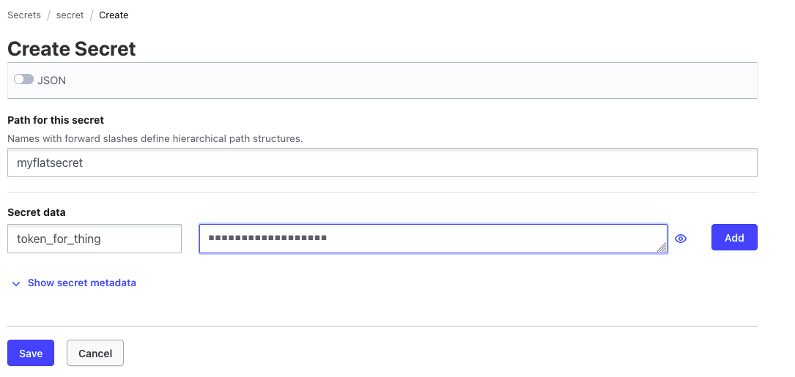
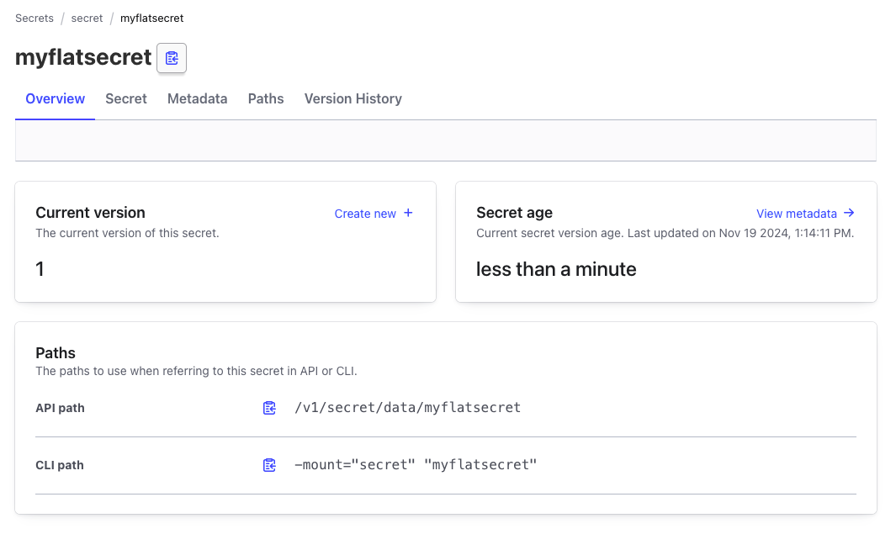

## Some Vault Primitives

Pretty much everywhere you go in vault you will find you need a few building blocks to make _anything_ work.

### Env Vars

Regardless of how you choose to talk to vault (CLI/WebAPI/SDK), you will find that the most common way to "encode" the vault settings is in an Environment variable. This is a nod towards its "cloud native" upbringing, where config files are the devil or something.

> Note: there are ways to have a config file like setup, and in the API you can code in the settings with vars instead of envs. If you RTFM, you'll absolutely find what you need here.

The most useful vars are: 

| name | example | purpose | 
| --- | --- | --- |
| VAULT_ADDR | http://localhost:8200 | tells your client (CLI/SDK) where to find the vault API service |
| VAULT_TOKEN | hvs.something | credential your client (CLI/SDK) will use for accessing secrets |
| VAULT_SKIP_VERIFY | true/false | if you have TLS from self signed certs, you'll need this to be false |
| VAULT_INSECURE | true/false | if you don't have TLS at all, you'll need this to be true |

### mount points, paths and data

Inside of vault your secrets need to live somewhere. Before we spoke about engines, which are _types_ of secret backend. When you configure an instance of a backend (e.g. the "key/value v2") engine, you have to name that instance, which will become the vault _mount-point_. In our testbed we have a kv-v2 instance which has a mount-point called `secret`.

> Note: I don't like that naming, but I cant change the dev instance, and I want this to be generic. Play about with names and referencing the content using the examples with different names - you'll get the hang of it.

A path is describing the top level name for this secret, _within_ the mount-point. Assume for a moment you were looking at the Vault UI, and you clicked on the "secret" _mount-point_. The list of objects you see in this view are all the path options you have to work with. You can have any number of paths within a mount-point, containing one or more secrets underneath in the k/v store.

The data is the actual key value pairs we find under this path, which could be one or more entries, in flat k/v, or if you like, a dictionary encoded with json.

for example: 

```
mount-point: secret
path: myflatsecret
data: {"token_for_thing": "293u4iehjkfdvhqink"}

--- 

mount-point: secret
path: mysimplesecret
data: {"username": "dave, "password": "Very-secure-information!"}

---

mount-point: secret
path: mycomplicatedsecret
data: {"wireguard": { "keys": {"privkey": "privkey1", "pubkey": "pubkey2"}, "ip": {"outer": "100.64.0.0/30", "inner": "100.64.255.0/31"}}}
```

Here we are creating that first secret in the WebUI



And here is what it looks like when we want to view it in the UI:



Lets create that second secret via the vault command line tool

```
~ vault kv put -mount="secret" "mysimplesecret" username=dave password=Very-secure-information\!
======= Secret Path =======
secret/data/mysimplesecret

======= Metadata =======
Key                Value
---                -----
created_time       2024-11-19T12:19:10.943201Z
custom_metadata    <nil>
deletion_time      n/a
destroyed          false
version            1
```

and lets fetch it back to check

```
~ vault kv get -mount="secret" "mysimplesecret"
======= Secret Path =======
secret/data/mysimplesecret

======= Metadata =======
Key                Value
---                -----
created_time       2024-11-19T12:19:10.943201Z
custom_metadata    <nil>
deletion_time      n/a
destroyed          false
version            1

====== Data ======
Key         Value
---         -----
password    Very-secure-information!
username    dave
```

Finally, lets make the last one against the web api, leveraging the cli tool `curl`

```bash
curl -X PUT -H "X-Vault-Request: true" -H "X-Vault-Token: root" -d '{"data":{"wireguard": { "keys": {"privkey": "privkey1", "pubkey": "pubkey2"}, "ip": {"outer": "100.64.0.0/30", "inner": "100.64.255.0/31"}}},"options":{}}' http://localhost:8200/v1/secret/data/mycomplicatedsecret

(response)
{"request_id":"55d9e183-5f18-3231-ea28-63802f9d85de","lease_id":"","renewable":false,"lease_duration":0,"data":{"created_time":"2024-11-19T12:25:17.82545Z","custom_metadata":null,"deletion_time":"","destroyed":false,"version":1},"wrap_info":null,"warnings":null,"auth":null,"mount_type":"kv"}
```

lets check that with another curl:

```bash
curl -XGET -H "X-Vault-Request: true" -H "X-Vault-Token: root" http://localhost:8200/v1/secret/data/mycomplicatedsecret
{"request_id":"86f26a97-9cfd-d123-4c67-84c8f4b9a07c","lease_id":"","renewable":false,"lease_duration":0,"data":{"data":{"wireguard":{"ip":{"inner":"100.64.255.0/31","outer":"100.64.0.0/30"},"keys":{"privkey":"privkey1","pubkey":"pubkey2"}}},"metadata":{"created_time":"2024-11-19T12:25:17.82545Z","custom_metadata":null,"deletion_time":"","destroyed":false,"version":1}},"wrap_info":null,"warnings":null,"auth":null,"mount_type":"kv"}
```

> note: if you want to be a bit extra, you can use the httpie package, or you can pipe the response to `jq` to pretty print the output. I prefer the latter with a filter string of .data.data and -s on the curl to prevent the status view appearing, like so:

```bash
curl -s -XGET -H "X-Vault-Request: true" -H "X-Vault-Token: root" http://localhost:8200/v1/secret/data/mycomplicatedsecret | jq .data.data
{
  "wireguard": {
    "ip": {
      "inner": "100.64.255.0/31",
      "outer": "100.64.0.0/30"
    },
    "keys": {
      "privkey": "privkey1",
      "pubkey": "pubkey2"
    }
  }
}
```

> Note: the vault CLI tool generated these curl commands for me. You make the vault cli query work, and then add `-output-curl-string` to the vault command where it will spit out a curl command that does the same thing. Neat!

### Everyone loves a naming convention...

Inside of vault, the breakdown of paths vs key/values is up to you - you really can choose any scheme you like. Keep an eye on these specific examples above however - we will use them a few times in the remaining activities.

Be mindful that there is a high RoI for security by centrally storing your secrets in a place where the access is not only authenticated, but logged and audited. That comes with a cost to operations because all those extra network calls and crypto, and potentially, the vault being locked and unusable, means your data is slow, or posibilty entirely unreachable at runtime. 

As you get further and further into Vault, you will find policies and accessors, which allow you do limit the scope of an authenticated token to specific things and places in the vault.

TLDR: Vault isn't for general purpose k/v storage. Protect what needs protecting, not everything and the kitchen sink. Also consider that whatever you do the first time will probably end up in the bin when you get into the technology more. Lean into that - don't overthink things.

So now we know what our building blocks are, lets dig into some [real life examples](/posts/making-more-use-of-vault/) with clients. 
