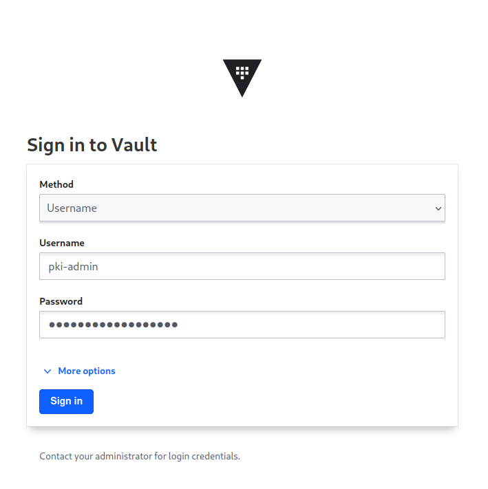
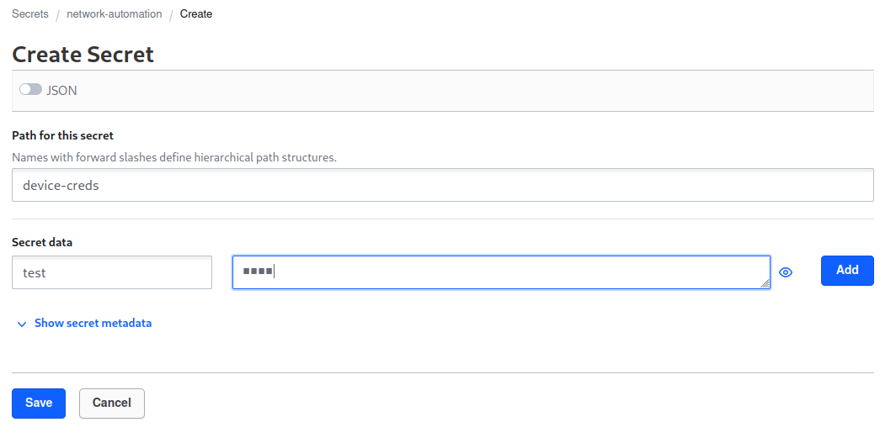
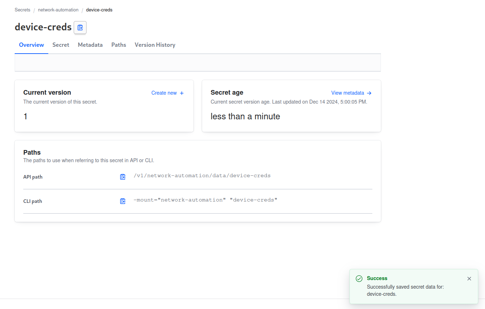
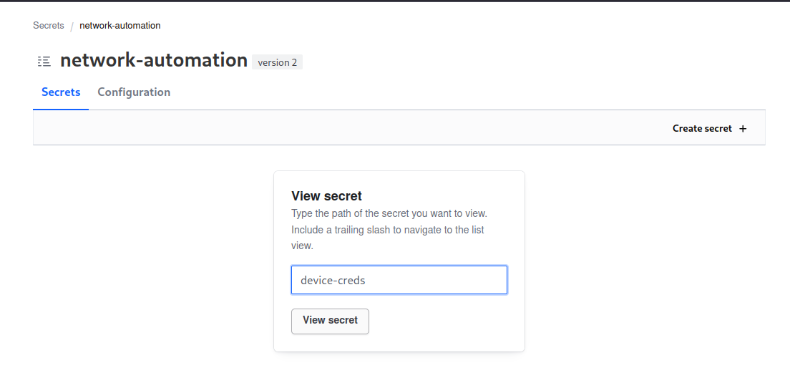
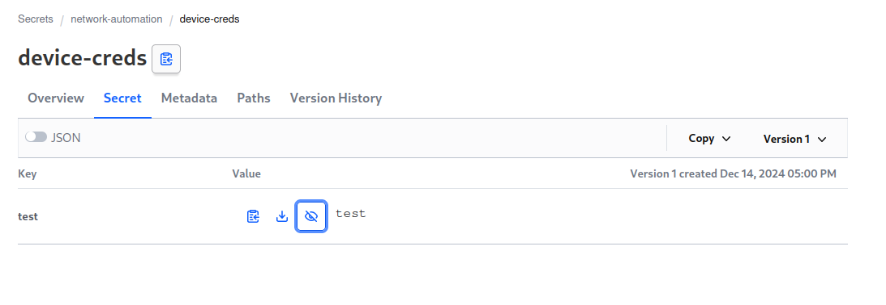
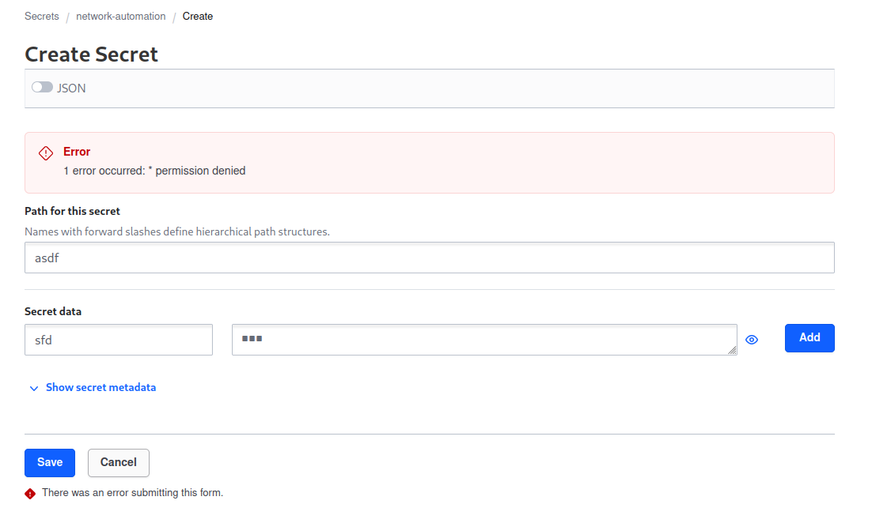

## abstract

Following on from the Hashicorp Vault "how-to" series. Lets dial things up a notch, and setup a PKI in vault that can issue "real" certificates for your devices. 

This has a couple of real tangible benefits. 

1. No more `verify=false` and/or urllib hacks to connect to TLS secured endpoints
2. No need to fight `openssl` to wrangle self signed (or for the really brave, a manual CA)
3. Full automation support to enable estate wide renewal in minutes, not _half a lifetime_.

So lets get into it.

---

## pre-requisites

First, we need a vault. If you are really going to do this in production, I recommend you get a "real" vault. up and running. The [hashi docs](https://developer.hashicorp.com/vault/tutorials/getting-started/getting-started-deploy) are great. If you just want to faff about a bit to learn, you can use my docker setup from [here](https://www.problemofnetwork.com/posts/bootstrapping-hashi-vault/) if you like. 

It will be really important to build out an authentication system, but its too much to cover here. I'm cheating and using a root token for the terraform bit, but we will create some scoped tokens for the _actual_ signing requests, within the terraform repo itself. You should poke around this more to setup a scoped token for the terraform to use that leverages policy to only have permissions to the parts of the vault needed.

Because there was soooo much to do inside of vault, I decided to make this into terraform and put it into git. You should clone the repo from `https://github.com/fatred/exploring-vault.git` into a place on your system. 

Before running anything you will need the [vault client](https://developer.hashicorp.com/vault/docs/install) on your system, and the [terraform client](https://developer.hashicorp.com/terraform/tutorials/aws-get-started/install-cli) too.

--- 

## Vault PKI setup

As previously discussed, Vault offers many options for storing secrets, but it can also be used to produce them as well. A software HSM if you will. To be able to make use of the PKI tooling, we have to enable the PKI engine, and configure a number of nerd knobs to ensure that what we deliver is of value.

> Note: Vault is written in golang, and it's generally understood that the golang crypto libraries (at least the ones used fof x509 work in vault), are incredibly strict in terms of applying the RFCs. There are a number of things that openssl might allow, that the vault will not. Two examples I ran into include use of underscores in common names (vault say no, openssl say meh), and invalid PathLength attributes in the chainlength field - if you say 1 and you have an intermediate CA, then this will be invalid. You should read your error messages carefully, and refer to the [issues in the stdlib](https://github.com/golang/go/issues?q=is%3Aissue+crypto%2Fx509) for `crypto/x509`. Chances are you will find something specific in there.

So, lets get started with some policies we will need in the vault system. In the repo, you want to look inside the `terraform` subfolder.

If you review the items in the repo, I have broken them out to make them easier to find and interact with. This is not actually required in TF world, but thats an exercise for the reader.

#### providers.tf

This file is typically used to "configure" the terraform _module_ (aka this folder and its descendent .tf files). Here we say we want to use the vault provider version 4.2.0. We then instansiate it, providing no variables. If you _want_ you can put the vault_addr and vault_tokens in here, but we will use environment vars for this instead.

At this point, you can visit your shell and enter the terraform folder of the repo. Export the `VAULT_ADDR` and `VAULT_TOKEN` for your vault instance, and then run `terraform init`. This should fetch the content for the provider and return a success message. If it doesn't make sure your internet is working to get the provider, and that the vault isn't sealed.

```
➜  terraform git:(main) terraform init
Initializing the backend...
Initializing provider plugins...
- Finding hashicorp/vault versions matching "4.2.0"...
- Installing hashicorp/vault v4.2.0...
- Installed hashicorp/vault v4.2.0 (signed by HashiCorp)
Terraform has created a lock file .terraform.lock.hcl to record the provider
selections it made above. Include this file in your version control repository
so that Terraform can guarantee to make the same selections by default when
you run "terraform init" in the future.

Terraform has been successfully initialized!

You may now begin working with Terraform. Try running "terraform plan" to see
any changes that are required for your infrastructure. All Terraform commands
should now work.

If you ever set or change modules or backend configuration for Terraform,
rerun this command to reinitialize your working directory. If you forget, other
commands will detect it and remind you to do so if necessary.
```

### Tokens and policies

First thing we want to put into vault is a method to login that _isn't_ the root token, and to limit the capabilities of these accounts to least priviledges possible.

#### network-automation-kv.tf

This is creating a "vault_mount" resource called "network-automation" which is a key value v2 database. In otherwords, its a place we can put credentials and certs after we created them.

#### policies.tf

Here we have two policies that permit a client with that policy to do things. Its a subject/verb system that is quite similar to kubernetes and cloud IAM systems. 

In the first policy we we setup the ability to read `device-creds` in the `network-automation` mount point.

In the second policy we we setup the ability to create, update and read `device-creds` in the `network-automation` mount point.

Idea here is that we have a human account that has more privs, and a service account used by automation that has less privs. 

#### auth.tf

Finally, we enable the `userpass` auth method, then create two accounts: 
* the `pki-admin` user who gets the `pki-admin-vault-policy` on login, which means they can do all the things that policy permits
* the `device-deployer` user who get the `pki-reader-vault-policy` on login, which means they can only read the creds/certs from the automation repo.

#### deploying this

make sure the network-automation-kv, policies and auth files are uncommented, and then run your first `terraform apply`

```
➜  terraform git:(main) terraform apply      

Terraform used the selected providers to generate the following execution plan. Resource actions are indicated with the following symbols:
  + create

Terraform will perform the following actions:

  # vault_auth_backend.userpass will be created
  + resource "vault_auth_backend" "userpass" {
      + accessor        = (known after apply)
      + disable_remount = false
      + id              = (known after apply)
      + path            = (known after apply)
      + tune            = (known after apply)
      + type            = "userpass"
    }

  # vault_generic_endpoint.device-deployer will be created
  + resource "vault_generic_endpoint" "device-deployer" {
      + data_json            = (sensitive value)
      + disable_delete       = false
      + disable_read         = false
      + id                   = (known after apply)
      + ignore_absent_fields = true
      + path                 = (known after apply)
      + write_data           = (known after apply)
      + write_data_json      = (known after apply)
    }

  # vault_generic_endpoint.pki-admin will be created
  + resource "vault_generic_endpoint" "pki-admin" {
      + data_json            = (sensitive value)
      + disable_delete       = false
      + disable_read         = false
      + id                   = (known after apply)
      + ignore_absent_fields = true
      + path                 = (known after apply)
      + write_data           = (known after apply)
      + write_data_json      = (known after apply)
    }

  # vault_mount.network-automation will be created
  + resource "vault_mount" "network-automation" {
      + accessor                     = (known after apply)
      + audit_non_hmac_request_keys  = (known after apply)
      + audit_non_hmac_response_keys = (known after apply)
      + default_lease_ttl_seconds    = (known after apply)
      + external_entropy_access      = false
      + id                           = (known after apply)
      + max_lease_ttl_seconds        = (known after apply)
      + options                      = {
          + "version" = "2"
        }
      + path                         = "network-automation"
      + seal_wrap                    = (known after apply)
      + type                         = "kv"
    }

  # vault_policy.pki-admin-vault-policy will be created
  + resource "vault_policy" "pki-admin-vault-policy" {
      + id     = (known after apply)
      + name   = "pki-admin-vault-policy"
      + policy = <<-EOT
            ## place to store account details for automation towards the devices
            path "network-automation/+/device-creds" {
              capabilities = ["create", "update"]
            }
            path "network-automation/+/device-creds" {
              capabilities = ["read"]
            }
            ## place to store certificates we generate for the devices
            path "network-automation/+/device-certs" {
              capabilities = ["create", "update"]
            }
            path "network-automation/+/device-certs" {
              capabilities = ["read"]
            }
            ## Vault TF provider requires ability to create a child token
            path "auth/token/create" {  
              capabilities = ["create", "update", "sudo"]  
            }
        EOT
    }

  # vault_policy.pki-reader-vault-policy will be created
  + resource "vault_policy" "pki-reader-vault-policy" {
      + id     = (known after apply)
      + name   = "pki-reader-vault-policy"
      + policy = <<-EOT
            ## place to store account details for automation towards the devices
            path "network-automation/+/device-creds" {
              capabilities = ["read"]
            }
            path "network-automation/+/device-certs" {
              capabilities = ["read"]
            }
            ## Vault TF provider requires ability to create a child token
            path "auth/token/create" {  
              capabilities = ["create", "update", "sudo"]  
            }
        EOT
    }

Plan: 6 to add, 0 to change, 0 to destroy.

Do you want to perform these actions?
  Terraform will perform the actions described above.
  Only 'yes' will be accepted to approve.

  Enter a value: yes

vault_policy.pki-admin-vault-policy: Creating...
vault_policy.pki-reader-vault-policy: Creating...
vault_mount.network-automation: Creating...
vault_auth_backend.userpass: Creating...
vault_auth_backend.userpass: Creation complete after 0s [id=userpass]
vault_policy.pki-reader-vault-policy: Creation complete after 0s [id=pki-reader-vault-policy]
vault_policy.pki-admin-vault-policy: Creation complete after 0s [id=pki-admin-vault-policy]
vault_mount.network-automation: Creation complete after 0s [id=network-automation]
vault_generic_endpoint.pki-admin: Creating...
vault_generic_endpoint.device-deployer: Creating...
vault_generic_endpoint.device-deployer: Creation complete after 0s [id=auth/userpass/users/device-deployer]
vault_generic_endpoint.pki-admin: Creation complete after 0s [id=auth/userpass/users/pki-admin]

Apply complete! Resources: 6 added, 0 changed, 0 destroyed.
```

#### testing those new accounts

Visit your terraform web interface and try the new creds.

First, we will login as `pki-admin`. 

Pick username from the login, and type the creds.



The policy we created only allows touching `device-creds` and `device-certs` paths. Neither of these exist yet, so lets try and make the creds one with a test entry.



Assuming it all goes to plan, you get the secret page.



Lets now logout and test that we can read the cred we just created, and then prove we cant create something else.

When we fist login as `device-deployer` we cannot see anything, and we have to provide a path to check. Enter `device-creds`



We are now able to view that test credential



And finally lets prove we can't make something new.



So there we go, we now have accounts that can do the needful. Lets move on to making the PKI store.

### PKI engine

The PKI engine is specialised plugin in vault that knows how to make certificates with a simplified request.


### Shipping with Terraform

### Root Trust

## Python for cert production

### Cert content

### Generating Certs

### Vaulting the cert for later use

### Fetching the cert again

## Clab env for testing

### Minimal Nokia SRL Env

### Template for SRL certs

### How/Where to use the cert

## Wrapping it up

### Generation Run

### Renewal Run

### Testing