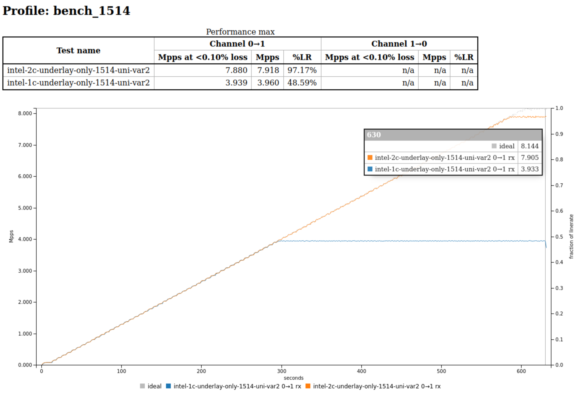
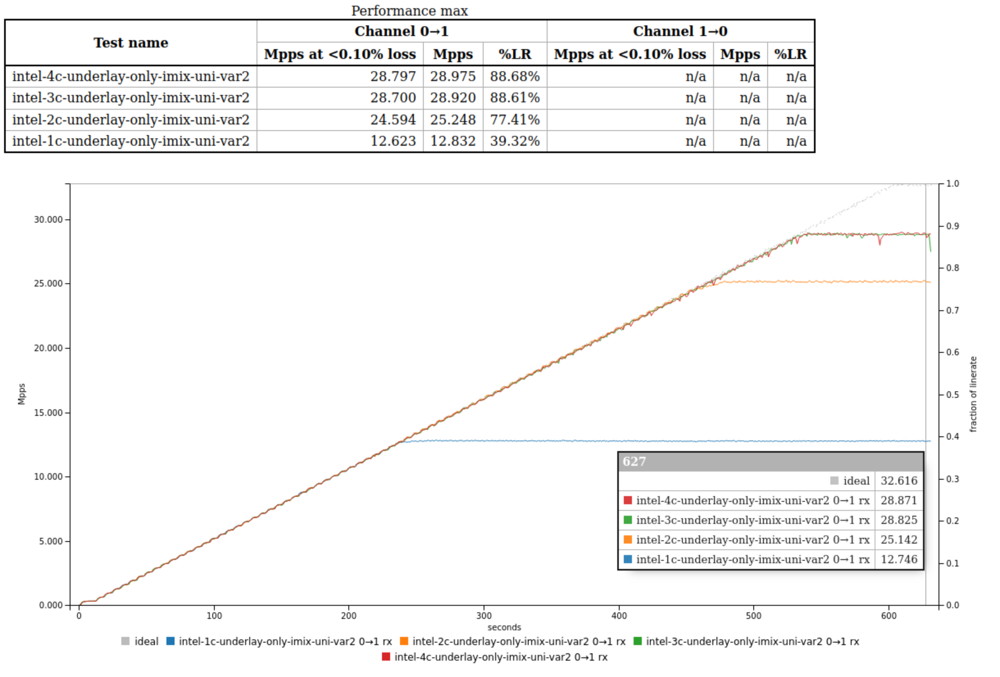
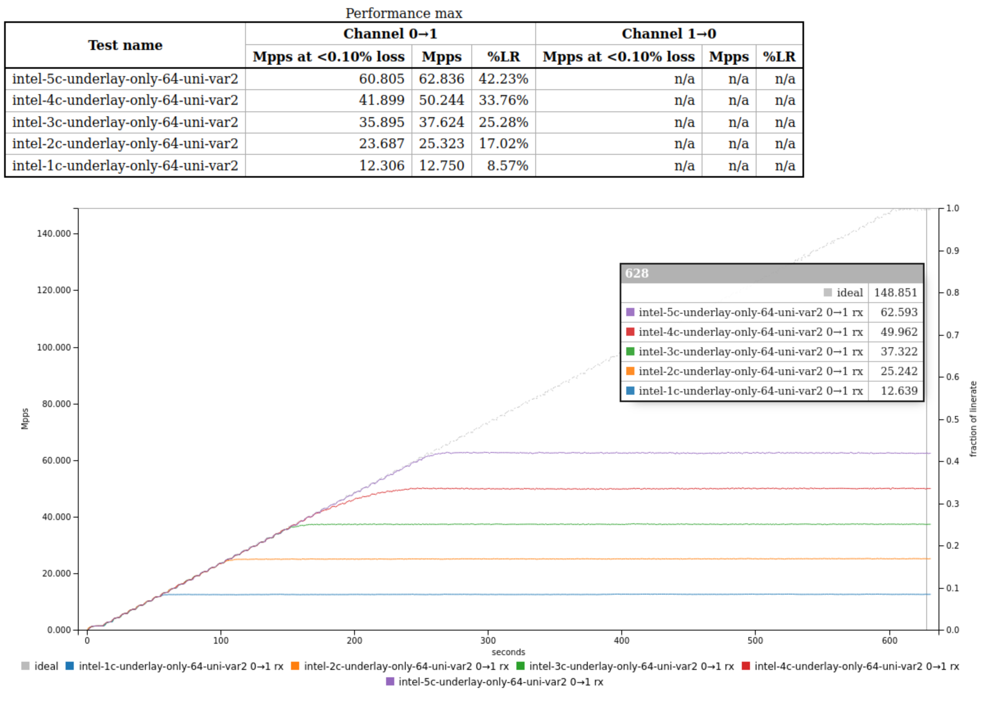

+++
title = "Using VPP as a MACSEC Replacement"
date = "2023-08-25T13:26:03+02:00"
author = ""
authorTwitter = "" #do not include @
cover = ""
tags = ["", ""]
keywords = ["", ""]
description = ""
showFullContent = false
readingTime = false
hideComments = false
color = "" #color from the theme settings
+++

As part of my VPP Adventures series, we have talked about what VPP is, why its interesting, and how we can prove it works. Today we spend a bit of time on what we can actually do with it.

### Who _actually_ uses MACSEC these days?

My first interest for a real world test of VPP was straight BGP routing for DFZ connected services. Kinda obvious no? For long and complicated reasons, it actually wasn't (more specifically it couldn't - we use IS-IS as part of our edge routing environment and VPP has issues there). Blocked on that, we found ourselves looking at something more esoteric.

For a long time it was drummed into me that any ISP service could be snooped on. In the modern age of TLS all the things, I don't care if someone taps my transit/dia for example. I would prefer they don't clearly, but doing so is unlikely to expose anything other than metadata that can be hoovered up at any other midpoint on the network too. Private circuits are a little more sensitive however. Network virtualisation like MPLS has long been a challenge for privacy minded places. You are much more likely to find some unencrypted flows on private connections, and no less likely to find a silent/undocumented tap at the service provider.

Historically for many a year the solution here was either a VPN or MACSEC, which would encrypt the data flowing over your private link between your facilities. Having known and used both in production before, I can speak from experience when I say neither is a silver bullet. The former is usually complicated to setup (to some degree at least) and rarely able to perform at high speeds. The latter is often significantly faster. MACSEC utilises high powered crypto engines on specialised hardware, taking the speeds much closer to line rates. This speed comes at a cost tho - invariably a _very high_ cost. Its common to find the MACSEC features and blessed hardware to add 50k USD per device to your budget.

Side effect - large amounts of people use VPNs (point to point, or perhaps SD-WAN), complain that theyre very slow, or the hardware to run fast is too expensive. Those who have more money than sense (or a gun pointed at them), will likely have MACSEC running already.

We had a new site coming and the MACSEC cost was extortion. Somehow i stumbled on an Intel Whitepaper describing VPP with AVX512 offloads for high speed Wireguard - the final spec offered 80gbits/s encrypted flow.

So the challenge was set - replace MACSEC with wireguard, and keep as close to 100G line rate as possible.

### Requirements

Firstly, the rates. We would like to get as close to 100G to _transit_ the device as possible. That is to say, the stream of unencrypted to encrypted traffic wants to be in the ballpark of 100G. The two cards we have access to are the Mellanox ConnectX5 2x100G (CDAT version), and the Intel e810 2x100G (CQDA2 version). Visibly, we have 2x100G full duplex ports, so physical box is ticked.

Electronically they both have PCIe Gen 4 x16 interfaces, which can carry 256Gbits. This is where we see our first bottleneck. Two 100GB Full duplex flows would need 400Gbits of bandwidth. This means that one card, regardless of port speeds could only forward a little over half of the full duplex peak capacity.

There is also an opaque bottleneck here, specific to DPDK. The DPDK concept assigns CPU cores to the RX/TX buffers of the NIC directly - this is where the speed comes from. If you have a dual socket system, the PCIe lanes that connect your NIC to the CPU complex will be hard wired to one socket. If you wanted to use the PCU cores from the other NUMA domain, packets will have to traverse the QPI bus and this introduces latency to the process. My servers are single socket, so that doesn't affect me, but if you have beefy dual socket systems, be sure to map your PCIe lanes and NUMA domains as part of your setup work.

Lastly, in testing we found that despite being dual interface cards, both the e810 and the CX5 have silicon limitations that mean you only get line rates on one port. In other words, the ASIC is limited to 148.1Mpps @ 64b, regardless of it you use one port or two. Therefore, to meet our design goal of line rate _transit_, I need two NICs per server - one for upstream and one for downstream.

Since the paper we were trying to replicate used e810, we stuck to that.

CPU wise we have two main options - AMD Epyc and Intel Xeon. In our tests we went for entry level CPUs for cost reasons. The AMD we chose was the 7313p which is cheaper, boasts higher base clock and core counts, whilst lacking AVX512. The Intel Silver 4310p has a slower base clock, but access to AVX512 instructions and Intel QuickAssist. At the time of acquisition, the AMD 4th Gen was not really competitive on price, hence wby the AVX feature disparity. Both obviously support the multiple PCIe Gen4 lanes we need for the NICs. In the whitepaper they use Xeon Platinum CPUs. This is not an option for us, so we started cheap and agreed to scale up based on the test results.

Chassis we kept simple. We used the 1U Supermicro A+ servers. This was not the best idea, but we can explain that later.

With the hardware options sorted, We could then start to look at the service design.

For the OS, we started with Rocky8 and quickly binned that when VPP wouldnt compile (os-release mismatches). On advice from Pim I went for Debian 12, since it was fresh out and offered a bunch of latest and greatest kernel things. We later found that quickassist drivers dont yet support deb12, but this again is later found to be moot.

For VPP, we are using the standard build process to `make-release` the 23.06 branch, including Pim's lcpng plugin, such that we can activate this as needed.

MACSEC is an L2 encryption tech where the frame is encrypted, and wrapped in a new frame with the MACSEC encryptors src/dst mac and the crypto header. In practical terms that means we have an L2 path and "something" in the middle just magically encrypts/decrypts as things pass on by.

Wireguard is a L3 protocol that encrypts traffic according to a src/dst IP profile (in a similar concept to IPSEC tunnel mode).

This created an immediate conflict. In order to replicate existing functionality, I need to add a point to point VXLAN (headend replication style), bound to the wireguard point to point inside addresses, which are connecting over an outside point to point IP pair on the underlying medium.

Playing through the layers:

* DUT1 connects to DUT2 with a 100G DAC in port 1
  * DUT1 applies underlay IP 100.101.0.1/30
  * DUT2 applies underlay IP 100.101.0.2/30
  * DUT1 and DUT2 can ping each other and have full, unencrypted reachability to one another.
* DUT1 uses the underlay to peer with DUT2 and negotiate a wg0 tunnel point to point interface
  * DUT1 applies cryptolay IP 100.101.10.1/32
  * DUT2 applies cryptolay IP 100.101.10.2/32
  * DUT1 and DUT2 can ping each other at the crypto layer and have full encrypted reachability to one another
* DUT1 uses the cryptolay to form a vxlan_tunnel1 interface with DUT2, and bridges its second local 100G port 2 to the VXLAN tunnel
  * Traffic reaching DUT1 port 2 is bridged directly to vxlan_tunnel1, encapsulated into a VXLAN packet, forwarded to wireguard and encrypted and then passed via the underlay to DUT2
  * DUT 2 decrypts the traffic, hands the vxlan frame to the tunnel interface, which then forwards the original L2 frame to DUT2 port 2.

At first this sounds complicated, and there are a few areas this can go wrong, so lets break it down into each section, and test them all one by one, layering up the features as we go.

### Test 1: VXLAN over a cleartext p2p interface

VXLAN is quite cheap in VPP, and the L2XC used to bridge the physical port to the vxlan tunnel endpoint is even cheaper. Lets start with a simple VXLAN tunnel from DUT1 to DUT2, using the underlay p2p as the medium.

The VPP startup config is still the same for both DUT devices, with the worker threads per NIC being tweaked in each test:

```text
lol
```

In this DCI setup, we do not need to leverage lcpng, and we use basic VPP CLI primatives to configure the setup once at startup time. KISS.

DUT1

```text
comment { setup LLDP to make my life easy }
set lldp system-name DUT1 tx-interval 10
set interface lldp HundredGigabitEthernet81/0/0 port-desc HundredGigabitEthernet81/0/0
set interface lldp HundredGigabitEthernet81/0/1 port-desc HundredGigabitEthernet81/0/1

comment { bring up the ports }
set int state HundredGigabitEthernet81/0/0 up
set int state HundredGigabitEthernet81/0/1 up

comment { setup the underlay point to point }
set int mtu packet 9216 HundredGigabitEthernet81/0/0
set int ip address HundredGigabitEthernet81/0/0 100.101.0.1/30

comment { setup VXLAN over underlay p2p interface }
create vxlan tunnel src 100.101.0.1 dst 100.101.0.2 vni 10 instance 1 decap-next l2
set interface state vxlan_tunnel1 up
set interface mtu packet 9120 vxlan_tunnel1
set interface mtu packet 9120 HundredGigabitEthernet81/0/1

comment { bridge the "downstream" physical interface to the VXLAN tunnel }
set interface l2 xconnect vxlan_tunnel1 HundredGigabitEthernet81/0/1
set interface l2 xconnect HundredGigabitEthernet81/0/1 vxlan_tunnel1
```

and DUT2

```text
comment { setup LLDP to make my life easy }
set lldp system-name DUT2 tx-interval 10
set interface lldp HundredGigabitEthernet81/0/0 port-desc HundredGigabitEthernet81/0/0
set interface lldp HundredGigabitEthernet81/0/1 port-desc HundredGigabitEthernet81/0/1

comment { bring up the ports }
set int state HundredGigabitEthernet81/0/0 up
set int state HundredGigabitEthernet81/0/1 up

comment { setup the underlay point to point }
set int mtu packet 9216 HundredGigabitEthernet81/0/0
set int ip address HundredGigabitEthernet81/0/0 100.101.0.2/30

comment { setup VXLAN over underlay p2p interface }
create vxlan tunnel src 100.101.0.2 dst 100.101.0.1 vni 10 instance 1 decap-next l2
set interface state vxlan_tunnel1 up
set interface mtu packet 9120 vxlan_tunnel1
set interface mtu packet 9120 HundredGigabitEthernet81/0/1

comment { bridge the "downstream" physical interface to the VXLAN tunnel }
set interface l2 xconnect vxlan_tunnel1 HundredGigabitEthernet81/0/1
set interface l2 xconnect HundredGigabitEthernet81/0/1 vxlan_tunnel1
```

For each test swing we try a unidirectional simple udp test with a single packet spec per run: 64b, imix, 1514b. We start the tests with only one CPU core assigned to the VPP instances and then we keep adding cores to the startup config one at a time and repeating the tests. We stop testing a given packet spec when it reaches line rate for that spec.

### Pretty Pictures: cleartext

#### VXLAN Only: 1514b



Here we see that at 1514b packet sizes, we get 3.9Mpps (48% Line rate or 48GBits/s) from just one CPU core. This doubles to 7.9Mpps (97% Line rate or 97Gbits/s) from just two CPU cores. I didnt bother adding the last CPU for the last 3%

#### VXLAN Only: imix



Here we see 12.6Mpps (39% line rate or 39Gbits/s) from one CPU core, 25.1 Mpps (77% line rate) from two cores, and then an interesting artefact - adding more cores we still cant get past 88% line rate.

#### VXLAN Only: 64b



Here we start to see how hard it is to push line rate at small packet sizes, and 64b is the smallest "valid" packet you can get. Notice the packet rates start out very similar to imix, and forwarding scales linearly with cores;

* one core: 12.6Mpps
* two cores: 25.1Mpps
* three cores: 37.4Mpps
* four cores: 50Mpps
* five cores: 62.6Mpps

My testbed runs out of VPP threads at 10 (its a 12 core CPU and linux needs some to live on as well), so in order to hit 148.1Mpps, we would need to upgrade to a Gold CPU that provides 24 Cores (with 22 for VPP split 11/11 north/south), and even _then_ we would probably only get to 138.6Mpps. The xfactor would be if the higher core base clock would bring enough additional _per-core_ performance to get to 148.1Mpps.

### Test 2: VXLAN over an encrypted p2p wireguard interface (established over the cleartext p2p)

The VPP startup config is still the same for both DUT devices, with the worker threads per NIC being tweaked in each test:

```text
lol
```

DUT1

```text
comment { setup LLDP to make my life easy }
set lldp system-name DUT1 tx-interval 10
set interface lldp HundredGigabitEthernet81/0/0 port-desc HundredGigabitEthernet81/0/0
set interface lldp HundredGigabitEthernet81/0/1 port-desc HundredGigabitEthernet81/0/1

comment { bring up the ports }
set int state HundredGigabitEthernet81/0/0 up
set int state HundredGigabitEthernet81/0/1 up

comment { setup the underlay point to point }
set int mtu packet 9216 HundredGigabitEthernet81/0/0
set int ip address HundredGigabitEthernet81/0/0 100.101.0.1/30

comment { setup wireguard }
comment { public-key MNi9NMKS2H9+2yLDIy1wOvo5S7QeeM5kxcoZMVoHIR0= }
wireguard create listen-port 51820 src 100.101.0.1 private-key OOVpesxgdiFycfDFPkUk9f8Ah6tPhI/8VAUpheVqmnc=
set int state wg0 up
set int mtu packet 9180 wg0
set interface ip address wg0 100.101.10.1/30
wireguard peer add wg0 public-key PdFvXPBf9RgaH1nBI0CrMPZcXl4X3OExygdYl8vdEhc= allowed-ip 100.101.10.2/32 dst-port 51820 endpoint 100.101.0.2 persistent-keepalive 150
ip route add 100.101.10.2/32 via wg0

comment { setup VXLAN over Wireguard tunnel }
create vxlan tunnel src 100.101.10.1 dst 100.101.10.2 vni 10 instance 1 decap-next l2
set interface state vxlan_tunnel1 up
set interface mtu packet 9120 vxlan_tunnel1
set interface mtu packet 9120 HundredGigabitEthernet81/0/1

comment { bridge the "downstream" physical interface to the VXLAN tunnel }
set interface l2 xconnect vxlan_tunnel1 HundredGigabitEthernet81/0/1
set interface l2 xconnect HundredGigabitEthernet81/0/1 vxlan_tunnel1
```

and DUT2

```text
comment { setup LLDP to make my life easy }
set lldp system-name DUT2 tx-interval 10
set interface lldp HundredGigabitEthernet81/0/0 port-desc HundredGigabitEthernet81/0/0
set interface lldp HundredGigabitEthernet81/0/1 port-desc HundredGigabitEthernet81/0/1

comment { bring up the ports }
set int state HundredGigabitEthernet81/0/0 up
set int state HundredGigabitEthernet81/0/1 up

comment { setup the underlay point to point }
set int mtu packet 9216 HundredGigabitEthernet81/0/0
set int ip address HundredGigabitEthernet81/0/0 100.101.0.2/30

comment { setup wireguard }
comment { public-key PdFvXPBf9RgaH1nBI0CrMPZcXl4X3OExygdYl8vdEhc= }
wireguard create listen-port 51820 src 100.101.0.2 private-key QIuVfQTJR2WShu/cNrHJ1DUA75kf4d0NAZgpIt9xnWE=
set int state wg0 up
set int mtu packet 9180 wg0
set interface ip address wg0 100.101.10.2/30
wireguard peer add wg0 public-key MNi9NMKS2H9+2yLDIy1wOvo5S7QeeM5kxcoZMVoHIR0= allowed-ip 100.101.10.1/32 dst-port 51820 endpoint 100.101.0.1 persistent-keepalive 150
ip route add 100.101.10.1/32 via wg0

comment { setup VXLAN over Wireguard tunnel }
create vxlan tunnel src 100.101.10.2 dst 100.101.10.1 vni 10 instance 1 decap-next l2
set interface state vxlan_tunnel1 up
set interface mtu packet 9120 vxlan_tunnel1
set interface mtu packet 9120 HundredGigabitEthernet81/0/1

comment { bridge the "downstream" physical interface to the VXLAN tunnel }
set interface l2 xconnect vxlan_tunnel1 HundredGigabitEthernet81/0/1
set interface l2 xconnect HundredGigabitEthernet81/0/1 vxlan_tunnel1
```

Same again, for each test swing we try a unidirectional simple udp test with a single packet spec per run: 64b, imix, 1514b. We start the tests with only one CPU core assigned to the VPP instances and then we keep adding cores to the startup config one at a time and repeating the tests. We stop testing a given packet spec when it reaches line rate for that spec.

### Pretty Pictures: Crypto

#### VXLAN + WG: 1514b


#### VXLAN + WG: imix


#### VXLAN + WG: 64b


