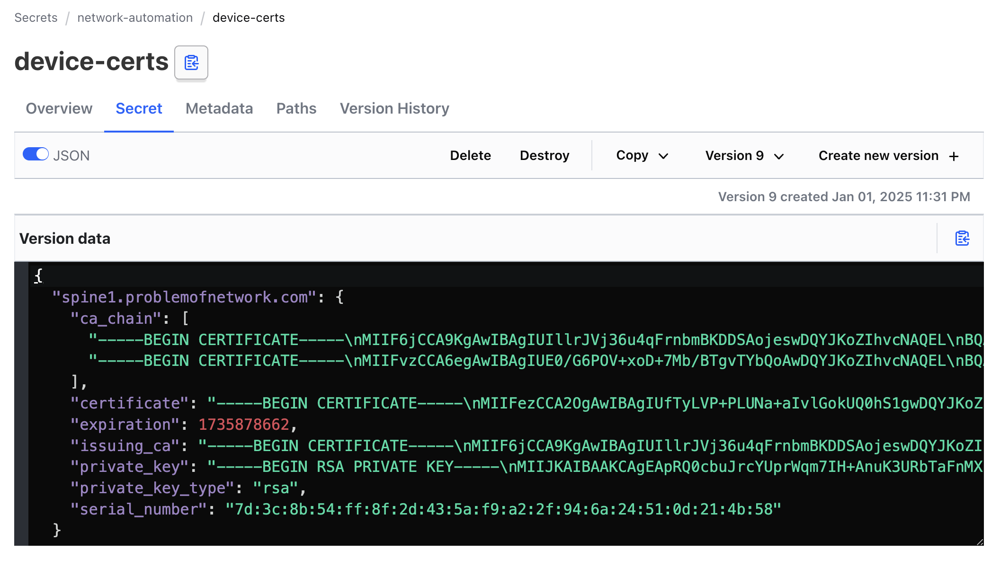
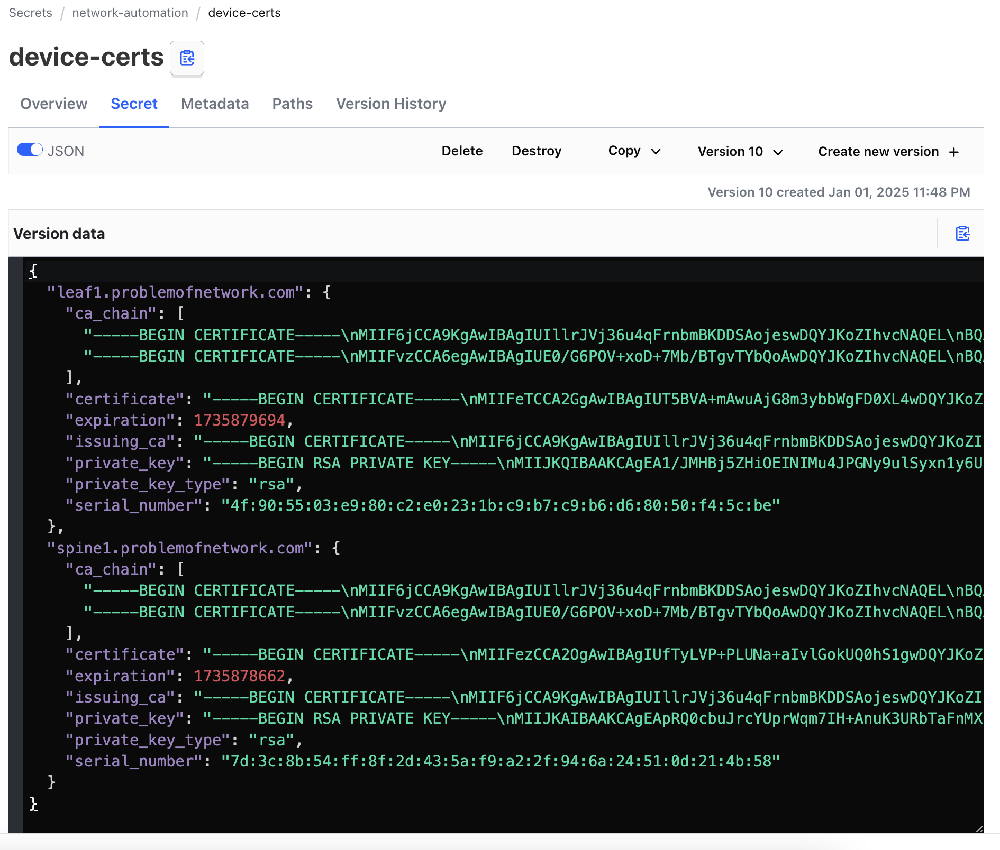
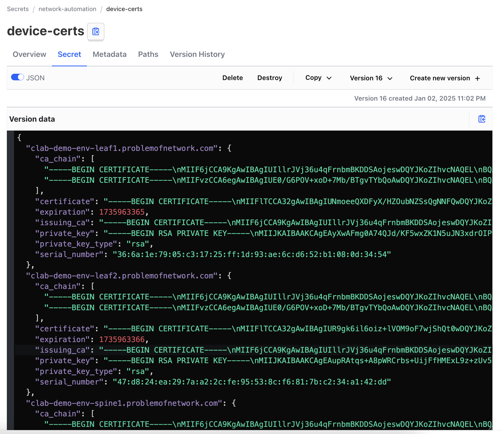

## Abstract

Now that we have a Vault, with a TLS Issuing CA, and some idea of how to get certs out of it, lets look at how we can use this in a "real" world scenario to put a valid TLS profile onto a Network Appliance (fancy word for a switch I guess).

> Why did I say appliance, and not Router or Switch? Weeeeeell, think about it. You manage a lot of network _stuff_ over HTTPS protocols these days, even when its not actually a web interface you are using to do it. We can also manage load balancers, Wireless Controllers, NAS devices etc etc etc. Lets not get bogged down in terminology and accept that network kit comes in all shapes and sizes these days. Trusted TLS is the goal here.

## Pre-Requisites

Since this is an extension of the _exploring-vault_ series, I added some more stuff to the git repo here: [exploring vault](https://github.com/fatred/exploring-vault). 

To complete the exercises here, you will need a docker host with [containerlab](https://containerlab.dev) installed, and a >=python3.11 venv created in the `demo-env` subfolder of the repo.

For brevity I assume you already completed all the Vault tasks in the previous posts, and so have your ENV vars set correctly to interact with the vault in later exercises.

All these tasks should be executed on the docker host running clab to ensure the demo-env devices can be reached. If you want to go rogue and make them routable, or use some other bare metal you have, thats great, but you're on your own there. ;)

## Getting started

First, lets get the clab up and running.

Enter the demo-env folder and execute `sudo clab deploy`

```
jhow@containerlab:~/git/exploring-vault/demo-env$ sudo clab deploy
INFO[0000] Containerlab v0.60.1 started
INFO[0000] Parsing & checking topology file: demo-env.clab.yml
INFO[0000] Pulling ghcr.io/nokia/srlinux:23.10.6 Docker image
INFO[0068] Done pulling ghcr.io/nokia/srlinux:23.10.6
INFO[0068] Creating lab directory: /home/jhow/git/exploring-vault/demo-env/clab-demo-env
INFO[0068] Creating container: "leaf2"
INFO[0068] Creating container: "spine1"
INFO[0068] Creating container: "leaf1"
INFO[0073] Running postdeploy actions for Nokia SR Linux 'leaf2' node
INFO[0073] Running postdeploy actions for Nokia SR Linux 'leaf1' node
INFO[0073] Created link: spine1:e1-1 <--> leaf1:e1-49
INFO[0073] Created link: spine1:e1-2 <--> leaf2:e1-49
INFO[0073] Running postdeploy actions for Nokia SR Linux 'spine1' node
INFO[0093] Adding containerlab host entries to /etc/hosts file
INFO[0093] Adding ssh config for containerlab nodes
╭──────────────────────┬───────────────────────────────┬─────────┬───────────────────╮
│         Name         │           Kind/Image          │  State  │   IPv4/6 Address  │
├──────────────────────┼───────────────────────────────┼─────────┼───────────────────┤
│ clab-demo-env-leaf1  │ nokia_srlinux                 │ running │ 172.20.20.4       │
│                      │ ghcr.io/nokia/srlinux:23.10.6 │         │ 3fff:172:20:20::4 │
├──────────────────────┼───────────────────────────────┼─────────┼───────────────────┤
│ clab-demo-env-leaf2  │ nokia_srlinux                 │ running │ 172.20.20.3       │
│                      │ ghcr.io/nokia/srlinux:23.10.6 │         │ 3fff:172:20:20::3 │
├──────────────────────┼───────────────────────────────┼─────────┼───────────────────┤
│ clab-demo-env-spine1 │ nokia_srlinux                 │ running │ 172.20.20.2       │
│                      │ ghcr.io/nokia/srlinux:23.10.6 │         │ 3fff:172:20:20::2 │
╰──────────────────────┴───────────────────────────────┴─────────┴───────────────────╯
```

Next, activate (or create) our venv, and ensure that we have all the pip requirements installed.

> IF NEEDED `python3.11 -m venv venv`

`source venv/bin/activate`

`pip3 install -r requirements.txt`

There is then one little _hack_ I am using here to make life easier when talking to the demo-env. Each time clab runs, it creates an ansible-topology.yml file in the topology folder, which is a nicely formatted YAML document with all the devices listed out. 

With the help of the nornir-ansible inventory plugin we can take this file, hand it to nornir and use that to transact with the demo-env, and not have to worry about hardcoding things in the topology file. Thanks clab!

Lets copy that file out of the generated folder and into the demo-env base so that we can point nornir at the containerlab instances.

> _note that this folder only exists after deploying the clab demo-env!_

```
(venv) jhow@containerlab:~/git/exploring-vault/demo-env$ pwd
/home/jhow/git/exploring-vault/demo-env

(venv) jhow@containerlab:~/git/exploring-vault/demo-env$ cp clab-demo-env/ansible-inventory.yml .

(venv) jhow@containerlab:~/git/exploring-vault/demo-env$ ls
ansible-inventory.yml  clab-demo-env  config.yaml  demo-env.clab.yml  requirements.txt  test-inventory.py  venv
```

We can now run our test-inventory script to see if it works

```
(venv) jhow@containerlab:~/git/exploring-vault/demo-env$ python3 ./test-inventory.py
AnsibleInventory
{'clab-demo-env-leaf1': Host: clab-demo-env-leaf1, 'clab-demo-env-leaf2': Host: clab-demo-env-leaf2, 'clab-demo-env-spine1': Host: clab-demo-env-spine1}
```

Tada! We have three hosts in our inventory for nornir to work with, all expending minimal effort. 

> Note: since we are using the ansible inventory plugin, we can if needed, extend this to make more use of other ansible inventory primitives, like group_vars and host_vars. I used this a lot in my [SRLinux-POC repo](https://github.com/protonjhow/srlinux-poc/), and if you decide to go there, you can leverage some additional [clab topology tweaks](https://containerlab.dev/manual/inventory/#ansible) to enable more grouping options that are _really_ handy.

## talking gnmi with the stock certs

The clab default config for gNMI uses some certs generated by clab and injected into the config. These are self signed, but they are derived, and the chain can be accessed if you know where to look. 

In the previous section we imported the `ansible-inventory.yml` file from the clab metadata folder, which clab creates when you run the deploy command. Within this folder is a hidden `.tls` folder which has a `ca` subfolder with the key and cert, as well as folder for each device, also containing the key and cert.

> Its worth noting that unless you use the -c flag when you destroy a topology, this folder is persisted between clab deployments, and its content is re-used. When you `admin save` a config, the container writes the config here for example. 

So, looking back to the `ansible_inventory.yml` we can see all the nokia devices are added by the clab template to a group called `nokia_srlinux`, so lets setup a `group_vars/nokia_srlinux.yaml` which has the nokia defaults for gnmi pre-defined, and the CA set to use this ca folder.

```
---
username: admin
password: NokiaSrl1!
port: 57400
connection_options:
  pygnmi:
    extras:
      path_root: "./clab-demo-env/.tls/ca/ca.pem"
      skip_verify: False
      insecure: False
```

> You can just remove the comments on the file I put in the repo obvs.

With _this_ information we are now able to make **trusted** connections to the gNMI server on each device, and get/set stuff on the device. Lets test that with our `show-version.py`

```python
from nornir import InitNornir
from nornir_utils.plugins.functions import print_result
from nornir_pygnmi.tasks import gnmi_get

nr = InitNornir(config_file="config.yaml")

result1 = nr.run(task=gnmi_get, encoding="json_ietf", path=["system/information/version"])
print_result(result1)
```

which when we run it should yield the following: 

```
(venv) jhow@containerlab:~/git/exploring-vault/demo-env$ python show-version.py
gnmi_get************************************************************************
* clab-demo-env-leaf1 ** changed : False ***************************************
vvvv gnmi_get ** changed : False vvvvvvvvvvvvvvvvvvvvvvvvvvvvvvvvvvvvvvvvvvvvvvv INFO
{ 'notification': [ { 'alias': None,
                      'atomic': False,
                      'prefix': None,
                      'timestamp': 1735685970351784517,
                      'update': [ { 'path': 'srl_nokia-system:system/srl_nokia-system-info:information/version',
                                    'val': 'v23.10.6-68-g3758560fa3'}]}]}
^^^^ END gnmi_get ^^^^^^^^^^^^^^^^^^^^^^^^^^^^^^^^^^^^^^^^^^^^^^^^^^^^^^^^^^^^^^
* clab-demo-env-leaf2 ** changed : False ***************************************
vvvv gnmi_get ** changed : False vvvvvvvvvvvvvvvvvvvvvvvvvvvvvvvvvvvvvvvvvvvvvvv INFO
{ 'notification': [ { 'alias': None,
                      'atomic': False,
                      'prefix': None,
                      'timestamp': 1735685970352370328,
                      'update': [ { 'path': 'srl_nokia-system:system/srl_nokia-system-info:information/version',
                                    'val': 'v23.10.6-68-g3758560fa3'}]}]}
^^^^ END gnmi_get ^^^^^^^^^^^^^^^^^^^^^^^^^^^^^^^^^^^^^^^^^^^^^^^^^^^^^^^^^^^^^^
* clab-demo-env-spine1 ** changed : False **************************************
vvvv gnmi_get ** changed : False vvvvvvvvvvvvvvvvvvvvvvvvvvvvvvvvvvvvvvvvvvvvvvv INFO
{ 'notification': [ { 'alias': None,
                      'atomic': False,
                      'prefix': None,
                      'timestamp': 1735685970351753842,
                      'update': [ { 'path': 'srl_nokia-system:system/srl_nokia-system-info:information/version',
                                    'val': 'v23.10.6-68-g3758560fa3'}]}]}
^^^^ END gnmi_get ^^^^^^^^^^^^^^^^^^^^^^^^^^^^^^^^^^^^^^^^^^^^^^^^^^^^^^^^^^^^^^
```

Tremendous. We can talk to our network device with a trusted TLS connection. But this TLS cert was made for us by clab, and we don't get that luxury in the real world. 

Lets generate some certs in vault, and push them into the device under a new tls-profile.

## Cert Management

### Generating a cert for our demo lab

In our previous post we generated some certs using a basic call to the vault HTTP API, using a simple json request consisting of just the common_name and the ttl. Before we dig into the nornir side of things, which can be a little overwhelming at first, lets focus instead on a simple little PoC for a single device in python.

In this cert generation request we need to add a few additional things in to be sure we have options for connecting to the device. Some protocols use the IP address, not an FQDN, so we need to add the IP SAN alongside the device FQDN in our cert request. If we go back to our `sudo clab inspect` output, we can see the IPs (we can get them programmatically later)

```json
{
    "common_name": "spine1.problemofnetwork.com",
    "ip_sans": "172.20.20.2",
    "ttl": 86400
}
```

If we refer to the hvac docs, the generic method to sign a cert is as follows: 

```python
import hvac
client = hvac.Client()

generate_certificate_response = client.secrets.pki.generate_certificate(
   name='myrole',
   common_name='test.example.com'
)
print('Certificate: {}'.format(generate_certificate_response))
```

This seems to miss out a few important bits of context, like the mount_point and the extra_params we will need, so lets pivot this into a function:

```python
import hvac

MOUNT_POINT: str = 'pki_int'
ROLE: str = 'problemofnetwork-dot-com'
TTL: int = 86400

def generate_device_cert(client: hvac.Client, device_name: str, device_ip: str) -> dict:
    vault_cert = client.secrets.pki.generate_certificate(
        name = ROLE,
        common_name = device_name,
        extra_params = {"ip_sans": device_ip, "ttl": TTL}
        mount_point = MOUNT_POINT
    )
    return dict(vault_cert['data'])

if __name__ == '__main__':
    client = hvac.Client()
    mycert = generate_device_cert(client, 'spine1.problemofnetwork.com', '172.20.20.2')
    print(mycert)
```

When we run this, and we pull out the certificate field, if we parse that we get a valid cert, with the right ttl and common name, with the extra IP SAN included.

```
Algorithm ID:     SHA256withRSA
Validity
  Not Before:     01/01/2025 05:39:47 (dd-mm-yyyy hh:mm:ss) (250101053947Z)
  Not After:      02/01/2025 05:40:12 (dd-mm-yyyy hh:mm:ss) (250102054012Z)
Issuer
  CN = problemofnetwork-Issuing-G1
Subject
  CN = spine1.problemofnetwork.com
...
Extensions
  ...
  subjectAltName :
    dns: spine1.problemofnetwork.com
    ip: 172.20.20.2
```

> Note: Why 86400 seconds (1 day)? Because this is a demo and I don't want to clog up my revocation lists. We will cover longer certs at the end...

I don't think I discussed this yet, but when you make a request to vault with any of these generate_certificate endpoints, vault will generate a private key, build a csr using the parameters you provide (overlaid with the role defaults), and then sign that. What you get back is a json blob with the key and the cert, including the chain as well for convenience. All of this is done in memory, and none of the key/cert data is stored on vault itself. 

In other words, once vault sends you the TLS content you requested, if you don't do anything, it will not be possible to retrieve the same information from the PKI engine in the future. 

> This in-mem key creation can make these http calls slow. If you are running vault on a low powered box like a Pi, be very aware that these vault requests will take many seconds if not a minute to complete...

So, if we want to keep a copy of the cert for later use (or to ensure a segregation of duties), we need to request a cert in one step, then push it back into vault as a key/value pair for retrieval on demand.

So lets use what we learned in the last post to make a get/set pair of functions.

### Vaulting the cert for later use

Writing getters and setters are typically quite easy, so we will copy out some of the functions from the documentation and then add our special sauce.

```python
def set_vault_device_cert(
    client: hvac.Client,
    kv_mount: str,
    kv_secret_name: str,
    device_name: str,
    cert_bundle: dict,
) -> (bool, int):
    results = client.secrets.kv.v2.patch(
        mount_point=kv_mount, path=kv_secret_name, secret={device_name: cert_bundle}
    )
    if results["warnings"] is None:
        return (True, results["data"]["version"])
    else:
        return (False, -1)


def get_vault_device_cert(
    client: hvac.Client, kv_mount: str, kv_secret_name: str, device_name: str
) -> dict:
    return client.secrets.kv.v2.read_secret_version(
        mount_point=kv_mount, path=kv_secret_name, raise_on_deleted_version=False
    )["data"]["data"][device_name]
```

In the set function, we take a vault client, the vault location data and the certificate data, then use the _patch_ method to update the base secret in `kv_secret_name`.

_Patch_ is an important feature here. 

If the `device_name` does not exist in the json blob stored at `kv_secret_name`, then it will add it inline, leaving all other entries untouched. 

If the `device_name` is already present, it will replace all the values under that key with the ones provided in the request. If there is some delta of values not provided by the request, these are left untouched also.

Assuming the request to patch the kv store works, we get a True, and the version number which we can log somewhere. If it fails, we get a False and a -1 for type compliance.

In the get function we provide a vault client, the vault location data and the device name, to be able to pull back the data we were provided that first time we generated the cert. 

So here now is our updated PoC called `issue_device_cert_poc.py`:

```python
import hvac

PKI_MOUNT_POINT: str = "pki_int"
PKI_ROLE: str = "problemofnetwork-dot-com"
CERT_TTL: int = 86400
KV_MOUNT_POINT: str = "network-automation"
KV_PATH: str = "device-certs"


def generate_device_cert(client: hvac.Client, device_name: str, device_ip: str) -> dict:
    vault_cert = client.secrets.pki.generate_certificate(
        name=PKI_ROLE,
        common_name=device_name,
        extra_params={"ip_sans": device_ip, "ttl": CERT_TTL},
        mount_point=PKI_MOUNT_POINT,
    )
    return dict(vault_cert["data"])


def set_vault_device_cert(
    client: hvac.Client,
    kv_mount: str,
    kv_secret_name: str,
    device_name: str,
    cert_bundle: dict,
) -> (bool, int):
    results = client.secrets.kv.v2.patch(
        mount_point=kv_mount, path=kv_secret_name, secret={device_name: cert_bundle}
    )
    if results["warnings"] is None:
        return (True, results["data"]["version"])
    else:
        return (False, -1)


def get_vault_device_cert(
    client: hvac.Client, kv_mount: str, kv_secret_name: str, device_name: str
) -> dict:
    return client.secrets.kv.v2.read_secret_version(
        mount_point=kv_mount, path=kv_secret_name, raise_on_deleted_version=False
    )["data"]["data"][device_name]


if __name__ == "__main__":
    device_name: str = "spine1.problemofnetwork.com"
    client = hvac.Client()
    test_cert = generate_device_cert(client, device_name, "172.20.20.2")
    print(
        f"Issued new cert for {device_name} with serial {test_cert['serial_number']} and expiry on {test_cert['expiration']}"
    )
    saved, secret_version = set_vault_device_cert(
        client, KV_MOUNT_POINT, KV_PATH, device_name, test_cert
    )
    if saved:
        print(
            f"Uploaded new cert for {device_name} to vault under {KV_MOUNT_POINT}/{KV_PATH}, stored with version {secret_version}"
        )
    else:
        print(
            f"Unable to upload cert to vault. Key material lost! Revoke {test_cert['serial_number']}"
        )
```

> Note that we put a little bit of a safety net in, so that if the generation works, but the vaulting doesnt for some reason (likely related to unlucky vault token expiry, or a bad policy/path to the kv store), then you can revoke that serial. Always tune this in a dev env before going to prod, so that you can trust your certs and CRLs...

When we run this, we get some nice output telling us it worked:

```
(venv) jhow@containerlab:~/git/exploring-vault/demo-env$ python3 ./issue_device_cert_poc.py
Issued new cert for spine1.problemofnetwork.com with serial 7d:3c:8b:54:ff:8f:2d:43:5a:f9:a2:2f:94:6a:24:51:0d:21:4b:58 and expiry on 1735878662
Uploaded new cert for spine1.problemofnetwork.com to vault under network-automation/device-certs, stored with version 9
```

...and if we check vault manually, there it is:



To wrap the PoC up, lets just edit the name and IP for the request to cover the leaf1 device, and ensure we don't clobber the spine1 entry. We edit line 45 & 47, then rerun the script:

```
(venv) jhow@containerlab:~/git/exploring-vault/demo-env$ python3 ./issue_device_cert_poc.py
Issued new cert for leaf1.problemofnetwork.com with serial 4f:90:55:03:e9:80:c2:e0:23:1b:c9:b7:c9:b6:d6:80:50:f4:5c:be and expiry on 1735879694
Uploaded new cert for leaf1.problemofnetwork.com to vault under network-automation/device-certs, stored with version 10
```

...and we check the secret in vault UI:



Excellent. We have a working PoC for generating and vaulting certs to fetch later.

In a world with a requirement for segregation of duties, you can have one workflow (or human) process the "secure" work of key generatation and vaulting, and then a lower priviliged token/user can read that cert out of vault and into a golden config or out to a device directly.

In a 3 node lab, running this script as is, or maybe adding an argparse to make that more repeatable would be great, but when you have tens or hundreds of devices, this gets boring, and dangerous (typos), quickly. Lets move on to make this scale with Nornir doing the work against the inventory.

### Batching the cert generation with nornir

For those unfamiliar with nornir, think Ansible, but you write python code yourself, rather than using the community modules and YAML. To be able to achieve the same outcomes, there are a bunch of primitives like Task and Result, and AggregatedResult, that make nornir a little daunting for a new user. I wont cover these here, because its _long ting_, but the [tutorial](https://nornir.readthedocs.io/en/latest/tutorial/index.html) is pretty good for this. 

Since we already have an inventory, we need to define a task first.

We do this by including the Task and Result structures from nornir, and then using their wireframe for a task definition, like so:

```python
from nornir.core.task import Task, Result

def hello_world(task: Task) -> Result:
    return Result(
        host=task.host,
        result=f"{task.host.name} says hello world!"
    )
```

So lets look back at our PoC and write a task that will generate and vault a cert for a host

```python
from nornir.core.task import Task, Result
import hvac


PKI_MOUNT_POINT: str = "pki_int"
PKI_ROLE: str = "problemofnetwork-dot-com"
CERT_TTL: int = 86400
KV_MOUNT_POINT: str = "network-automation"
KV_PATH: str = "device-certs"


def _generate_device_cert(
    client: hvac.Client, device_name: str, device_ip: str
) -> dict:
    vault_cert = client.secrets.pki.generate_certificate(
        name=PKI_ROLE,
        common_name=device_name,
        extra_params={"ip_sans": device_ip, "ttl": CERT_TTL},
        mount_point=PKI_MOUNT_POINT,
    )
    return dict(vault_cert["data"])


def _set_vault_device_cert(
    client: hvac.Client,
    kv_mount: str,
    kv_secret_name: str,
    device_name: str,
    cert_bundle: dict,
) -> tuple[bool, int]:
    results = client.secrets.kv.v2.patch(
        mount_point=kv_mount, path=kv_secret_name, secret={device_name: cert_bundle}
    )
    if results["warnings"] is None:
        return (True, results["data"]["version"])
    else:
        return (False, -1)


def generate_cert_to_vault(task: Task) -> Result:
    client = hvac.Client()
    generated_keymat = _generate_device_cert(
        client=client, device_name=task.host.name, device_ip=task.host.hostname
    )
    saved, secret_version = _set_vault_device_cert(
        client=client,
        kv_mount=KV_MOUNT_POINT,
        kv_secret_name=KV_PATH,
        device_name=task.host.name,
        cert_bundle=generated_keymat,
    )
    if saved:
        result_msg: str = f"Uploaded new cert for {task.host.name} to vault under {KV_MOUNT_POINT}/{KV_PATH}, stored with version {secret_version}"
    else:
        result_msg: str = f"Unable to upload cert to vault. Key material lost! Revoke {generated_keymat['serial_number']}"
    return Result(host=task.host, result=result_msg)

```

There is a lot to unpack here, but lets just bear in mind that the majority of this code is copy pasted from the PoC.

First, we rename the two functions from the PoC, prefixing them with an underscore `_`. This is an indicator to python that these are not supposed to be consumed directly outside of the file.

Second, we import these two nornir structures, and then create a new function with the correct fingerprint, which we call `generate_cert_to_vault`.

We then lift out the core of the main() function from the PoC, and tweak some important parts.

The device_name now comes from the `task.host.name` value, and the device_ip now comes from `task.hosts.hostname`. 

> why hostname? because the ansible-inventory (as populated by containerlab) puts the IP in the hostname field. More on this later.

Finally, instead of printing some stuff to stdout, we take the helpful generated message, and store it into a string, which we attach to our Result object that will go back to the main Nornir execution pipeline. 

To keep this as simple as possible, we will add the nornir boilerplate for a task run at the bottom inside a main() function, so that this is then self contained. 

```python
from nornir import InitNornir
from nornir_utils.plugins.functions import print_result

# ... all the code from above

if __name__ == "__main__":
    nr = InitNornir(config_file="config.yaml")
    generate_certs_to_vault = nr.run(task=generate_cert_to_vault)
    print_result(generate_certs_to_vault)
```

Which, when we run should give the following output: 

```
<snip>
* clab-demo-env-spine1 ** changed : False **************************************
vvvv generate_cert_to_vault ** changed : False vvvvvvvvvvvvvvvvvvvvvvvvvvvvvvvvv ERROR
Traceback (most recent call last):
  File "/home/jhow/git/exploring-vault/demo-env/venv/lib/python3.11/site-packages/nornir/core/task.py", line 99, in start
    r = self.task(self, **self.params)
        ^^^^^^^^^^^^^^^^^^^^^^^^^^^^^^
  File "/home/jhow/git/exploring-vault/demo-env/./issue_device_certs_nornir.py", line 43, in generate_cert_to_vault
    generated_keymat = _generate_device_cert(
                       ^^^^^^^^^^^^^^^^^^^^^^
  File "/home/jhow/git/exploring-vault/demo-env/./issue_device_certs_nornir.py", line 16, in _generate_device_cert
    vault_cert = client.secrets.pki.generate_certificate(
                 ^^^^^^^^^^^^^^^^^^^^^^^^^^^^^^^^^^^^^^^^
  File "/home/jhow/git/exploring-vault/demo-env/venv/lib/python3.11/site-packages/hvac/api/secrets_engines/pki.py", line 380, in generate_certificate
    return self._adapter.post(
           ^^^^^^^^^^^^^^^^^^^
  File "/home/jhow/git/exploring-vault/demo-env/venv/lib/python3.11/site-packages/hvac/adapters.py", line 159, in post
    return self.request("post", url, **kwargs)
           ^^^^^^^^^^^^^^^^^^^^^^^^^^^^^^^^^^^
  File "/home/jhow/git/exploring-vault/demo-env/venv/lib/python3.11/site-packages/hvac/adapters.py", line 408, in request
    response = super().request(*args, **kwargs)
               ^^^^^^^^^^^^^^^^^^^^^^^^^^^^^^^^
  File "/home/jhow/git/exploring-vault/demo-env/venv/lib/python3.11/site-packages/hvac/adapters.py", line 376, in request
    self._raise_for_error(method, url, response)
  File "/home/jhow/git/exploring-vault/demo-env/venv/lib/python3.11/site-packages/hvac/adapters.py", line 294, in _raise_for_error
    utils.raise_for_error(
  File "/home/jhow/git/exploring-vault/demo-env/venv/lib/python3.11/site-packages/hvac/utils.py", line 41, in raise_for_error
    raise exceptions.VaultError.from_status(
hvac.exceptions.InvalidRequest: common name clab-demo-env-spine1 not allowed by this role, on post https://vault.fatred.co.uk:8200/v1/pki_int/issue/problemofnetwork-dot-com
```

Oops.

The "name" generated by clab only has the hostname, not an FQDN, and the role we have on vault requries that you have a FQDN within the problemofnetwork.com domain. 

Lets add a new constant and generate the FQDN, then swap out `task.host.name` with the new derived `fqdn`

```python
# snip
DN: str = "problemofnetwork.com"
# snip
def generate_cert_to_vault(task: Task) -> Result:
    client = hvac.Client()
    fqdn = f"{task.host.name}.{DN}"
    generated_keymat = _generate_device_cert(
        client=client, device_name=fqdn, device_ip=task.host.hostname
    )
    saved, secret_version = _set_vault_device_cert(
        client=client,
        kv_mount=KV_MOUNT_POINT,
        kv_secret_name=KV_PATH,
        device_name=fqdn,
        cert_bundle=generated_keymat,
    )
    if saved:
        result_msg: str = f"Uploaded new cert for {fqdn} to vault under {KV_MOUNT_POINT}/{KV_PATH}, stored with version {secret_version}"
    else:
        result_msg: str = f"Unable to upload cert to vault. Key material lost! Revoke {generated_keymat['serial_number']}"
    return Result(host=task.host, result=result_msg)
```

Lets try again...

```
(venv) jhow@containerlab:~/git/exploring-vault/demo-env$ python3 ./issue_device_certs_nornir.py
generate_cert_to_vault**********************************************************
* clab-demo-env-leaf1 ** changed : False ***************************************
vvvv generate_cert_to_vault ** changed : False vvvvvvvvvvvvvvvvvvvvvvvvvvvvvvvvv INFO
Uploaded new cert for clab-demo-env-leaf1.problemofnetwork.com to vault under network-automation/device-certs, stored with version 11
^^^^ END generate_cert_to_vault ^^^^^^^^^^^^^^^^^^^^^^^^^^^^^^^^^^^^^^^^^^^^^^^^
* clab-demo-env-leaf2 ** changed : False ***************************************
vvvv generate_cert_to_vault ** changed : False vvvvvvvvvvvvvvvvvvvvvvvvvvvvvvvvv INFO
Uploaded new cert for clab-demo-env-leaf2.problemofnetwork.com to vault under network-automation/device-certs, stored with version 13
^^^^ END generate_cert_to_vault ^^^^^^^^^^^^^^^^^^^^^^^^^^^^^^^^^^^^^^^^^^^^^^^^
* clab-demo-env-spine1 ** changed : False **************************************
vvvv generate_cert_to_vault ** changed : False vvvvvvvvvvvvvvvvvvvvvvvvvvvvvvvvv INFO
Uploaded new cert for clab-demo-env-spine1.problemofnetwork.com to vault under network-automation/device-certs, stored with version 12
^^^^ END generate_cert_to_vault ^^^^^^^^^^^^^^^^^^^^^^^^^^^^^^^^^^^^^^^^^^^^^^^^
```
Almost perfect. We can see that the tasks completed ok based on the message, but it says `changed: False`, which is misleading. 

Final tweak, lets add a changed True/False alongside the result_msg generation, and add that bool to the Result:

```python
# snip
    if saved:
        result_msg: str = f"Uploaded new cert for {task.host.name} to vault under {KV_MOUNT_POINT}/{KV_PATH}, stored with version {secret_version}"
        changed = True
    else:
        result_msg: str = f"Unable to upload cert to vault. Key material lost! Revoke {generated_keymat['serial_number']}"
        changed = False
    return Result(host=task.host, result=result_msg, changed=changed)
```

So lets go one last time:

```
(venv) jhow@containerlab:~/git/exploring-vault/demo-env$ python3 ./issue_device_certs_nornir.py
generate_cert_to_vault**********************************************************
* clab-demo-env-leaf1 ** changed : True ****************************************
vvvv generate_cert_to_vault ** changed : True vvvvvvvvvvvvvvvvvvvvvvvvvvvvvvvvvv INFO
Uploaded new cert for clab-demo-env-leaf1.problemofnetwork.com to vault under network-automation/device-certs, stored with version 15
^^^^ END generate_cert_to_vault ^^^^^^^^^^^^^^^^^^^^^^^^^^^^^^^^^^^^^^^^^^^^^^^^
* clab-demo-env-leaf2 ** changed : True ****************************************
vvvv generate_cert_to_vault ** changed : True vvvvvvvvvvvvvvvvvvvvvvvvvvvvvvvvvv INFO
Uploaded new cert for clab-demo-env-leaf2.problemofnetwork.com to vault under network-automation/device-certs, stored with version 14
^^^^ END generate_cert_to_vault ^^^^^^^^^^^^^^^^^^^^^^^^^^^^^^^^^^^^^^^^^^^^^^^^
* clab-demo-env-spine1 ** changed : True ***************************************
vvvv generate_cert_to_vault ** changed : True vvvvvvvvvvvvvvvvvvvvvvvvvvvvvvvvvv INFO
Uploaded new cert for clab-demo-env-spine1.problemofnetwork.com to vault under network-automation/device-certs, stored with version 16
^^^^ END generate_cert_to_vault ^^^^^^^^^^^^^^^^^^^^^^^^^^^^^^^^^^^^^^^^^^^^^^^^
```

Perfect!

...and when we check vault, we should see our secret dictionary now has all three devices



So, we can celebrate the first scale victory - we have generated device specific certificates and put the entire keymaterial into vault for later delivery to devices. 

There are two key benefits here (over and above the ones we already spoke of for trusted enterprise CAs) 

1. we no longer have to keep keymaterial in a git repo for all to see
2. we can rotate key material in a sizable estate _VERY_ easily, meaning you can reduce the lifetime (and so the risk of compromise) to lets encrypt levels.

## Device config delivery

Golden configs and the process for config delivery is often rather vendor specific, and even when it isn't - workflows are never going to be completely common between businesses. What I show here is one way to manage certs on the Nokia SRL platform, but having worked with Cisco, Arista, Juniper and F5 (among others), all of them have a similar concept of TLS Profiles that host the key/cert/chain. These can be numerous in count, such that you can then direct the management services of the box to utilise via a direct object reference (usually a name).

### Creating a TLS profile 

On Nokia SRL the YANG models are all public, and the box likes to transact using JSON, and YAML is the human readable form of JSON, so this should be very easy. 

Lets steal a template from the box by looking up the clab profile.

`ssh -C admin@clab-demo-env-leaf1 -C "info system tls server-profile clab-profile | as json" | yq -P`

```yaml
system:
  tls:
    server-profile:
      - name: clab-profile
        key: $aes1$ATRd5NUoQmOaLm8=$z7pe0nJYKe+59gExkef1WI+cs5TNI6OoA9j5ZC/rXtrLcP/Mw2ueq3RLipzobfmdXO3XUT4X0Q/OGiWd6ZasV++qZ5mYIYxuoXydESl/Sft2atsNL36cMJvrFuChJgnvzFflU7MCTy255b8lCyQmtuJ4qGnmMVLAcieQOjyTDBPytiala/4qnTwK/iL2D/CJ8P8eznBOALoHdSrxBHdQN0yb7bfuGGxw9Lwt1TguFCnTpK4m7FPy/cLWwyeJwzwDcwO3qGDH7EWAfjISMRqL57fV/JONQjhfjFyyEQE1yCL+AdX+iiy+nj0GVcxFF4AdFHWVCjnZJQcnXR1L6r3F+XM0TUfmyKnzoPqHoGDdC1XvUJiuSZe0HwPHFLHazQVSF6p5X+Y33YvlnjWkSmNbKRQWCVmsnXtL0hORLRXSv7lvktEdAUttfjmVuAiEn6VSQROQiWgKWTkizD7+0ylPGYpxGvsb23pEAp4jAq6NDEM1U0cGXAz0dnXA9kDRixgbZzDO2QyUkahvsc66Tr9Ea3nEgWGPBpyfrNPM6Sxam9e8/1xvy5gSOIPS1uBrXY8lafH7/70LtldOjfTcqqQBsP/1yEszBqmLrmpfDvE6P1YHqr5Mos4vZFHEd7XW60lbl/Tcqr0WfBMMSetYQftLPqwNkzEuWxI8eAQKE7WUlEiriZyEsgkxKaWN9jbiHBdDDafT3YXqZUzoQQ+ed6hsHQ5QV674v5F5rEqWbGlOXYP8NTKRJF3lKbmMFMyag4Fq45SAyEwuNxGE2ukS1xEWQol8yb6m95//7YLXBzbVuyRZMzOqRVAybuwcIFrNojugnwKAUd38cKiM0BAHOGyYCf7l+ceUibI91YjGRdVi+ohRNGSt7iKDEHr+yCHTNNouaSQhH5vYjelZWJREwlhaWR9u5jdRGsgo6x+vmqSyqz5pXTalc9NDDr2DQrI/TbwlfBJOUiIbYiT3xktHHmhrtN/IZB0Q0wxh5hWYSBRUZBBdEb2R4U11fjBKe9P+lWIYusqiimfsUrOMf+3dBIyBCDlPNa6rjnyJMKwLMsPpzVRtbKdm8Lp4IOrmHXbvZf04fSMC5+yRCTzZyewlFbC9TWz3XDZYz52qVUNGQU3Gr67u0I7U64n+UX/Ud5CH736zI4H+64ANm26Ki7J583eSgrRVGM1JEUlnZgmHFPnltWMGi93J77Tbx5F2mVICdm+UelDKK+uH6yy1/pIzZG5G/l1owKrgY/uUGEs8MHDm0Dvayf/90Y+epY5MYDeDjpJj8mt0oIvAyMI0uQx9Z2Wv0yu/KH6c7rEeJ72rE4hYKnnrEn3rOo8hF9lHN/xQOxZYSIOq4CHIPxUKW8XnUIHi/U2mlxYPAFXf3BSlJlhPqklEs/xTrNeSraPKz+kx5EtCxCyRD3v1os7wtdpNPybj0SGvZ8uAOw9yyMvUrEXuvEzrehZFFBalUUyOmRSZMCyrVcp
        certificate: |
          -----BEGIN CERTIFICATE-----
          MIID3DCCAsSgAwIBAgICBnowDQYJKoZIhvcNAQELBQAwVDELMAkGA1UEBhMCVVMx
          CTAHBgNVBAcTADEVMBMGA1UEChMMY29udGFpbmVybGFiMQkwBwYDVQQLEwAxGDAW
          BgNVBAMTD2RlbW8tZW52IGxhYiBDQTAeFw0yNDEyMjkyMjIyMjRaFw0yNTEyMjky
          AwEAAaOBtTCBsjAOBgNVHQ8BAf8EBAMCBaAwHQYDVR0lBBYwFAYIKwYBBQUHAwIG
          CCsGAQUFBwMBMA4GA1UdDgQHBAUBAgMEBjAfBgNVHSMEGDAWgBQ/IzFJx5IgOjxI
          o9K8f9F8zt8mMzBQBgNVHREESTBHggVsZWFmMYITY2xhYi1kZW1vLWVudi1sZWFm
          MYIRbGVhZjEuZGVtby1lbnYuaW+HBKwUFASHED//AXIAIAAgAAAAAAAAAAQwDQYJ
          KoZIhvcNAQELBQADggEBAIMbuFHIvARqBTeg72if0/TEQxsDiTtRed+AXFo9IUI5
          0h/Q85nqHz5luot11JJMOHp04A37E6ZHzNT9NDJ58mFV2h6Mjuh+DQayuBGpIX1W
          C9PFUTfOymvaMq7jKOTzdyukJePctvqQlO6+y9gD/2PEe2vjnrn+Sf3isntBEMjD
          S9CeAT4Rf6+nHYPcX15I1p0l0CCYSoIDdIvF7RBCt9VN+EA5trBblMXsStRrvLsY
          /UiaYOxeRXd7FHuRvPogK57dhCSQ3hAAQkkUHlp52F6+IX1+f/iQWMnTo8h1U7mB
          k0NwLDarZVZUA+/Z9+zj7DnEm8DPFumbwDzo4Y5y6D0=
          -----END CERTIFICATE-----
        authenticate-client: false
```
Again, I have broken this output to make the github secret fairies happy.

> Note: I love that you can use these weird little hacks to get to stuff in a programmatic way. The SRL team really do mean it when they say they built an automation first platform here...

So using our PoC mentality, and one of the _plethora_ of keys we already published, lets make a simple python script that will produce a dict object that is model compliant, containing valid materials, and then push it to the box with gNMI with a new profile name. 

```python
from pygnmi.client import gNMIclient

KEY= "-----BEGIN RSA PRIVATE KWEY-----\nMIIJKAIBAAKCAgEAo9PzY6DpQTiXpPZiB2gtGov54lp9iRmaplyl+xsLdkx6e7Z2\nAlbJvkG3f1NZqgVMh06tpoetsZqJ81U5+b6GL+jpMwlvZwsDdOnIN9OUc+RUuo0F\nkKVDLeRyf8tRM5JF3CbLpmuDY+WyMZY9rXqkxxZK/yIzpLOlRG8cPgJb76tYX8NG\nHLBv2MXhMy06JdgsUBUJsOnD3dsACFjTlSffRbH9KJkRp19AXUvdy+VbLBtyD9f+\nNsLHhQ46AmuvCZMGDNZWOmmuaEWTucQEb1pX1UZc1lGBLdwomhyCjUAF13JDAzQs\nexICEBVqoIORNXMS3iamkwF8f8uBq8vDWY+A6KvNfq/I6ZuyoyXoX9zXlelIhM8Z\nB3ajuQnAoI+mqv7MKsFZ7B3rVbxItxYhA1p9PiA1ViCycTTX6daLNqh9XbjEYMD1\niRW7crsVJHdkz1WH3+89KzjIbgdrAAfh4jwMbud1jUxufgF\nzDxTu4qKrLhNxej6KOE29lq0OiWorvzQFTUNfnguyQ2ovTnm2dbB6WL+ox0=\n-----END RSA PRIVATE KWEY-----"
CERT = "-----BEGIN CERTIFICATE-----\nMIIFlzCCA3+gAwIBAgIUedTecis7ve0ZDSwvyGdplipLZMQwDQYJKoZIhvcNAQEL\nBQAwJjEkMCIGA1UEAxMbcHJvYmxlbW9mbmV0d29yay1Jc3N1aW5nLUcxMB4XDTI1\nMDEwMzA0MDIyMVoXDTI1MDEwNDA0MDI0NVowNDEyMDAGA1UEAxMpY2xhYi1kZW1v\nLWVudi1zcGluZTEucHJvYmxlbW9mbmV0d29yay59czCw7e7S7cEW9R2LxFwkIvTWqP2vAqbYI40kjQfsO0mnB\nPHnXflYfm/U/cayjwRWsX7/x0Ha4IIPmWnkCp82jhn/256CEDGu+SHjxxeoDk5WN\nqbeJTHPNUueP4k3FdDERfDTFvszQVSggn9KBdsrv8tCWQbJEtOURsZ+Z+Kiu+3ql\n/6Subl4pIzsCv3OPYR7hJ7g4n0wAKOUWGfej/BvCo3t0hdpJIkhBmSvWX7IpyCnE\nRn8s9oaDN/YKJpqRfTEf5BdyKxaXBneZGm4tOr+bWGTakc9fG83Y+iVh4Sd/2tx/\npYSXKoS5IiCiJJp1e8mVeIYveE+jtvfvS25gFVA4Tkr0rrPhz45yYgRVcw==\n-----END CERTIFICATE-----"


host = ('172.20.20.2', '57400')
set_config = [
    {
        "system": {
            "tls": {
                "server-profile": [
                    {
                        "name": "vault-profile",
                        "key": f"{KEY}",
                        "certificate": f"{CERT}",
                        "authenticate-client": False
                    }
                ]
            }
        }
    }
]


if __name__ == '__main__':
    with gNMIclient(target=host, username='admin', password='NokiaSrl1!', path_root='clab-demo-env/.tls/ca/ca.pem') as gc:
        result = gc.set(update=set_config)
        print(result)

```

> note: yet AGAIN, I snipped the key/cert base64 to prevent the key fairies getting worked up, but also, to make the paste smaller. This Blog is running LOOOOOONNNNNNGGG... :)

When we run this, we hope to see the following: 

```
(venv) jhow@containerlab:~/git/exploring-vault/demo-env$ python3 ./push_tls_profile_poc.py
{'timestamp': 1735879887779635880, 'prefix': None, 'response': [{'path': 'system', 'op': 'UPDATE'}]}
```

And when we check the box, we should see a new profile in there

`ssh -C admin@clab-demo-env-spine1 -C "info system tls server-profile vault-profile | as json"`

```
{
  "system": {
    "tls": {
      "server-profile": [
        {
          "name": "vault-profile",
          "key": "$aes1$ATdfyhdM/u3Gh28=$8Wv20B9KUzoiypLoDflDdeohEYxS7suRa9UDJ9n/NzvEByJkTJGgYDJ0d7BjY20UWV1bGAaVYvqmX+4haRM/qiDn8JSAndmqINMzqhVPNF4pq46AgupWyWIaedpVMJSQBZ68EzvYytZWuWn8xcxw8MT1FUQ7CjFsb/KKYj9YM/fCsg00hrVLsts7vLi9OBv3L+km+OYOxpmIYShVw0j+3BlH0f86992MyRB9LaJ4OYykpXg55Poh1lsZtats=",
          "certificate": "-----BEGIN CERTIFICATE-----\nMIIFlzCCA3+gAwIBAgIUedTecis7ve0ZDSwvyGdplipLZMQwDQYJKoZIhvcNAQEL\nBQAwJjE\nAQUAA4ICDwAwggIKAoICAQCj0/NjoOlBOJek9mIHaC0ai/9oaDN/YKJpqRfTEf5BdyKxaXBneZGm4tOr+bWGTakc9fG83Y+iVh4Sd/2tx/\npYSXKoS5IiCiJJp1e8mVeIYveE+jtvfvS25gFVA4Tkr0rrPhz45yYgRVcw==\n-----END CERTIFICATE-----",
          "authenticate-client": false
        }
      ]
    }
  }
}
```
> note: yes snipped for brevity!

So we have a working PoC that can push a new TLS profile in. Lets scale this with Nornir!

### Pushing the TLS profile with Nornir

This time, we keep the structure, but not the workflow, because nornir abstracts most of the gnmiclient stuff out of the way. 

```python
from nornir import InitNornir
from nornir_utils.plugins.functions import print_result
from nornir_pygnmi.tasks import gnmi_set
from nornir.core.task import Task, Result
from nornir.core.filter import F
import hvac

DN: str = "problemofnetwork.com"
KV_MOUNT_POINT: str = "network-automation"
KV_PATH: str = "device-certs"


def _get_vault_device_cert(
    client: hvac.Client, kv_mount: str, kv_secret_name: str, device_name: str
) -> dict:
    return client.secrets.kv.v2.read_secret_version(
        mount_point=kv_mount, path=kv_secret_name, raise_on_deleted_version=False
    )["data"]["data"][device_name]


def push_tls_profile(task: Task) -> Result:
    client = hvac.Client()
    fqdn = f"{task.host.name}.{DN}"
    key_material = _get_vault_device_cert(client=client, kv_mount=KV_MOUNT_POINT, kv_secret_name=KV_PATH, device_name=fqdn)
    set_config = [
        (
            "system", {
                "tls": {
                    "server-profile": [
                        {
                            "name": "vault-profile",
                            "key": f"{key_material['private_key']}",
                            "certificate": f"{key_material['certificate']}",
                            "authenticate-client": False
                        }
                    ]
                }
            }
        )
    ]
    # bit of a hack
    me = nr.filter(F(name__eq=task.host.name))
    push_profile = me.run(task=gnmi_set, encoding="json_ietf", update=set_config)
    if push_profile[task.host.name].failed:
        result_msg: str = f"UPDATE to {task.host.name} failed"
        success = False
    elif push_profile[task.host.name].changed:
        result_msg: str = f"UPDATE to {task.host.name} was successful"
        success = True
    else:
        result_msg: str = f"UPDATE to {task.host.name} was unnecessary"
        success = True
    return Result(host=task.host, result=result_msg, changed=success)

if __name__ == '__main__':
    nr = InitNornir(config_file="config.yaml")
    push_tls_profile = nr.run(task=push_tls_profile)
    print_result(push_tls_profile)
```

There is a little bit of a hack in here. If there is a better way, I am happy to hear about it. 

The main func has literlaly three calls. We setup nornir, we call the custom task we created to generate and push the tls profile to devices, and we then show the result of the work. 

Our custom task will be called once per device in the inventory, so that means three times in our demo-lab. First we setup vault, we patch our device FQDN, and we use that to fetch the keymaterial from vault. 

We then render the template to go out to the box with the device specific cert/key, and here we see the hack.

The nornir_pygnmi tooling exposes a gnmi_get and a gnmi_set task, and these accept a single tuple input. The first field of the tuple is the path on the target device model you will be sending to. The second field is the dictionary you want to send to the model. The operation is the other side of the variable, which in our case (at line 43) we say we want to update.

If we call gnmi_set with three devices in the inventory, but one set_config, my three devices will recieve the same set_config request, which would contain key/certs only valid for one of them. Big no-no.

The hack at line 42 is creating a filtered copy of the main inventory called `me` that only includes the host.name of the device we are on at this point in the outer loop. 

We then use the `me.run` to limit gnmi_set operation to that one machine, with the correct set_config. 

> Wait, what? This sounds stupid? Yeah, it kinda is, and I nearly scrapped this entirely to use pygnmi directly as a result. In production I almost certainly would too for efficiency, but it teaches you about filtering, and the compromises required in the wild. I'll add the pygnmi version as an extra script for reference in the repo.

Now, to be sure that we correctly expose the state of the subtask completion, we parse the nornir Result objects correctly, and then reflect these in custom return messages, and boolean states. These are captured correctly in the outer loop Result objects and returned cleanly to main. 

When we run this, we get a coherant response: 

```
(venv) jhow@containerlab:~/git/exploring-vault/demo-env$ python3 ./push_tls_profile_nornir.py
push_tls_profile****************************************************************
* clab-demo-env-leaf1 ** changed : True ****************************************
vvvv push_tls_profile ** changed : True vvvvvvvvvvvvvvvvvvvvvvvvvvvvvvvvvvvvvvvv INFO
UPDATE to clab-demo-env-leaf1 was successful
^^^^ END push_tls_profile ^^^^^^^^^^^^^^^^^^^^^^^^^^^^^^^^^^^^^^^^^^^^^^^^^^^^^^
* clab-demo-env-leaf2 ** changed : True ****************************************
vvvv push_tls_profile ** changed : True vvvvvvvvvvvvvvvvvvvvvvvvvvvvvvvvvvvvvvvv INFO
UPDATE to clab-demo-env-leaf2 was successful
^^^^ END push_tls_profile ^^^^^^^^^^^^^^^^^^^^^^^^^^^^^^^^^^^^^^^^^^^^^^^^^^^^^^
* clab-demo-env-spine1 ** changed : True ***************************************
vvvv push_tls_profile ** changed : True vvvvvvvvvvvvvvvvvvvvvvvvvvvvvvvvvvvvvvvv INFO
UPDATE to clab-demo-env-spine1 was successful
^^^^ END push_tls_profile ^^^^^^^^^^^^^^^^^^^^^^^^^^^^^^^^^^^^^^^^^^^^^^^^^^^^^^
```

and if we check the boxes manually, we can see our TLS Profile is present too.

`ssh -C admin@clab-demo-env-leaf2 -C "info system tls server-profile vault-profile | as json"`

```
{
  "system": {
    "tls": {
      "server-profile": [
        {
          "name": "vault-profile",
          "key": "$aes1$ATdUT0XwPt1YwW8=$h4Yv1jO3rBKfsW21XsHTgcNo8iIy6qE2C1fkY7h5uMmYb7oEC5hUa8LeCmHA0LG8XCNvYIQmxUdf7f2Y0SKh1aFEYX0ufa885ATl2io+B29tSxtV3xnHfTlCpOfm5snWCqPdjVq8N48jk4Da9R4Nqq4pIsBxf8bBvHBMnTnXFT6OZz0dKalI0hiCffYqVvNEeEFA/ePsbbMxz2EdGdnJjPAemrApu+VqyFu3c5fmYDKzCGBEYYbRyWoyzJgjUcRUFPRCIcE6IIThwScXOZ4Xj6Lnf5A5KF0nEvAI5kJGEL4Q04QSQS7SkElykjCN6o=",
          "certificate": "-----BEGIN CERTIFICATE-----\nMIIFlTCCA32gAwIBAgIUR9gk6il6oiz+lVOM9oF7wjShQt0wDQYJKoZIhvcNAQEL\nBQAwJjEkMCIGA1UEAxMbcHJvYmxlbW9mbmV0d29yay1Jc3N1aW5nLUcxMB4XDTI1\nMDEwMzA0MDIxOVoXDTI1MDEwNDA0MDI0NlowMzExMC8GA1UEAxMoY2xhYi1kZW1v\nLWVudi1sZWFmMi5wcm9ibGVtb2ZuZXR3b3JrLmNvbTCCAiIwDQYJKoZIhvcNAQEB\nBQADggIPADCCAgoCggIBALqUQLarPgPKVkQq27PlIoxXxzBMS/c/s1L+RN2+fGtNDGHfBt1fb3cfqKad56k=\n-----END CERTIFICATE-----",
          "authenticate-client": false
        }
      ]
    }
  }
}
```

> Note: yes, snipped...

AAAAAAND if we want to be really cool, we can pipe the cert to openssl to parse it.

`ssh -C admin@clab-demo-env-leaf2 -C "info system tls server-profile vault-profile | as json" | jq -r '."system"."tls"."server-profile"[0]."certificate"' | openssl x509  -noout -text`

> note the single + double ('"abc"') quoting is weird, but thats jq for you. The `server-profile` is an illegal name technically, so you need to double quote that, and then simply because it exists somewhere, the whole jsonpath needs single quoting to bundle it as a thing.

when we trim out the guff we see:

```
Certificate:
    Data:
        Issuer: CN = problemofnetwork-Issuing-G1
        Validity
            Not Before: Jan  3 04:02:19 2025 GMT
            Not After : Jan  4 04:02:46 2025 GMT
        Subject: CN = clab-demo-env-leaf2.problemofnetwork.com
        X509v3 extensions:
            X509v3 Subject Alternative Name:
                DNS:clab-demo-env-leaf2.problemofnetwork.com, IP Address:172.20.20.3
```

...and if we check each of the other three devices, the common name and the SANs should be accurate.

Success! But we are not done _just_ yet.

### TLS Profile assignment

There is a logical flaw lurking in the last change we need to make. We want to tell our boxes to start using the new TLS profile we just uploaded to the box, which means assigning it to the gnmi and jsonrpc services. The way we instruct the device to update these configurations, is _using_ these services.


We have all experienced (especially in the imperative world of Cisco and Arista) that feeling when you press enter, and the prompt doesnt come back. It still amazes me how we leaned on `reboot in 5` in a professional network environment. All hail `commit confirm`.

So whilst these vendors who leverage the commit system _should_ be ok with the declarative, I think it's still good practice to maintain some form of access throughtout the cycle. On that basis, we will be a little bit extra here, and use jsonrpc to update gnmi, and gnmi to update jsonrpc. This way, we never cut the branch on which we are sitting.

Lets start with an update over gnmi to assign the vault profile to JSONRPC, because its very easy to bolt that on the end of the script we already have.

#### JSONRPC config over gNMI

This time, we will be sending the same data to each device, so we _dont_ need an inner/outer loop concept. We should probably DRY the profile name however. Lets add a new constant, a function to return the config block in a derivative way, and call the gnmi_set command cleanly. Don't forget to update line 31 to include the constant too...

```python
TLS_PROFILE_NAME = "vault-profile"

def set_jsonrpc_tls_profile(profile_name: str) -> list:
    return [
        (
            "system", {
                "json-rpc-server": {
                    "network-instance": [
                        {
                            "name": "mgmt",
                            "https": {
                                "tls-profile": f"{profile_name}"
                            }
                        }
                    ]
                }
            }
        )
    ]


if __name__ == '__main__':
    nr = InitNornir(config_file="config.yaml")
    push_tls_profile = nr.run(task=push_tls_profile)
    print_result(push_tls_profile)
    apply_jsonrpc_tls_profile = nr.run(task=gnmi_set, encoding="json_ietf", update=set_jsonrpc_tls_profile(TLS_PROFILE_NAME))
    print_result(apply_jsonrpc_tls_profile)
```

When we run that, we get the unformatted UPDATE messages back

```
(venv) jhow@containerlab:~/git/exploring-vault/demo-env$ python3 ./push_tls_profile_nornir.py
push_tls_profile****************************************************************
* clab-demo-env-leaf1 ** changed : True ****************************************
vvvv push_tls_profile ** changed : True vvvvvvvvvvvvvvvvvvvvvvvvvvvvvvvvvvvvvvvv INFO
UPDATE to clab-demo-env-leaf1 was successful
^^^^ END push_tls_profile ^^^^^^^^^^^^^^^^^^^^^^^^^^^^^^^^^^^^^^^^^^^^^^^^^^^^^^
* clab-demo-env-leaf2 ** changed : True ****************************************
vvvv push_tls_profile ** changed : True vvvvvvvvvvvvvvvvvvvvvvvvvvvvvvvvvvvvvvvv INFO
UPDATE to clab-demo-env-leaf2 was successful
^^^^ END push_tls_profile ^^^^^^^^^^^^^^^^^^^^^^^^^^^^^^^^^^^^^^^^^^^^^^^^^^^^^^
* clab-demo-env-spine1 ** changed : True ***************************************
vvvv push_tls_profile ** changed : True vvvvvvvvvvvvvvvvvvvvvvvvvvvvvvvvvvvvvvvv INFO
UPDATE to clab-demo-env-spine1 was successful
^^^^ END push_tls_profile ^^^^^^^^^^^^^^^^^^^^^^^^^^^^^^^^^^^^^^^^^^^^^^^^^^^^^^
gnmi_set************************************************************************
* clab-demo-env-leaf1 ** changed : True ****************************************
vvvv gnmi_set ** changed : True vvvvvvvvvvvvvvvvvvvvvvvvvvvvvvvvvvvvvvvvvvvvvvvv INFO
{ 'prefix': None,
  'response': [{'op': 'UPDATE', 'path': 'system'}],
  'timestamp': 1736061700477438345}
^^^^ END gnmi_set ^^^^^^^^^^^^^^^^^^^^^^^^^^^^^^^^^^^^^^^^^^^^^^^^^^^^^^^^^^^^^^
* clab-demo-env-leaf2 ** changed : True ****************************************
vvvv gnmi_set ** changed : True vvvvvvvvvvvvvvvvvvvvvvvvvvvvvvvvvvvvvvvvvvvvvvvv INFO
{ 'prefix': None,
  'response': [{'op': 'UPDATE', 'path': 'system'}],
  'timestamp': 1736061700470205283}
^^^^ END gnmi_set ^^^^^^^^^^^^^^^^^^^^^^^^^^^^^^^^^^^^^^^^^^^^^^^^^^^^^^^^^^^^^^
* clab-demo-env-spine1 ** changed : True ***************************************
vvvv gnmi_set ** changed : True vvvvvvvvvvvvvvvvvvvvvvvvvvvvvvvvvvvvvvvvvvvvvvvv INFO
{ 'prefix': None,
  'response': [{'op': 'UPDATE', 'path': 'system'}],
  'timestamp': 1736061700468452057}
^^^^ END gnmi_set ^^^^^^^^^^^^^^^^^^^^^^^^^^^^^^^^^^^^^^^^^^^^^^^^^^^^^^^^^^^^^^
```

Good. it worked. Lets test it.

> Note: our friends at containerlab edit the hosts file for you so that you can use hostnames in your scripts, but they don't include a FQDN option. Since this blog is about a production setup where DNS is part of the story, I prefer to hack the hosts file than the certs and the issuer.

edit your hosts file to update the clab generated entry to include the FQDN as well.

```
###### CLAB-demo-env-START ######
172.20.20.4     clab-demo-env-leaf1 clab-demo-env-leaf1.problemofnetwork.com
172.20.20.3     clab-demo-env-leaf2 clab-demo-env-leaf2.problemofnetwork.com
172.20.20.2     clab-demo-env-spine1 clab-demo-env-spine1.problemofnetwork.com
3fff:172:20:20::4       clab-demo-env-leaf1
3fff:172:20:20::3       clab-demo-env-leaf2
3fff:172:20:20::2       clab-demo-env-spine1
###### CLAB-demo-env-END ######
```

Now, we can test with the correct names

curl: 

```
(venv) jhow@containerlab:~/git/exploring-vault/demo-env$ curl https://clab-demo-env-spine1.problemofnetwork.com
<!doctype html>
<html lang=en>
<title>404 Not Found</title>
<h1>Not Found</h1>
<p>The requested URL was not found on the server. If you entered the URL manually please check your spelling and try again.</p>
```

openssl: 

```
(venv) jhow@containerlab:~/git/exploring-vault/demo-env$ openssl s_client -connect clab-demo-env-spine1.problemofnetwork.com:443
CONNECTED(00000003)
depth=2 CN = Problem Of Network Root G1
verify return:1
depth=1 CN = problemofnetwork-Issuing-G1
verify return:1
depth=0 CN = clab-demo-env-spine1.problemofnetwork.com
verify return:1
---
Certificate chain
 0 s:CN = clab-demo-env-spine1.problemofnetwork.com
   i:CN = problemofnetwork-Issuing-G1
   a:PKEY: rsaEncryption, 4096 (bit); sigalg: RSA-SHA256
   v:NotBefore: Jan  5 07:06:10 2025 GMT; NotAfter: Jan  6 07:06:35 2025 GMT
---
```

If for some reason you get an error about verifying the first certificate 

e.g.
`curl: (60) SSL certificate problem: unable to get local issuer certificate`
or 
```
(venv) jhow@containerlab:~/git/exploring-vault/demo-env$ openssl s_client -connect clab-demo-env-spine1.problemofnetwork.com:443
CONNECTED(00000003)
depth=0 CN = clab-demo-env-spine1.problemofnetwork.com
verify error:num=20:unable to get local issuer certificate
verify return:1
depth=0 CN = clab-demo-env-spine1.problemofnetwork.com
verify error:num=21:unable to verify the first certificate
verify return:1
depth=0 CN = clab-demo-env-spine1.problemofnetwork.com
verify return:1
```

Then check that you have the CA root in your /usr/local/share/ca-certificates folder, ending with `.crt` and you have run `sudo update-ca-certificates` or your distro's equivalent.

#### gNMI Config over JSONRPC

The JSON RPC endpoint is really very simple. There is a nice demo [here](https://learn.srlinux.dev/tutorials/programmability/json-rpc/basics/#why-json-rpc)

Because we need to talk to a bunch of devices, we will setup a function to build our requests, and then loop over a list of devices. This doensst scale as nicely as nornir with its dynamic inventory, but in the real world you probably use netbox/nautobot/infrahub already, and know how to setup that as a dynamic inventory source... right?

```python
#!/usr/bin/env python3
import requests
import json

TLS_PROFILE_NAME = "vault-profile"

device_list = [
    "clab-demo-env-leaf1.problemofnetwork.com",
    "clab-demo-env-leaf2.problemofnetwork.com",
    "clab-demo-env-spine1.problemofnetwork.com",
]
jsonrpc_path = "/jsonrpc"
default_cred = ("admin", "NokiaSrl1!")
headers = {"Content-type": "application/json"}


def build_rpc_request(path: str, value: dict) -> str:
    body = {
        "jsonrpc": "2.0",
        "id": 0,
        "method": "set",
        "params": {"commands": [{"action": "update", "path": path, "value": value}]},
    }
    return body


for device in device_list:
    url = f"https://{device}{jsonrpc_path}"
    gnmi_update_req = requests.post(
        url,
        data=json.dumps(build_rpc_request("/system/gnmi-server/network-instance[name=mgmt]", {"tls-profile": f"{TLS_PROFILE_NAME}"})),
        headers=headers,
        auth=requests.auth.HTTPBasicAuth(*default_cred),
        verify=True,
    )

    print(f"{device}: status {gnmi_update_req.status_code} message {gnmi_update_req.json()['result'][0]}")```

```

Slightly unhelpfully the return data from the JSONRPC set request is `{}`, but the real answer comes from the HTTP return codes. 

When we run it, we see it was ok.

```
(venv) jhow@containerlab:~/git/exploring-vault/demo-env$ python3 ./apply_gnmi_tls_profile_jsonrpc.py
clab-demo-env-leaf1.problemofnetwork.com: status 200 message {}
clab-demo-env-leaf2.problemofnetwork.com: status 200 message {}
clab-demo-env-spine1.problemofnetwork.com: status 200 message {}
```

And we can then check this with a run of the show version script from before, BUT, we should remove the hardcoded CA Path from the group_vars first:

```yaml
---
username: admin
password: NokiaSrl1!
port: 57400
connection_options:
  pygnmi:
    extras:
#      path_root: "./clab-demo-env/.tls/ca/ca.pem"
      skip_verify: False
      insecure: False
```

running it then like so:

```
(venv) jhow@containerlab:~/git/exploring-vault/demo-env$ python show-version.py
gnmi_get************************************************************************
* clab-demo-env-leaf1 ** changed : False ***************************************
vvvv gnmi_get ** changed : False vvvvvvvvvvvvvvvvvvvvvvvvvvvvvvvvvvvvvvvvvvvvvvv INFO
{ 'notification': [ { 'alias': None,
                      'atomic': False,
                      'prefix': None,
                      'timestamp': 1736063986248317327,
                      'update': [ { 'path': 'srl_nokia-system:system/srl_nokia-system-info:information/version',
                                    'val': 'v23.10.6-68-g3758560fa3'}]}]}
^^^^ END gnmi_get ^^^^^^^^^^^^^^^^^^^^^^^^^^^^^^^^^^^^^^^^^^^^^^^^^^^^^^^^^^^^^^
* clab-demo-env-leaf2 ** changed : False ***************************************
vvvv gnmi_get ** changed : False vvvvvvvvvvvvvvvvvvvvvvvvvvvvvvvvvvvvvvvvvvvvvvv INFO
{ 'notification': [ { 'alias': None,
                      'atomic': False,
                      'prefix': None,
                      'timestamp': 1736063986247883491,
                      'update': [ { 'path': 'srl_nokia-system:system/srl_nokia-system-info:information/version',
                                    'val': 'v23.10.6-68-g3758560fa3'}]}]}
^^^^ END gnmi_get ^^^^^^^^^^^^^^^^^^^^^^^^^^^^^^^^^^^^^^^^^^^^^^^^^^^^^^^^^^^^^^
* clab-demo-env-spine1 ** changed : False **************************************
vvvv gnmi_get ** changed : False vvvvvvvvvvvvvvvvvvvvvvvvvvvvvvvvvvvvvvvvvvvvvvv INFO
{ 'notification': [ { 'alias': None,
                      'atomic': False,
                      'prefix': None,
                      'timestamp': 1736063986244127165,
                      'update': [ { 'path': 'srl_nokia-system:system/srl_nokia-system-info:information/version',
                                    'val': 'v23.10.6-68-g3758560fa3'}]}]}
^^^^ END gnmi_get ^^^^^^^^^^^^^^^^^^^^^^^^^^^^^^^^^^^^^^^^^^^^^^^^^^^^^^^^^^^^^^
```

Success!

## Wrapping up

So here we are at the end of a monster post. 

We are now able to use vault to create valid, long lived, trustworthy certificates for our environment. We can put these away in a secure place, and then only extract them as needed, and rotating them on the endpoint is relatively trivial, and most importantly, safe in an automation sense. 

I say that, but this code is lacking a ton of comments (on the basis that this post _constitutes_ the comments), but also it lacks a lot of **_error handling_**. 

It won't shock you to learn that a lot of this was borne out of real work my team and I undertook recently, and most of that leverages our internal library of functions and tools, which abstract so very much of that away. 

This code should get a ton more exceptions and try/except/finally loops before being used in the wild, as well as a bunch of mocks and tests. Time is not my friend and I figure the base knowledge is the meat of this sandwich. I will do my best to loop back and update the repo side with some _better quality_ code for long term use.

--- 

If you made it this far, thanks for sticking with me on this one. The easter egg you can see littered through this is the amount of time it took me to actually write this over the new year. There was a fair amount of trial and error involved. 

If you have questions or feedback you can find me in the naf and packetpushers slack, or you can fire me an email.

Until next time, I hope you have a great day.