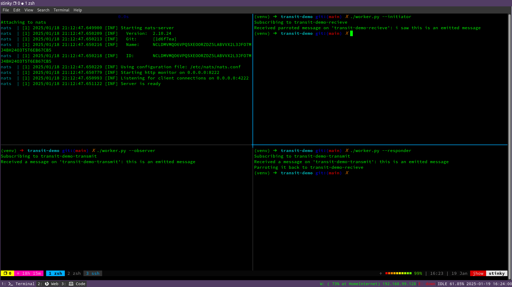
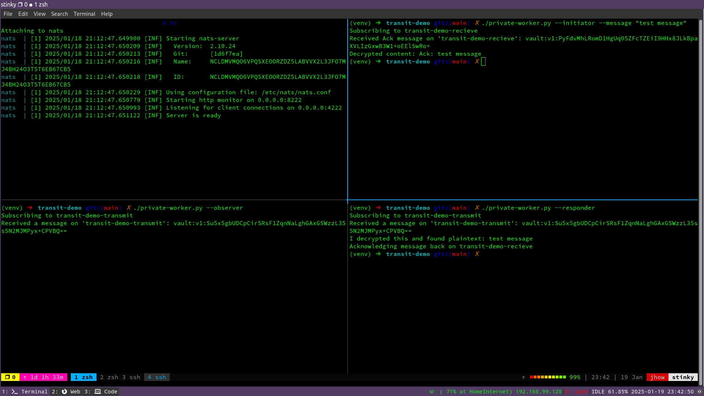

This post has a weird genesis. If I think back to the first time I heard of Transit Encryption I originally thought it was something else, and when I finally understood what [the docs were telling me](https://developer.hashicorp.com/vault/tutorials/encryption-as-a-service/eaas-transit), I thought it was the dumbest idea ever. 

Turns out I was way wrong. Over the next half an hour I hope to explain why.

---

The point of transit encryption is to provide a mechanism for requesting vault encrypt some content for you as a service, so that you can send that encrypted blob over untrustworthy, or observable channels. The recipient can then go back to vault, and request that content be decrypted for use.

Lets demonstrate this with a simple Message Queue demo, using the NATS messaging system and a pair of python clients.

## Basic NATS Setup

Inside the exploring-vault repo we have a new folder called [transit-demo](https://github.com/fatred/exploring-vault). Inside here we will need to create a new python venv, and install the `requirements.txt`

```
cd exploring-vault/transit-demo
python3 -m venv venv
source venv/bin/activate
pip3 install -r requirements.txt
```

I have provided an _extremely basic_ docker-compose using an even more basic NATS server config, taken the excellent documentation [here](https://docs.nats.io/running-a-nats-service/nats_docker). 

Simply open a new terminal in the transit-demo folder and `docker compose up` to start the server. Return to the terminal with the venv in to run a quick test. 

The `simple-test.py` is adapted from the nats-py README.md, and it shows how you can use python async to subscribe to the queue in one background task, and then post to the queue in another. They leverage a callback function to handle each event as they arrive and then exit cleanly. 

> Note: this is a really simple, and clean example of async python. It's worth spending a little time dissecting it as a separate challenge imho.

Execute the script and yo ushould get some messages back.

```shell
(venv) ➜  transit-demo git:(main) $ ./simple-test.py             
Received a message on 'foo ': Hello
Received a message on 'foo ': World
Received a message on 'bar ': First
Received a message on 'bar ': Second
Received a message on 'help _INBOX.aUsrfJ3BOJuQFjVhxCOi8S.aUsrfJ3BOJuQFjVhxCOiB50196': help me
Received response: I can help
```

If you dont get a response, then I would point you at the nats-py docs to work out what is wrong. Assuming you do, then we are ok to start playing with transit encryption.

## Using Gall's Law to build effective platforms

[Gall's Law](https://en.wikipedia.org/wiki/John_Gall_(author)#Gall's_law) states that all complex systems that work, start from a simple system that worked.

Lets heed this advice and build our script in stages. 

### Start with Psuedocode

Every script I ever write will usually start like this:

```python
#!/usr/bin/env
"""
Author: John Howard <fatred@gmail.com>

Simple script that emulates a worker process communicating with NATS sending 
messages on a sender queue to be consumed by another worker, who will return 
them back on a reply queue. Use command line args to establish if we are 
sender or reciever.
"""
# import something


def main():
    pass


if __name__ == "__main__":
    main()
```

Sometimes I will skip the `main()`, but if I think there is a chance that I will need more than one entrypoint, then I will try to start this way. 

Lets map out what main is supposed to do with some comments. We start by making the NATS transactions "work", and we will add crypto after.

```python
#!/usr/bin/env
"""
Author: John Howard <fatred@gmail.com>

Simple script that emulates a worker process communicating with NATS sending 
messages on a sender queue to be consumed by another worker, who will return 
them back on a reply queue. Use command line args to establish if we are 
sender or reciever.
"""
import argparse
import nats


## CONSTANTS
NATS_TX_QUEUE: str = "transit-demo-transmit"
NATS_RX_QUEUE: str = "transit-demo-recieve"


def main(role: str):
    # connect to NATS server.
    # subscribe to the correct queue for recieving messages async in role.
    # if outbound worker, send a message to the TX queue, wait for reply
    #   before ending async.
    # if inbound worker, wait for a message on the TX queue, reply with
    #   content on reciept and then end async.
    # exit after cleanup the connection to the NATS server.
    pass


if __name__ == "__main__":
    # parse args.
    #  options: 
    #    role: initiator or responder.
    # call main.
    role: str = "initiator" # or "responder"
    main(role)

```

Why is the arg parsing being done in the dunder method vs main? The Argparse function is a CLI only method, and the dunder method only matches when we call the python file from a cli prompt. 

We do that so that main can be called by any entrypoint with the same structure of variables. 

Now we know _what_ we want to do, lets start to build out some functionality.

### Our first script

```python
#!/usr/bin/env python3
"""
Author: John Howard <fatred@gmail.com>

Simple script that emulates a worker process communicating with NATS sending 
messages on a sender queue to be consumed by another worker, who will return 
them back on a reply queue. Use command line args to establish if we are 
sender or reciever.
"""
import asyncio
import argparse
import nats


## CONSTANTS
# connstring to the NATS server
NATS_SERVER_CONNSTRING: str = "nats://localhost:4222"
# names are from the perspective of the emitting worker.
NATS_TX_QUEUE: str = "transit-demo-transmit"
NATS_RX_QUEUE: str = "transit-demo-recieve"


def pick_subscription_queue(role: str) -> str:
    """Take the role name and reply the name of the queue to subscribe to.
    Subscriptions are "inbound" to that worker

    Responders should be subscribed to the TX queue.
    Initiators should be subscribed to the RX queue.

    Args:
        role (str): role from argparse.

    Returns:
        str: queuename to subscribe to.
    """
    return NATS_RX_QUEUE if role == "initiator" else NATS_TX_QUEUE


def pick_transmit_queue(role: str) -> str:
    """Take the role name and reply the name of the queue to transmit on.
    Transmissions are "outbound" to that worker

    Initiators should be emitting to the TX queue.
    Responders should be emitting to the RX queue.

    Args:
        role (str): role from argparse.

    Returns:
        str: queuename to transmit to.
    """
    return NATS_TX_QUEUE if role == "initiator" else NATS_RX_QUEUE


async def main(role: str):
    # connect to NATS server.
    nc = await nats.connect(NATS_SERVER_CONNSTRING)

    # subscribe to the correct queue for recieving messages async in role.
    print(f"Subscribing to {pick_subscription_queue(role)}")
    sub = await nc.subscribe(pick_subscription_queue(role))

    # if outbound worker, send a message to the TX queue, wait for reply
    #   before ending async.
    if role == "initiator":
        await nc.publish(pick_transmit_queue(role), b"this is an emitted message")

    # handle a message on our queue
    try:
        async for msg in sub.messages:
            # extract the message attributes once
            queue = msg.subject
            content = msg.data.decode()
            if role == "responder":
                # we are the responder, and we just got a message from the initator
                # announce message content
                print(f"Received a message on '{queue}': {content}")
                # announce the reply and queue
                print(f"Parroting it back to {pick_transmit_queue(role)}")
                # encode our response to bytes
                reply = bytes(f"i saw {content}", 'utf-8')
                # push message 
                await nc.publish(pick_transmit_queue(role), reply)
                # we only want one so time to cleanup
                await sub.unsubscribe()
            else: 
                # we are the initiator, waiting for the parrot response.
                print(f"Received parroted message on '{queue}': {content}")
                # we only want one so time to cleanup
                await sub.unsubscribe()
    except Exception as e:
        # something broke - report what.
        print(e)

    # Terminate connection to NATS.
    await nc.drain()


if __name__ == "__main__":
    # parse args.
    #  options:
    #    role: initiator or responder.
    parser = argparse.ArgumentParser()
    role_group = parser.add_mutually_exclusive_group(required=True)
    role_group.add_argument('--initiator', action='store_true')
    role_group.add_argument('--responder', action='store_true')
    args = parser.parse_args()
    if args.responder:
        role = "responder"
    else:
        role = "initiator"

    # call main.
    asyncio.run(main(role))

```

First, lets look at the functions. I could have made this a lot simpler with a dictionary and a dict comprehention, but this seemed a little complex. 

The point of these functions is to reply back the correct queue names based on the role we are in. Hopefully the one-liner return makes it clear.

The argparse is offering up the option of being an initiator or a responder. I did this because i didnt want two scripts that were very duplicative.

Inside main we first connect to the NATS server. When we are connected, we use the `pick_subscription_queue` function to subscribe to the correct queue for our position.

If we are an initator, we just go straight into publishing the message on the `pick_transmit_queue`. 

Inside the try loop, we will use `async for msg in sub.messages` to read messages off the queue as they appear. If we didnt put the `await sub.unsubscribe()` at the end of our loop iteration, it would sit there running this loop every time a message appears.

Since we want the content in both sides of the loop, we extract the message data to fields we can reuse. Not sure if this is an optimisation or not, but its a habit of mine.

In the Message reciept process, we have a simple branch for the initator role, which is to purely print the parroted message. 

In the responder role, we have a bit more work. We spit it out and then we say what queue we will reply to (I am being verbose obvs). NATS requires that we send a response in bytes, so we cast the updated string to utf8 bytes, and then finally we send the message to the RX queue.

Since we don't want the responder to do any more work, we unsubscribe and that triggers the cleanup and exit.

So lets run the whole thing in two separate terminals and observe the responses.

> Note: You want to run the responder first, since it needs to be "online" to see the initators message and thus be able to send it back. This is not kafka - the messages are not buffered.

worker1 - responder
```
(venv) ➜  transit-demo git:(main) ✗ ./worker.py --responder
Subscribing to transit-demo-transmit
Received a message on 'transit-demo-transmit': this is an emitted message
Parroting it back to transit-demo-recieve
```

worker2 - initiator
```
(venv) ➜  transit-demo git:(main) ✗ ./worker.py --initiator
Subscribing to transit-demo-recieve
Received parroted message on 'transit-demo-recieve': i saw this is an emitted message
```

So you can see that the Responder loads up and "hangs" at `Subscribing to transit-demo-transmit`, until it gets a message as the initiator sends it. When the initiator sends his message, the responder repeats the inbound message, then when it parrots it back the initiator can see the amended message.

## Visualising the problem

Now we have the ability to send a message either way, lets look at why we are doing this in the first place.

Lets add a new CLI feature for an "observer", which will just subscribe to the two queues and log the messages it observes.

Lets first add the arg to the parser:

```python
    parser = argparse.ArgumentParser()
    role_group = parser.add_mutually_exclusive_group(required=True)
    role_group.add_argument('--initiator', action='store_true')
    role_group.add_argument('--responder', action='store_true')
    role_group.add_argument('--observer', action='store_true')
    args = parser.parse_args()
    if args.responder:
        role = "responder"
    elif args.observer:
        role = "observer"
    else:
        role = "initiator"
```

Then lets update the try section of the main loop:

```python
    # handle a message on our queue
    try:
        async for msg in sub.messages:
            # extract the message attributes once
            queue = msg.subject
            content = msg.data.decode()
            if role == "observer":
                # we are the responder, and we just got a message from the initator
                # announce message content
                print(f"Received a message on '{queue}': {content}")
            elif role == "responder":
                # we are the responder, and we just got a message from the initator
                # announce message content
                print(f"Received a message on '{queue}': {content}")
                # announce the reply and queue
                print(f"Parroting it back to {pick_transmit_queue(role)}")
                # encode our response to bytes
                reply = bytes(f"i saw {content}", 'utf-8')
                # push message 
                await nc.publish(pick_transmit_queue(role), reply)
                # we only want one so time to cleanup
                await sub.unsubscribe()
            else: 
                # we are the initiator, waiting for the parrot response.
                print(f"Received parroted message on '{queue}': {content}")
                # we only want one so time to cleanup
                await sub.unsubscribe()
    except Exception as e:
        # something broke - report what.
        print(e)

```

So if we run all three of these, the observer can see all the messages that the initiator sends in plain text.



So, now we have to do something to ensure that the initiator and the responder can communicate privately without the observer knowing what is being discussed.

## Intro to transit crypto

Before we try to setup anything on the client side, we need to setup Vault to offer the transit encryption feature, and then create two "users" and a policy to allow them to use the transit role we setup for this.

> Reminder: you can have as many transit encryption roles as you want, and tokens/users can be allowed to use them in their policies alongside one, many or no other vault features. Yay RBAC!

I assume that you are still using my docker-compose from earlier in the series, and have the terraform to hand.

### Enabling the role in vault

Lets start with a change in terraform. 

Add the new file `transit-crypto.tf` in the `exploring-vault/terraform` folder. Add the following content:

```toml
# transit-crypto-nats.tf
#-------------------------------------------------
# Create a transit mount point called transit-nats
#-------------------------------------------------
resource "vault_mount" "transit_nats" {
  path        = "transit-nats"
  type        = "transit"
  description = "This is a transit secret engine mount for NATS message encryption"

  options = {
    convergent_encryption = false
  }
}

#---------------------------------------------------
# Create a backend key in the new transit mountpoint
#---------------------------------------------------

resource "vault_transit_secret_backend_key" "transit_nats_demo_key" {
  backend = vault_mount.transit_nats.path
  name    = "demo_key"
}

#-----------------------------------------------------------
# Create a policy that can encrypt and decrypt using the key
#-----------------------------------------------------------

resource "vault_policy" "transit_nats_client_policy" {
  name = "transit-nats-client-policy"

  policy = <<EOT
path "transit-nats/encrypt/demo_key" {
   capabilities = [ "update" ]
}

path "transit-nats/decrypt/demo_key" {
   capabilities = [ "update" ]
}
EOT
}

#----------------------------------------------------------
# Create users with a basic password assigned to the policy
#----------------------------------------------------------

resource "vault_generic_endpoint" "nats-worker1" {
  path                 = "auth/${vault_auth_backend.userpass.path}/users/nats-worker1"
  ignore_absent_fields = true

  data_json = <<EOT
{
  "token_policies": ["transit-nats-client-policy"],
  "password": "Less-Secure-Cred1!"
}
EOT
}

resource "vault_generic_endpoint" "nats-worker2" {
  path                 = "auth/${vault_auth_backend.userpass.path}/users/nats-worker2"
  ignore_absent_fields = true

  data_json = <<EOT
{
  "token_policies": ["transit-nats-client-policy"],
  "password": "Less-Secure-Cred2!"
}
EOT
}
```

When we apply this into our vault, we should get the following amendments:

```
Terraform will perform the following actions:

  # vault_mount.transit_nats will be created
  + resource "vault_mount" "transit_nats" {
      + accessor                     = (known after apply)
      + audit_non_hmac_request_keys  = (known after apply)
      + audit_non_hmac_response_keys = (known after apply)
      + default_lease_ttl_seconds    = (known after apply)
      + description                  = "This is a transit secret engine mount for NATS message encryption"
      + external_entropy_access      = false
      + id                           = (known after apply)
      + max_lease_ttl_seconds        = (known after apply)
      + options                      = {
          + "convergent_encryption" = "false"
        }
      + path                         = "transit-nats"
      + seal_wrap                    = (known after apply)
      + type                         = "transit"
    }

  # vault_policy.transit_nats_client_policy will be created
  + resource "vault_policy" "transit_nats_client_policy" {
      + id     = (known after apply)
      + name   = "transit-nats-client-policy"
      + policy = <<-EOT
            path "transit-nats/encrypt/demo_key" {
               capabilities = [ "update" ]
            }
            
            path "transit-nats/decrypt/demo_key" {
               capabilities = [ "update" ]
            }
        EOT
    }

  # vault_transit_secret_backend_key.transit_nats_demo_key will be created
  + resource "vault_transit_secret_backend_key" "transit_nats_demo_key" {
      + allow_plaintext_backup = false
      + auto_rotate_period     = (known after apply)
      + backend                = "transit-nats"
      + convergent_encryption  = false
      + deletion_allowed       = false
      + derived                = false
      + exportable             = false
      + id                     = (known after apply)
      + key_size               = 0
      + keys                   = (known after apply)
      + latest_version         = (known after apply)
      + min_available_version  = (known after apply)
      + min_decryption_version = 1
      + min_encryption_version = 0
      + name                   = "demo_key"
      + supports_decryption    = (known after apply)
      + supports_derivation    = (known after apply)
      + supports_encryption    = (known after apply)
      + supports_signing       = (known after apply)
      + type                   = "aes256-gcm96"
    }

  # vault_generic_endpoint.nats-worker1 will be created
  + resource "vault_generic_endpoint" "nats-worker1" {
      + data_json            = (sensitive value)
      + disable_delete       = false
      + disable_read         = false
      + id                   = (known after apply)
      + ignore_absent_fields = true
      + path                 = "auth/userpass/users/nats-worker1"
      + write_data           = (known after apply)
      + write_data_json      = (known after apply)
    }

  # vault_generic_endpoint.nats-worker2 will be created
  + resource "vault_generic_endpoint" "nats-worker2" {
      + data_json            = (sensitive value)
      + disable_delete       = false
      + disable_read         = false
      + id                   = (known after apply)
      + ignore_absent_fields = true
      + path                 = "auth/userpass/users/nats-worker2"
      + write_data           = (known after apply)
      + write_data_json      = (known after apply)
    }

Plan: 5 to add, 0 to change, 0 to destroy.
```

Once we have applied that, lets make a very simple python script to test encryption and decryption of a test string. 

```python
#!/usr/bin/env python3
# import hvac

# CONSTANTS
VAULT_USER: str = "nats-worker1"
VAULT_PASS: str = "Less-Secure-Cred!"
TRANSIT_MOUNT: str = "transit-nats"
TRANSIT_KEY: str = "demo_key"


def encrypt_string(input: str) -> str:
    output = input
    return output


def decrypt_string(input: str) -> str:
    output = input
    return output


def main():
    test_string: str = "this is private"
    print(f"Test string: {test_string}")
    encrypted_string: str = encrypt_string(test_string)
    print(f"Encrypted string: {encrypted_string}")
    decrypted_string: str = decrypt_string(encrypted_string)
    print(f"Decrypted string: {decrypted_string}")


if __name__ == "__main__":
    main()

```

The smart person will see we are not actually encrypting anything in this first edition. It's about the structure.

Quick test shows it "works". Duh.

```
(venv) ➜  transit-demo git:(main) ✗ ./encryption_test.py 
Test string: this is private
Encrypted string: this is private
Decrypted string: this is private
```

Lets string up the hvac part for vault now.

```python
#!/usr/bin/env python3
import hvac
import base64

# CONSTANTS
VAULT_USER: str = "nats-worker1"
VAULT_PASS: str = "Less-Secure-Cred!"
TRANSIT_MOUNT: str = "transit-nats"
TRANSIT_KEY: str = "demo_key"


def encrypt_string(input: str, client: hvac.Client) -> str:
    encrypt_data_response = client.secrets.transit.encrypt_data(name=TRANSIT_KEY, mount_point = TRANSIT_MOUNT, plaintext = base64.b64encode(input.encode()).decode())
    ciphertext = encrypt_data_response['data']['ciphertext']
    return ciphertext


def decrypt_string(input: str, client: hvac.Client) -> str:
    decrypt_data_response = client.secrets.transit.decrypt_data(name=TRANSIT_KEY, mount_point = TRANSIT_MOUNT, ciphertext = input)
    plaintext = base64.b64decode(decrypt_data_response['data']['plaintext']).decode()
    return plaintext


def main():
    # setup vault client
    client = hvac.Client()
    # auth with userpass
    client.auth.userpass.login(username=VAULT_USER, password=VAULT_PASS)
    # if it didnt work, quit.
    if not client.is_authenticated():
        print("Vault auth failed!")
        exit
    # we have a valid session
    # setup our "secret" and display it
    test_string: str = "this is private"
    print(f"Test string: {test_string}")

    encrypted_string: str = encrypt_string(input = test_string, client = client)
    print(f"Encrypted string: {encrypted_string}")
    decrypted_string: str = decrypt_string(input = encrypted_string, client = client)
    print(f"Decrypted string: {decrypted_string}")


if __name__ == "__main__":
    main()

```

I am going to be honest now and say this took me a little bit of dancing around. All the work was in the two functions. So lets start with the signatures.

We added a bit in main to stand up a vault client. Once this is authenticated, we will need to pass that client object around the functions, so we add that to the args. 

Then, we fetched the examples from the excellent [hvac docs](https://hvac.readthedocs.io/en/stable/usage/secrets_engines/transit.html#encrypt-data) to pad out the encrypt and decrypt functions. 

The bit that got me stuck is on the encryption side, specifically the content we are "allowed" to encrypt as plaintext.

In the docs it says `plaintext=base64ify('hi its me hvac'.encode())`, but base64ify doesnt exist. 

At first I tried to just use `base64.b64encode(input)` but it wanted a bytes object. 

Then I tried `base64.b64encode(bytes(input, 'utf-8')), which works, but the vault call fails because it canst serialses bytes into JSON for the post. 

Eventually [StackOverflow](https://stackoverflow.com/questions/23164058/how-to-encode-text-to-base64-in-python) gives me enough of a shove to figure out the plaintext needs to look like this: `plaintext = base64.b64encode(input.encode()).decode()`. In otherwords, we encode the input to bytes, hand it to the base64 library to encode that, and then we convert it from bytes back to string before sending it to vault. 

On the decryption side, we have to remember to decode the base64 back to a string too, but this is less complex. To get the plaintext back we say: `plaintext = base64.b64decode(decrypt_data_response['data']['plaintext']).decode()`, which is to say, get the "plaintext" back from vault after decryption, then base64 decode this, and strip off the bytes before printing it out.

When we run it, we get the below output:

```
(venv) ➜  transit-demo git:(main) ✗ ./encryption_test.py
Test string: this is private
Encrypted string: vault:v1:+zf0fsJxYWVZ31IY1GqVqSz/+1J2Fqr7gTJTaSfngJS2pxDq8s1Y3d0yww==
Decrypted string: this is private
```

### The encrypted data and key management

Quick pause to look at the encrypted string data. 

First we have the `vault` keyword. This should be obvious why its here.

Second we have `v1`. This is the index number of the private key used to encrypt the subsequent ciphertext. 

Finally we have the ciphertext, which can only be decrypted by vault using the key in the index position noted.

As I said at the start, the transit encryption engine doesnt actually store any of the message content. If you dont capture and store the response to an encryption request, or the original plaintext send to obtain that ciphertext, then it will be lost forever. This is Encryption-as-a-Service, and the only promise it makes is to remember the private key. You can use the [rotate_key](https://hvac.readthedocs.io/en/stable/usage/secrets_engines/transit.html#rotate-key) function to produce a new key if the desire is such. By default, unless you provide a `key_version` in your encryption request, vault will always use the most recent key number for encryption requests.

If for some reason, the token (the userpass in this situation) is exposed, then its plausible someone with this identity can request decryption of ciphertexts. Under that scenario, you dont _have_ to rotate the key, you simply expire/replace/change the credential that was exposed to make it impossible for the attacker to use that exposed credential to get a token and thus access to the decryption service.

It is _possible_ to [export](https://hvac.readthedocs.io/en/stable/usage/secrets_engines/transit.html#export-key) the key with python (seemingly not in the UI?). This is a risk to avoid by ensuring your policies don't permit this to a "human", since there is no forward secrecy in this approach. If the key is exposed, you have to then consider all that data plaintext whereever it lies, and either re-wrap it, or delete it.

## Encrypting our demo messages

So lets take what we learned over to our demo in a forked copy of the script.

We copy the `worker.py` off to `private-worker.py`, and make a few little changes.

1. copy the functions over for encrypt and decrypt.
2. add hvac setup to the start of main. 
3. change the message we send out of the initiator to a bytes version of the string (yes lol)
`bytes(encrypt_string(message, client), 'utf-8')`
4. Rephrase the "i saw this" bit on the parrot stage of the responder - lets make this an "ack" and add encryption. Remember that we have to send bytes.
```python
print(f"Received a message on '{queue}': {content}")
plaintext = decrypt_string(input=content, client=client)
print(f"I decrypted this and found plaintext: {plaintext}")
# announce the reply and queue
print(f"Acknowledging message back on {pick_transmit_queue(role)}")
ack_message = f"Ack: {plaintext}"
# encrupt our response
crypted_ack_message = encrypt_string(ack_message, client=client)
# encode our response to bytes
reply = bytes(f"{crypted_ack_message}", 'utf-8')
# push message 
await nc.publish(pick_transmit_queue(role), reply)
```
5. add the decryption step to the initiator side of the recieving loop. (no double translating bytes this time tho!)
```python
content = msg.data.decode()
# we are the initiator, waiting for the ack response.
print(f"Received Ack message on '{queue}': {content}")
plaintext = decrypt_string(input=content, client=client)
print(f"Decrypted content: {plaintext}")
```
6. finally, we make it possible to add our own message to the call, with a default if we forget.
```python
parser.add_argument('--message', type=str, default="Empty Message")
...
asyncio.run(main(role = role, message=args.message))
```

So if we ensure we have our VAULT_ADDR env var correctly set, we should now be able to stand up the 4 panes in order:

1. start the observer: `./private-worker.py --observer`
2. start the responder: `./private-worker.py --responder`
3. run the initiator: `./private-worker.py --initiator --message "test message"`

We should then see the output as per the below screenshot:



The initiator takes our "test message" string, and encrypts it at the vault. This ciphertext is put on the TX queue, which the observer and the responder both see. 

The responder takes the ciphertext and makes a request to vault to decrypt it. We prove we have the plaintext, then we form an "ack" message, encrypt that and send it back on the RX queue to the initiator. 

The initiator takes the encrypted ack message, proves we have the ciphertext, and then proves we can decrypt it.

Great success! 

We can now have encryption in transit, protecting the message content even from people with authorised access to the logs or the environment.

## Refining the security posture

This demo is pretty contrived, but hopefully you can see the value of encryption outside of the code. There are a few things we cna do to increase the security level here so lets dig in a little bit further before we call it a day.

### Per worker accounts

You will recall we created two worker userpass accounts. This is a little pointless in our demo here, but assume for a moment that you have a production web server with a high risk profile sending messages to an API server that has a lower risk profile. The web server is more likely to have an external facing attack surface, than an application server that doesnt recieve client traffic directly for example. 

If all applications use the same credential, then if one webserver is compromised, then all instances of that credential now need to be rolled over. If you have different credentials per host or at least per service class, you reduce the impact of rolling these credentials. Lets implement that here.

> Note: this is super janky. Don't do this in prod! Once you understand the primitives, you can decide on the best approach for you.

1. add the new username and differentiate them in the constants; remember the password was the same. _yes. thats dumb._ 
```python
# Vault stuff
VAULT_USER1: str = "nats-worker1"
VAULT_USER2: str = "nats-worker2"
VAULT_PASS: str = "Less-Secure-Cred!"
```
2. shift the vault auth off to a function, and add a user index number to the function signature. use a loop to pick the correct user from the constants. 
```python
def auth_vault(user: int) -> hvac.Client:
    # setup vault client
    client = hvac.Client()
    # auth with userpass
    if user == 1:
        client.auth.userpass.login(username=VAULT_USER1, password=VAULT_PASS)
    elif user == 2:
        client.auth.userpass.login(username=VAULT_USER2, password=VAULT_PASS)
    else:
        # assume we have a token in env
        client.auth.login()
    # if it didnt work, quit.
    if not client.is_authenticated():
        print("Vault auth failed!")
        exit
    # we have a valid session
    return client
```
3. use the role to define what user account to use:
```python
args = parser.parse_args()
if args.responder:
    role = "responder"
    user = 2
elif args.observer:
    role = "observer"
    user = 1
else:
    role = "initiator"
    user = 1

# call main.
asyncio.run(main(role = role, message=args.message, user=user))
```
4. use the new function in main.
```python
async def main(role: str, message: str, user: int):
    # connect to vault with correct user
    client = auth_vault(user)
    
```

Now obviously this is very silly, but thats she cul-de-sac I made for myself when I setup just one script for 3 different jobs.

Works tho.

## Wrapping up

So here we showed how the transit encryption feature can prevent snooping on data in flight, regardless of TLS on the wire. This is especially important when we have numerous admins who can access our tools, and service internal logs are not necsarily private or respecting of secrets.

I hope that now you had a chance to see it in "the wild" you might start to observe more opportunities to secure your automation tooling. 

Until next time, toodleoo :D